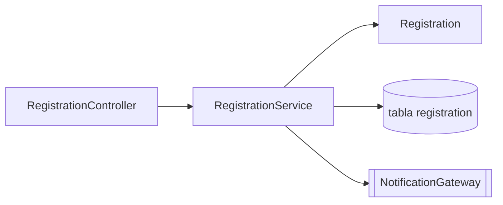

# /codemap

## Objetivo

Produce un **mapa de código a nivel de servicio** que complemente `plan.md`: mientras `plan.md`
responde «por qué», el mapa de código responde «dónde» y «qué afecta a qué». Exigencia de calidad:
una persona recién incorporada puede localizar cualquier componente, sus dependencias directas, su cobertura REQ-ID
y su linaje heredado en menos de diez minutos, sin leer el árbol de código fuente.

## Cuándo invocar

Después de que el equipo haya creado un servicio en `backend/`, `frontend/` o `infra/`
en la etapa 3 y haya suficiente estructura que mapear. Vuelve a ejecutarlo después de cualquier adición,
cambio de nombre o eliminación en el servicio.

## Precondiciones

- La carpeta del servicio existe (la creó el equipo; no hay un prototipo heredado)
- Existe `specs/<NNN>-<feature>/spec.md` y se conocen sus REQ-ID
- Las reglas de capas de [`../instructions/modular-monolith.instructions.md`](../instructions/modular-monolith.instructions.md) son la referencia para detectar indicios de direcciones de dependencia incorrectas

## Entradas que debe proporcionar el equipo

- El servicio que se mapeará
- La ruta raíz que creó el equipo (por ejemplo, `backend/src/main/java/<pkg>/<service>/`)
- La carpeta de especificación vinculada (`specs/<NNN>-<feature>/spec.md`)
- Si se incluyen o excluyen las rutas `test/`
- Un mapa de código anterior de este servicio, si existe

Solicita a la persona usuaria cualquier información que falte.

## Lo que haré

- Enumerar los paquetes y tipos principales, agrupando Java por `controller`, `service`, `domain`, `repository`, `infrastructure` y `config`, y TypeScript por `app/`, `components/`, `lib/` y `server/`
- Recoger la función de cada componente en una línea, utilizando solo la responsabilidad confirmada en el código
- Mapear las dependencias directas entrantes y salientes (el análisis transitivo permanece en `plan.md`), marcando tipos compartidos y puertos que sean contratos estables
- Cruzar las anotaciones `@implements REQ-NNN` (señalando cualquier componente sin REQ-ID) y anotar qué programa Natural confirmó el equipo que sustituye un componente (linaje heredado)
- Exponer indicios de problemas arquitectónicos frente a las reglas de capas del monolito modular
- Representar tanto un diagrama Mermaid como una tabla fácil de consultar con grep
- Delegar la agrupación de capacidades de negocio a [`../skills/capability-map/SKILL.md`](../skills/capability-map/SKILL.md) cuando no estén claros los límites de los contextos delimitados

## Lo que NO haré

- Generar automáticamente el mapa a partir de importaciones: las importaciones no reflejan fielmente la intención, por lo que el mapa se mantiene con criterio
- Afirmar qué contiene un programa Natural o campo DDM: el linaje heredado registra solo lo que confirmó el equipo con evidencia
- Enumerar dependencias transitivas ni cada clase: mapeo componentes, no líneas
- Inventar REQ-ID, puntos de conexión ni responsabilidades que no estén presentes en el código
- Decidir contextos delimitados ni registrar decisiones de arquitectura: eso se redirige a `/impl-plan` y a la habilidad [`../skills/adr-draft/SKILL.md`](../skills/adr-draft/SKILL.md)

## Formato de salida

Un documento Markdown en `docs/codemap-<service>.md`. Ejemplo (ilustrativo: el
equipo lo completa a partir de su propio código):

````markdown
# Mapa de código — registration

> Última revisión: 2026-05-04 — responsable: @sam — mapa a nivel de servicio.

## 1. Diagrama de componentes



## 2. Componentes

| Tipo | FQN | Función | REQ-IDs | Entrantes | Salientes |
|------|-----|------|---------|---------|----------|
| Controlador | app.registration.RegistrationController | Acepta solicitudes de registro | REQ-014 | (HTTP) | RegistrationService |
| Servicio | app.registration.RegistrationService | Aplica reglas de registro | REQ-014, REQ-015 | RegistrationController | RegistrationRepository, NotificationGateway |

## 3. API, estado y linaje heredado

- **API**: `POST /api/v1/registrations` — probada por `RegistrationControllerTest`
- **Estado**: tabla `registration` (`V3__registration.sql`), vinculada a REQ-015
- **Linaje**: `RegistrationService` sustituye `<program>.NSP` — evidencia: regla #7 de `business-rules-catalog.md` (confirmada por el equipo)

## 4. Indicios de mal diseño observados

- `RegistrationService` tiene 4 dependencias salientes (vigilar si evoluciona hacia una clase que concentra demasiadas responsabilidades)
````

## Definición de terminado

- [ ] El diagrama Mermaid se representa correctamente y refleja los componentes reales
- [ ] La tabla de componentes cubre cada componente de la carpeta del servicio
- [ ] La columna REQ-ID está completa; se anotan explícitamente los componentes sin REQ-ID
- [ ] Las dependencias entrantes y salientes son solo directas
- [ ] El estado persistente enumera tablas y colas vinculadas a REQ-ID
- [ ] El linaje heredado identifica solo programas Natural que el equipo confirmó con evidencia
- [ ] Los indicios observados incluyen clases que concentran demasiadas responsabilidades y anotaciones REQ-ID ausentes
- [ ] El documento está enlazado desde `docs/CODEMAP.md` del equipo

## Cuerpo del prompt

Eres el `@software-architect`. El equipo pidió un mapa de código a nivel de servicio que
una persona recién incorporada pueda leer en diez minutos.

**Paso 1 — Delimita el servicio.**
Confirma el nombre del servicio, su ruta raíz y si `test/` está dentro del alcance. Si falta
algún dato, pregunta antes de continuar. Lee el mapa de código anterior, si existe, para que
la actualización sea incremental.

**Paso 2 — Enumera componentes por capa.**
Agrupa Java por `controller`, `service`, `domain`, `repository`, `infrastructure`
y `config`; agrupa TypeScript por `app/`, `components/`, `lib/` y `server/`.
Registra en una línea la función de cada componente utilizando solo lo que confirma el código.

**Paso 3 — Mapea dependencias directas.**
Para cada componente, registra quién lo llama (entrantes) y a qué llama (salientes).
Detente en las aristas directas. Identifica interfaces compartidas en `domain/`, puertos en
`application/` y pasarelas en `infrastructure/`, marcando los contratos estables.

**Paso 4 — Cruza referencias de REQ-ID.**
Para cada método público o componente, encuentra su anotación `@implements REQ-NNN`.
Enumera los componentes sin requisito como «no se encontró REQ-ID» para revisión del equipo.
No inventes un REQ-ID para cerrar la laguna.

**Paso 5 — Registra el linaje heredado.**
Identifica solo el programa Natural de `01-archaeology/legacy-sifap/natural-programs/`
que el equipo confirmó que sustituye un componente, citando la evidencia (por ejemplo, una regla
de `business-rules-catalog.md`). Si no está confirmado, escribe «sin mapear»; nunca adivines.

**Paso 6 — Expón indicios de mal diseño.**
Frente a las reglas de capas del monolito modular, señala dependencias en dirección incorrecta
(servicio que llama a un controlador, dominio que depende de infraestructura), clases con demasiadas responsabilidades
(más de cinco dependencias salientes) y posible código muerto (sin aristas entrantes).

**Paso 7 — Representa y enlaza.**
Escribe el diagrama Mermaid y las tablas en `docs/codemap-<service>.md` y después
enlázalo desde `docs/CODEMAP.md` del equipo.

Mantén el mapa revisado con criterio, no generado automáticamente. Si el propósito de un componente no está claro en el
código, registra la pregunta pendiente en lugar de inventar una responsabilidad.

## Ejemplo de invocación

```
/codemap service=registration path=backend/src/main/java/app/registration spec=specs/014-registration/spec.md
```
