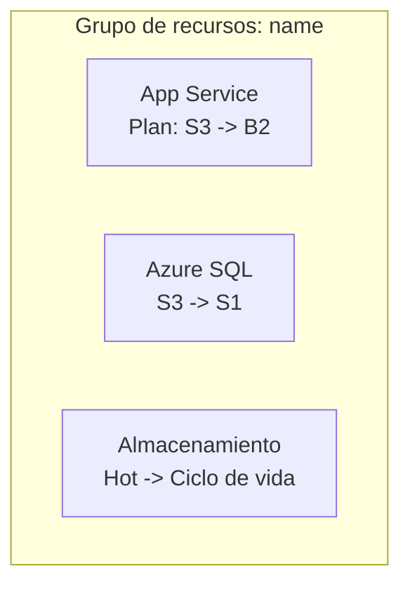

# Optimización de costos de Azure

Analiza archivos de infraestructura como código y recursos de Azure desplegados para generar recomendaciones de optimización de costos. Después, crea una incidencia de GitHub por oportunidad y una épica para coordinar la implementación.

> [!NOTE]
> Esta skill requiere autenticación en el **servidor Azure MCP** y el **servidor GitHub MCP** (o `gh`). La IaC de este kit es **Terraform**, por lo que los archivos `.tf` son la fuente de verdad principal; no consideres autoritativos los demás archivos del repositorio. Prefiere las herramientas Azure MCP (`azmcp-*`) al uso directo de Azure CLI cuando estén disponibles.

## Cuándo invocar

- "Reduce nuestro gasto de Azure para la carga de trabajo de SIFAP."
- "Ajusta el tamaño de estos recursos sobredimensionados y da seguimiento al trabajo."
- "Abre incidencias de GitHub para nuestras oportunidades de optimización de costos de Azure."
- "¿Dónde estamos desperdiciando dinero en este grupo de recursos?"

## Prerrequisitos

- Servidor Azure MCP configurado y autenticado.
- Servidor GitHub MCP (o `gh`) configurado y autenticado.
- Repositorio de GitHub de destino identificado.
- Recursos de Azure desplegados (los archivos IaC son opcionales, pero útiles).

## Pasos del flujo de trabajo

### Paso 1: Obtener buenas prácticas de Azure

Ejecuta `azmcp-bestpractices-get` para cargar las directrices actuales de optimización de Azure y úsalas para orientar el análisis y las recomendaciones. Cita la buena práctica pertinente en cada recomendación.

### Paso 2: Descubrir la infraestructura de Azure

1. **Descubrimiento de recursos**:
   - `azmcp-subscription-list` para encontrar suscripciones.
   - `azmcp-group-list --subscription <id>` para encontrar grupos de recursos.
   - `az resource list --subscription <id> --resource-group <name>` para obtener un inventario completo.
   - Prefiere las herramientas MCP de cada tipo de recurso y recurre a la CLI como alternativa: `azmcp-cosmos-account-list`, `azmcp-storage-account-list`, `azmcp-monitor-workspace-list`, `azmcp-keyvault-key-list`; y `az webapp list`, `az appservice plan list`, `az functionapp list`, `az sql server list`, `az redis list` cuando no exista una herramienta MCP.
2. **Detección de IaC**:
   - Busca archivos IaC: `**/*.tf` (principales en este kit), además de `**/*.bicep`, `**/main.json`, `**/*template*.json`.
   - Analiza las definiciones de recursos y compáralas con los recursos descubiertos.
   - Usa únicamente los archivos IaC como fuente de verdad, no otros archivos del repositorio.
   - Si no encuentras archivos IaC, detente e informa a la persona.
3. **Análisis de configuración**: extrae las SKU, los niveles y los ajustes actuales; mapea las dependencias y los patrones de utilización.

### Paso 3: Recopilar métricas de uso y validar los costos actuales

1. **Encuentra fuentes de supervisión**: `azmcp-monitor-workspace-list` y después `azmcp-monitor-table-list` para descubrir tablas.
2. **Ejecuta consultas de uso** con `azmcp-monitor-log-query` (consultas predefinidas `recent`, `errors`) o KQL personalizado:

```kql
AppServiceAppLogs
| where TimeGenerated > ago(7d)
| summarize avg(CpuTime) by Resource, bin(TimeGenerated, 1h)
```

```kql
AzureDiagnostics
| where ResourceProvider == "MICROSOFT.DOCUMENTDB"
| where TimeGenerated > ago(7d)
| summarize avg(RequestCharge) by Resource
```

3. **Calcula las métricas de referencia**: promedios de CPU y memoria, rendimiento de las bases de datos, frecuencia de acceso al almacenamiento y tasas de ejecución de funciones.
4. **Valida los costos actuales**: con las SKU y los niveles descubiertos, consulta los precios actuales de Azure (o usa la skill `azure-pricing`) y documenta Recurso → SKU actual → Costo mensual estimado antes de recomendar cambios.

### Paso 4: Generar recomendaciones de optimización de costos

1. **Aplica patrones de optimización**:

| Área | Patrón |
|---|---|
| Proceso | Ajustar el tamaño de los planes de App Service; pasar Functions de poco uso de Premium a Consumption; reducir las máquinas virtuales sobredimensionadas |
| Bases de datos | Pasar Cosmos DB de capacidad aprovisionada a sin servidor para cargas variables; ajustar RU/s; dimensionar los niveles de SQL por DTU |
| Almacenamiento | Políticas de ciclo de vida (de Hot a Cool y a Archive); consolidar cuentas redundantes; ajustar los niveles |
| Infraestructura | Eliminar recursos sin uso; añadir escalado automático; programar el apagado fuera de producción |

2. **Calcula ahorros basados en evidencia**: costo actual validado menos costo objetivo, documentando la fuente de precios de ambos.
3. **Calcula una puntuación de prioridad** para cada recomendación:

```text
Puntuación de prioridad = (Puntuación de valor x Ahorro mensual) / (Puntuación de riesgo x Días de implementación)

Prioridad alta:  Puntuación > 20
Prioridad media: Puntuación 5-20
Prioridad baja:  Puntuación < 5
```

4. **Valida las recomendaciones**: verifica los comandos de CLI, confirma los cálculos de ahorro y evalúa los riesgos y prerrequisitos; cada ahorro debe estar respaldado por evidencia.

### Paso 5: Confirmación de la persona

Presenta el resumen y condiciona la creación de incidencias a una aprobación explícita:

```text
Resumen de optimización de costos de Azure

Resultados del análisis:
- Total de recursos analizados: X
- Costo mensual actual: $X
- Ahorro mensual potencial: $Y
- Oportunidades de optimización: Z
- Elementos de prioridad alta: N

Recomendaciones:
1. [Recurso]: [SKU actual] -> [SKU objetivo] = $X/mes - [Riesgo] | [Esfuerzo]
2. [Recurso]: [Actual] -> [Objetivo] = $Y/mes - [Riesgo] | [Esfuerzo]

Esto creará Z incidencias individuales de GitHub más 1 épica.

¿Continuar con la creación de incidencias de GitHub? (y/n)
```

> [!IMPORTANT]
> Crea incidencias de GitHub solo después de recibir una respuesta afirmativa explícita. Si la respuesta es negativa, ambigua o no existe, imprime las recomendaciones en la consola y detente.

### Paso 6: Crear incidencias individuales de optimización

Crea una incidencia de GitHub por oportunidad, con las etiquetas `cost-optimization` y `azure`, usando la plantilla de incidencia individual de [Plantilla de salida](#plantilla-de-salida). Formato del título: `[COST-OPT] [Tipo de recurso] - [Descripción breve] - $X/mes de ahorro`.

### Paso 7: Crear la épica de coordinación

Crea una épica con las etiquetas `cost-optimization`, `azure` y `epic`, usando la plantilla de épica de [Plantilla de salida](#plantilla-de-salida). Verifica que los diagramas Mermaid tengan una sintaxis válida y sean accesibles (estilos y colores). Formato del título: `[EPIC] Iniciativa de optimización de costos de Azure - $X/mes de ahorro potencial`.

## Gestión de errores

| Situación | Acción |
|---|---|
| Las estimaciones de ahorro carecen de evidencia | Vuelve a verificar las configuraciones y las fuentes de precios antes de continuar |
| Fallo de autenticación en Azure | Proporciona los pasos de configuración manual de Azure CLI |
| No se encuentran recursos | Crea una incidencia informativa sobre el despliegue de recursos |
| Fallo al crear incidencias en GitHub | Muestra las recomendaciones con formato en la consola |
| Datos de uso insuficientes | Señala la limitación y ofrece únicamente recomendaciones basadas en la configuración |

## Plantilla de salida

Incidencia individual de optimización:

````markdown
## Optimización de costos: <Título breve>

**Ahorro mensual**: $X | **Nivel de riesgo**: <Bajo/Medio/Alto> | **Esfuerzo de implementación**: X días

### Descripción
<Explicación clara de la optimización y de por qué es necesaria>

### Implementación

Archivos IaC detectados: <Sí/No>

Cuando se encuentren archivos IaC, aplica el cambio de Terraform (por ejemplo, en `infra/app_service.tf`, cambia `sku_name = "S3"` por `sku_name = "B2"`):

```bash
terraform -chdir=infra apply
```

Cuando no se encuentren archivos IaC, usa Azure CLI directamente y advierte que puede existir un archivo IaC autoritativo en otra ubicación:

```bash
az appservice plan update --name <plan> --sku B2
```

### Evidencia
- Configuración actual: <detalles>
- Patrón de uso: <evidencia de los datos de supervisión>
- Impacto en el costo: $X/mes -> $Y/mes
- Alineación con buenas prácticas: <referencia>

### Pasos de validación
- [ ] Probar en un entorno que no sea de producción
- [ ] Verificar que no haya degradación del rendimiento
- [ ] Confirmar la reducción de costos en Azure Cost Management
- [ ] Actualizar la supervisión y las alertas si es necesario

### Riesgos y consideraciones
- <Riesgo y mitigación>

**Puntuación de prioridad**: X | **Valor**: X/10 | **Riesgo**: X/10
````

Épica de coordinación:

````markdown
## Épica de optimización de costos de Azure

**Ahorro potencial total**: $X/mes | **Plazo de implementación**: X semanas

### Resumen ejecutivo
- Recursos analizados: X
- Oportunidades de optimización: Y
- Ahorro mensual potencial total: $X
- Elementos de prioridad alta: N

### Descripción general de la arquitectura actual



### Seguimiento de la implementación

Prioridad alta (implementar primero):
- [ ] #<issue>: <Título> - $X/mes de ahorro

Prioridad media:
- [ ] #<issue>: <Título> - $X/mes de ahorro

Prioridad baja:
- [ ] #<issue>: <Título> - $X/mes de ahorro

### Seguimiento del progreso
- Completado: 0 de Y optimizaciones
- Ahorro logrado: $0 de $X/mes

### Criterios de éxito
- [ ] Todas las optimizaciones de prioridad alta implementadas
- [ ] Más del 80% del ahorro estimado logrado
- [ ] Ninguna degradación del rendimiento observada
- [ ] Panel de supervisión de costos actualizado
````

## Puerta de calidad

- [ ] Cada estimación de costo se verifica con la configuración real del recurso y los precios de Azure.
- [ ] Las recomendaciones se derivan únicamente de archivos IaC que sean fuente de verdad, o la ejecución se detiene si no se encuentran.
- [ ] Cada recomendación incluye evidencia, una puntuación de prioridad y comandos ejecutables concretos.
- [ ] Se crea una incidencia de GitHub con seguimiento por oportunidad, más una épica de coordinación.
- [ ] Las incidencias se crean solo tras la confirmación explícita de la persona.
- [ ] Todo diagrama de arquitectura es Mermaid válido y representa con precisión el estado actual.
