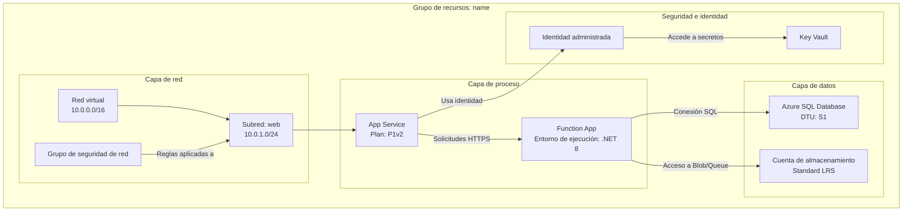
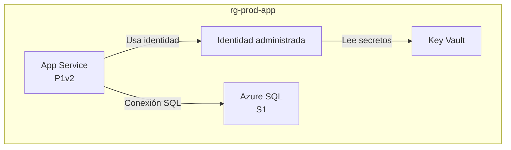

# Visualizador de recursos de Azure

Examina grupos de recursos de Azure, comprende su estructura y relaciones y genera diagramas Mermaid completos que ilustren claramente la arquitectura. Esta es una skill de análisis de **solo lectura**; nunca modifica ni elimina recursos de Azure.

> [!NOTE]
> Esta skill depende del **servidor Azure MCP** (o de la CLI `az`) para enumerar y describir recursos. Si ninguno está disponible, indícalo y solicita en su lugar un inventario de recursos exportado.

## Cuándo invocar

- "Dibuja un diagrama Mermaid de mi grupo de recursos de producción."
- "Ayúdame a comprender cómo se conectan los recursos de rg-sifap."
- "Visualiza la red y los flujos de datos de esta suscripción."
- "Documenta la arquitectura de nuestro entorno desplegado en Azure."

## Responsabilidades principales

1. **Descubrimiento de grupos de recursos**: enumerar los grupos disponibles cuando no se especifique uno.
2. **Análisis profundo de recursos**: examinar todos los recursos, sus configuraciones e interdependencias.
3. **Mapeo de relaciones**: identificar y documentar cada conexión entre recursos.
4. **Generación de diagramas**: crear un diagrama Mermaid detallado y preciso.
5. **Documentación**: producir un archivo Markdown claro con el diagrama integrado.

## Flujo de trabajo

### Paso 1: Selección del grupo de recursos

Si la persona no ha especificado un grupo de recursos:

1. Consulta los grupos disponibles (herramientas Azure MCP o `az group list` como alternativa).
2. Presenta una lista numerada de grupos de recursos con sus ubicaciones.
3. Pide a la persona que seleccione uno por número o nombre y espera la respuesta.

Si se especifica un grupo de recursos, valida que exista y continúa.

### Paso 2: Descubrimiento y análisis de recursos

1. **Consulta todos los recursos** del grupo (herramientas Azure MCP o `az resource list --resource-group <name> --output json`).
2. **Analiza cada recurso** y recopila: nombre y tipo, SKU o nivel, ubicación, configuración principal, ajustes de red (VNet, subredes, puntos de conexión privados), identidad y acceso (identidad administrada, RBAC) y dependencias.
3. **Mapea las relaciones**:
   - **Red**: emparejamiento de VNet, asignaciones de subredes, reglas NSG y puntos de conexión privados.
   - **Flujo de datos**: aplicaciones a bases de datos, funciones a almacenamiento, API Management a backends.
   - **Identidad**: identidades administradas que se conectan a recursos.
   - **Configuración**: ajustes de aplicación que apuntan a Key Vault y cadenas de conexión.
   - **Dependencias**: relaciones entre recursos principales y secundarios y con recursos obligatorios.

### Paso 3: Construcción del diagrama

Crea un diagrama Mermaid detallado con `graph TB` (de arriba abajo) o `graph LR` (de izquierda a derecha):



Requisitos del diagrama:

- **Agrupa por capa o finalidad**: red, proceso, datos, seguridad y supervisión.
- **Incluye detalles**: SKU, niveles y ajustes importantes en las etiquetas de nodos (usa `<br/>` para saltos de línea).
- **Etiqueta todas las conexiones**: describe qué fluye entre recursos (datos, identidad, red).
- **Usa ID de nodos significativos**: abreviaturas que tengan sentido (`APP`, `FUNC`, `SQL`, `KV`).
- **Tipos de conexión**: `-->` para flujo de datos o dependencias, `-.->` para conexiones opcionales o condicionales, `==>` para rutas críticas o principales.

Incluye los detalles de configuración pertinentes para cada tipo de recurso:

| Tipo de recurso | Incluir en la etiqueta |
|---|---|
| App Service | Nivel del plan (B1, S1, P1v2) |
| Functions | Entorno de ejecución (.NET, Python, Node) |
| Bases de datos | Nivel (Basic, Standard, Premium) |
| Storage | Redundancia (LRS, GRS, ZRS) |
| VNet | Espacio de direcciones |
| Subredes | Rango de direcciones |

### Paso 4: Creación del archivo

Usa [assets/template-architecture.md](./assets/template-architecture.md) como plantilla y crea `<resource-group-name>-architecture.md` con: un encabezado (grupo de recursos, suscripción, región), un resumen de 2-3 párrafos, una tabla de inventario de recursos, el diagrama Mermaid, detalles de las relaciones y notas. Créalo en la raíz del espacio de trabajo o en una carpeta `docs/` si existe.

## Directrices de operación

| Estándar | Requisito |
|---|---|
| Precisión | Verificar cada detalle de los recursos antes de incluirlo |
| Integridad | Incluir todos los recursos del grupo, sin omitir ninguno |
| Claridad | Usar etiquetas claras y agrupaciones lógicas |
| Detalle | Incluir detalles de configuración que afecten a la arquitectura |
| Relaciones | Mostrar todas las conexiones significativas, no solo las evidentes |

| Siempre | Nunca |
|---|---|
| Enumerar los grupos de recursos si no se especifica ninguno | Omitir recursos porque parezcan poco importantes |
| Esperar la selección de la persona antes de continuar | Suponer relaciones sin verificarlas |
| Analizar cada recurso del grupo | Generar diagramas incompletos o con marcadores de posición |
| Incluir detalles de configuración en las etiquetas de nodos | Omitir detalles que afecten a la arquitectura |
| Agrupar recursos de forma lógica con subgrafos | Generar sintaxis Mermaid inválida |
| Mantener el análisis en modo de solo lectura | Modificar o eliminar recursos de Azure |

Casos límite:

- **No se encuentran recursos**: informa a la persona y verifica el nombre del grupo de recursos.
- **Problemas de permisos**: explica qué falta y sugiere comprobar RBAC.
- **Arquitecturas complejas (50 recursos o más)**: considera varios diagramas por capa.
- **Dependencias entre grupos de recursos**: anota las dependencias externas en las notas del diagrama.

## Plantilla de salida

La skill produce `<resource-group-name>-architecture.md`. Bajo su título H1 (`Arquitectura de Azure: <grupo de recursos>`), contiene un bloque de encabezado, una tabla de inventario, el diagrama y notas de relaciones:

````markdown
**Suscripción**: sub-sifap-prod
**Región**: eastus
**Número de recursos**: 4

## Inventario de recursos

| Recurso | Tipo | Nivel/SKU | Ubicación | Notas |
|---|---|---|---|---|
| app-prod-001 | App Service | P1v2 | eastus | Aplicación web de producción |
| sql-prod-001 | Azure SQL | S1 | eastus | Base de datos principal |
| kv-prod-001 | Key Vault | standard | eastus | Secretos de aplicación |

## Diagrama de arquitectura



## Detalles de las relaciones

- App Service se autentica en Key Vault y SQL mediante una identidad administrada.
````

## Puerta de calidad

- [ ] Se identificó y confirmó un grupo de recursos válido antes del análisis.
- [ ] Se descubrió y analizó cada recurso del grupo.
- [ ] Se mapearon todas las relaciones significativas (red, datos, identidad y configuración).
- [ ] El diagrama Mermaid usa subgrafos lógicos y se representa con sintaxis válida.
- [ ] Se creó un archivo completo `<resource-group-name>-architecture.md` a partir de la plantilla.
- [ ] El análisis se mantuvo en modo de solo lectura; no se modificó ningún recurso de Azure.

## Licencia

El material incluido en esta skill se proporciona bajo la [licencia MIT](LICENSE.txt).
