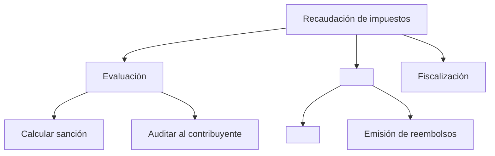

# Mapa de capacidades

## Cuándo invocar

- "Crea un mapa de capacidades para el dominio identificado por el equipo."
- "¿Dónde se solapan las responsabilidades de dos equipos?"
- "¿Qué capacidades son esenciales y cuáles son genéricas?"

## Concepto

Una **capacidad** describe *qué* hace el negocio, no *cómo* lo hace. Las capacidades se mantienen estables durante décadas, mientras que las aplicaciones y los procesos cambian con frecuencia.

## Estructura (3 niveles)

- **L1**: Área de negocio de nivel superior (por ejemplo, "Recaudación de impuestos" o "Atención al cliente").
- **L2**: Subfunciones principales identificadas por el equipo.
- **L3**: Capacidades específicas confirmadas mediante evidencia.

Regla orientativa: 8-12 capacidades L1 para una empresa mediana.

## Pasos

1. **Empieza por los resultados**, no por el organigrama. "¿Qué hace este negocio por sus clientes?"
2. **Descompón de arriba abajo** hasta L3. Detente cuando una capacidad corresponda a un único responsable.
3. **Clasifica cada capacidad**:

- **Esencial**: diferenciadora; desarrollar internamente.
- **De apoyo**: necesaria; comprar o configurar.
- **Genérica**: no diferenciadora; externalizar o utilizar SaaS.

4. **Añade los sistemas al mapa**: identifica qué aplicaciones proporcionan cada capacidad L3. Busca:

- Duplicaciones (dos sistemas que hacen lo mismo)
- Carencias (una capacidad sin responsable)
- Monolitos (un sistema que abarca muchas capacidades L1)

5. **Añade la inversión al mapa**: compara dónde se destina el dinero con dónde se genera la diferenciación.

## Ejemplo de Mermaid



## Plantilla de salida

```markdown
## Mapa de capacidades - <Dominio>

### L1: <Área superior>
#### L2: <Subfunción>
- **<Capacidad L3>** [Esencial|De apoyo|Genérica]
 - Responsable: <equipo>
 - Sistemas: <app1>, <app2>
 - Madurez: 1-5
 - Inversión: $$$
```

## Puerta de calidad

- [ ] Cada capacidad L3 tiene exactamente un responsable.
- [ ] Cada capacidad L3 se clasifica como Esencial, De apoyo o Genérica.
- [ ] Cada capacidad L3 se relaciona con los sistemas que la proporcionan.
- [ ] Las duplicaciones, carencias y monolitos se señalan para su seguimiento.
