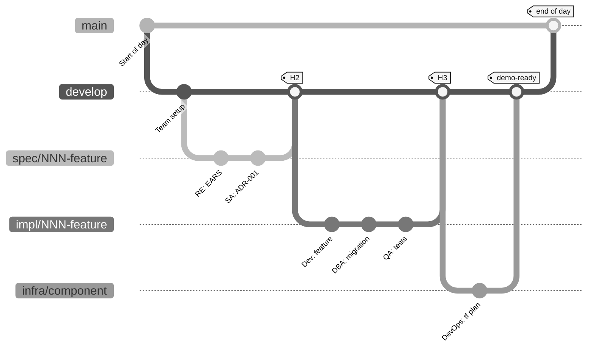

# Flujo de trabajo Git del equipo: cada persona en su propia rama

> **Ruta:** [Kit del equipo](README.md) › **Flujo de Git**

**Guía completa de Git para la inmersión: ramas, commits, pull requests y transiciones entre parejas.**

  

| Campo | Valor |
|---|---|
| **Público objetivo** | Todo el equipo, especialmente quienes nunca han usado una rama por funcionalidad |
| **Prerrequisitos** | Git instalado, repositorio clonado y `develop` creado |
| **Tiempo estimado** | 10 minutos de lectura |
| **Resultado esperado** | Saber crear una rama, registrar un commit, abrir una PR y entregar el trabajo |

---

## Ramas de idiomas y ramas de integración

El kit publicado mantiene `main` como rama predeterminada en inglés y `develop` como rama de integración en inglés.
Las ramas permanentes `portugues-br` y `espanol` contienen la documentación y la prosa de las primitivas de Copilot (agentes, prompts, instrucciones, skills y hooks) en portugués de Brasil y español, respectivamente, no trabajo de funcionalidades.
Usa el [selector de idiomas](README.md#idiomas-del-repositorio) para abrir cualquiera de las tres ediciones.

Las ramas de funcionalidades siguen el flujo `develop` -> `main` descrito a continuación. Las integraciones en `main` requieren CI aprobada y al menos una revisión por pares.
Para una corrección compartida, integra el cambio en inglés mediante `develop` y después traslada y traduce el cambio pertinente a `portugues-br` y `espanol`.
Mantén las correcciones específicas de un idioma en su rama de idioma. Nunca integres el árbol completo de documentación en portugués o español en `main` ni en `develop`.

## Qué significa cada concepto (referencia rápida)

| Concepto de Git | Significado práctico |
|---|---|
| `main` | Versión estable, lista para la demo; protegida contra pushes directos |
| `develop` | Versión integrada del día; punto de partida de las ramas nuevas |
| `spec/<NNN>-<feature>` | Rama donde trabajas durante la Etapa 2 |
| `git commit` | Guarda una versión local (solo tú puedes verla) |
| `git push` | La envía a GitHub (los compañeros pueden verla) |
| **Pull Request (PR)** | Solicita una revisión antes de integrar tu rama en `develop` |
| `git merge` | Integra tu rama en `develop` después de aprobarse la revisión |
| **CI en verde** | El pipeline de integración continua se aprobó; obligatorio antes de integrar |
| **CI en rojo** | Algo falló: corrígelo antes de integrar |
| **Conflicto de integración** | Dos ramas modificaron la misma sección y debes resolverlo manualmente |

---

## Árbol de ramas del día (visual)



---

## Cómo nombrar tu rama (convención por persona)

| Quién | Etapa | Prefijo de rama | Origen | Ejemplo |
|---|---|---|---|---|
| RE + SA | 2 - Especificación | `spec/<NNN>-<feature>` | `develop` | `spec/001-calculo-beneficio` |
| Dev + DBA | 3 - Implementación | `impl/<NNN>-<feature>` | `develop` | `impl/001-calculo-beneficio` |
| QA | 3 - Pruebas | `impl/<NNN>-<feature>` | `develop` | `impl/001-calculo-beneficio` |
| DevOps | 4 - Infraestructura | `infra/<componente>` | `develop` | `infra/azure-postgres` |
| Redactor Técnico | Transversal | `docs/<topico>` | `develop` | `docs/glossario-sifap` |
| Modo Agent | 4 - Delegación | `agent/<issue-NN>` | `develop` | `agent/issue-42` |

> [!IMPORTANT]
> El flujo es `spec/<NNN>-<feature>` -> `develop` -> `main`. No existe una rama `stage`.
> Cada rama `impl/<NNN>-<feature>` parte de `develop`, nunca de `spec/*`.

> [!TIP]
> Patrón de mensaje de commit: cita siempre el REQ-ID o la Issue. Ejemplo: `feat: Implements REQ-XXX: describes the behavior`.

---

## Secuencia de integración: paso a paso

### Paso 1: crea tu rama desde `develop`

- [ ] **Actualiza `develop` y crea la rama.**

```bash
git checkout develop && git pull        # actualiza el punto de partida
git checkout -b spec/001-feature-name  # crea tu rama
```

### Paso 2: trabaja (crea un commit después de cada avance significativo)

- [ ] **Crea commits con frecuencia: una idea por commit.**

```bash
git add .
git commit -m "Implements REQ-XXX: behavior"
git push -u origin spec/001-feature-name   # lo envía a GitHub
```

> [!NOTE]
> Crea commits pequeños y frecuentes. Cada commit = una idea. No acumules cinco horas de trabajo en un solo commit.

### Paso 3: abre una PR hacia `develop`

- [ ] **Abre la pull request.**

```bash
gh pr create \
  --base develop \
  --head spec/001-feature-name \
  --title "spec/001: feature name" \
  --body "Implements REQ-XXX.

  ## What changes
  - EARS spec
  - Team-recorded decisions

  ## Source legacy
  - <legacy-file:lines>

  ## How to test
  - See the 'acceptance' section for each REQ-ID"
```

### Paso 4: se ejecuta la CI

- [ ] **Comprueba el estado de la CI en la PR.**
- CI en verde -> pasa al Paso 5
- CI en rojo -> lee el error, corrígelo, crea un nuevo commit y espera a que la CI se ejecute de nuevo

### Paso 5: la siguiente pareja receptora revisa

| Estás en la pareja... | Quién revisa tu PR |
|---|---|
| 1 (Visión) | Pareja 2 (Arquitectura) |
| 2 (Arquitectura) | Pareja 3 (Implementación) |
| 3 (Implementación) | Pareja 4 (Calidad) |
| 4 (Calidad) | Pareja 5 (Operaciones) |
| 5 (Operaciones) | Pareja 1 (Visión) |

### Paso 6: integra en `develop`

- [ ] **Integra después de la aprobación.** Haz clic en **"Merge pull request"** en GitHub (o usa `gh pr merge`). Usa **squash merge** para mantener limpio el historial.

### Paso 7: al final de la etapa, el líder abre la PR `develop -> main`

- [ ] **El líder abre la PR de integración.** Solo el líder del equipo realiza esta integración. Es el punto de control de cada etapa.

---

## Las cinco reglas de oro

> [!IMPORTANT]
> **Sin excepciones.**
>
> 1. Nunca crees commits directamente en `main`. Pasa siempre por una PR.
> 2. Nunca uses `git push --force` en una rama compartida. Usa `--force-with-lease` solo si es absolutamente necesario.
> 3. Cada mensaje de commit cita el REQ-ID: `feat: Implements REQ-XXX: ...`.
> 4. Con CI en rojo no se integra. Corrige primero.
> 5. Una PR sin descripción no se integra. Describe *qué* cambió y *por qué*.

---

## Plantillas de mensajes de commit

Copia y pega; después adapta el REQ-ID y la descripción.

```bash
# Funcionalidad nueva que implementa un REQ-ID
git commit -m "feat: Implements REQ-XXX (behavior)"

# Corrección de error
git commit -m "fix: corrects behavior for REQ-XXX"

# Documentación
git commit -m "docs: records ADR-XXXX"

# Pruebas
git commit -m "test: covers acceptance criteria for REQ-XXX"

# Migración de base de datos
git commit -m "db: V2__feature_change (REQ-XXX)"

# Refactorización sin cambio de comportamiento
git commit -m "refactor: extracts component (keeps REQ-XXX)"

# Configuración / build / CI
git commit -m "chore: adds spec-quality.yml workflow"

# Modo Agent (Etapa 4)
git commit -m "agent: PR #42 - implements REQ-XXX"
```

**Reglas de los mensajes:**

- La primera línea tiene como máximo 72 caracteres
- Empieza con un tipo: `feat:` `fix:` `docs:` `test:` `db:` `refactor:` `chore:` `agent:`
- Cita el REQ-ID cuando corresponda
- No uses `wip` ni `temp`: usa solo commits con un significado claro

---

## Minitutorial para quienes nunca han usado Git

Si hoy es tu primer contacto con Git, realiza esta preparación de cinco minutos:

- [ ] **Comprueba el estado del repositorio.**

```bash
# 1. Comprueba dónde estás
git status

# 2. Comprueba en qué rama estás
git branch --show-current

# 3. Actualiza develop
git checkout develop
git pull

# 4. Crea tu primera rama
git checkout -b docs/meu-primeiro-commit

# 5. Edita un archivo
echo "# Hello world" >> docs/playground.md

# 6. Comprueba qué cambió
git diff
git status

# 7. Guárdalo (commit)
git add docs/playground.md
git commit -m "docs: first commit"

# 8. Envíalo a GitHub
git push -u origin docs/meu-primeiro-commit

# 9. Abre una PR
gh pr create --base develop --title "docs: first commit" --body "Warm-up"
```

Si completas los nueve pasos, **sabes suficiente Git para la inmersión**. Todo lo demás es una variación de los mismos comandos.

---

## Comandos de emergencia

| Situación | Comando |
|---|---|
| Creé un commit en `develop` sin crear una rama | `git reset --soft HEAD~1 && git stash && git checkout -b nova-branch && git stash pop` |
| El rebase se atascó | `git rebase --abort` (no hay problema, empieza de nuevo sin el rebase pendiente) |
| Conflicto de integración | Abre el archivo, busca `<<<<<<<`, elige las líneas correctas, `git add <file> && git rebase --continue` |
| Eliminé una rama por error | `git reflog` -> encuentra el SHA -> `git checkout -b name SHA` |
| Quiero descartar cambios sin commit | `git restore .` |
| Todo salió mal y quiero volver 30 minutos atrás | **Detente. Llama al Líder Técnico. No lo intentes a solas.** |

---

## Definición de terminado: manejas Git con confianza cuando...

- [ ] Sabes crear una rama desde `develop`
- [ ] Creas commits pequeños (una idea por commit) con el REQ-ID en el mensaje
- [ ] Sabes hacer `git push` de tu rama
- [ ] Sabes abrir una PR con `gh pr create` o en el sitio web de GitHub
- [ ] Sabes leer el estado de la CI en la PR (verde/rojo)
- [ ] Sabes quién revisa tu PR (la siguiente pareja)
- [ ] Sabes pedir ayuda antes de intentar `--force`

---

## Para profundizar

- [`00-SETUP.md`](00-SETUP.md) - pasos 3 y 4 sobre protección de ramas
- [`00-TEAM-FLOW.md`](00-TEAM-FLOW.md) - las tres transiciones (H1, H2, H3) entre parejas
- [`docs/persona-agent-matrix.md`](docs/persona-agent-matrix.md) - quién depende de quién
- [GitHub: documentación de gh CLI](https://cli.github.com/manual/)

---

### Sigue leyendo

| Anterior | Siguiente |
|---|---|
| [Flujo del equipo](00-TEAM-FLOW.md)<br/><sub>Cronograma del día, transiciones, regla de los 20 minutos y definición de terminado.</sub> | [Etapa 1: arqueología](01-archaeology/GUIDE.md)<br/><sub>Leer el sistema heredado y catalogar reglas de negocio.</sub> |

<sub>[Volver al índice del kit](README.md)</sub>
