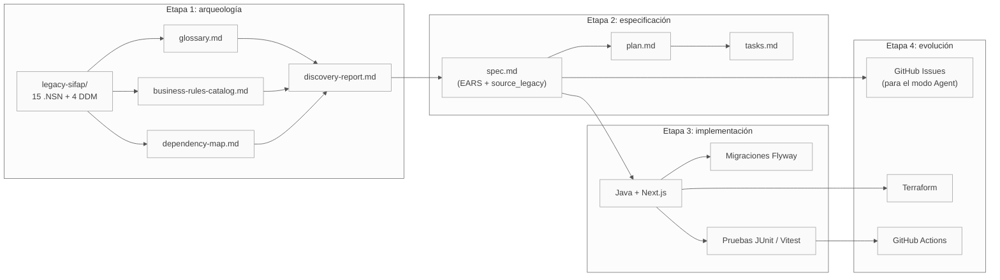

# Mapa del sitio: mapa visual del kit

> **Ruta:** [Kit del equipo](README.md) › **Mapa del sitio**

**Mapa de navegación completo del kit:** dónde reside cada archivo, cómo fluyen los artefactos entre etapas y qué ruta debe seguir cada persona en la inmersión del Sistema de Fiscalización y Administración de Pagos (SIFAP).

 

---

## Descripción general: flujo de las cuatro etapas

```mermaid
%%{init: {'theme':'neutral','themeVariables':{'fontFamily':'ui-sans-serif, system-ui, sans-serif','primaryColor':'#F5F5F5','primaryTextColor':'#171717','primaryBorderColor':'#171717','lineColor':'#525252','secondaryColor':'#FFFFFF','tertiaryColor':'#FAFAFA','background':'#FFFFFF'}}}%%
flowchart LR
    classDef step fill:#F5F5F5,stroke:#171717,color:#171717
    classDef handoff fill:#FFFFFF,stroke:#525252,color:#171717
    classDef result fill:#FFFFFF,stroke:#171717,color:#171717,stroke-width:2px

    E1["Etapa 1<br/>Arqueología<br/>@archaeologist"]:::step
    H1["Transición H1<br/>5 min"]:::handoff
    E2["Etapa 2<br/>Especificación<br/>@architect"]:::step
    H2["Transición H2<br/>5 min"]:::handoff
    E3["Etapa 3<br/>Implementación<br/>@builder"]:::step
    H3["Transición H3<br/>5 min"]:::handoff
    E4["Etapa 4<br/>Evolución<br/>@evolution"]:::step
    R["SIFAP 2.0<br/>en ejecución"]:::result

    E1 --> H1 --> E2 --> H2 --> E3 --> H3 --> E4 --> R
```

---

## Estructura ordenada del repositorio

| Prefijo | Carpeta / archivo | Cuándo leerlo |
|---|---|---|
| **00** | [`README.md`](README.md) | Primera visita: descripción general de la inmersión |
| **00** | [`00-START-HERE.md`](00-START-HERE.md) | Recorrido de 15 minutos para cualquier persona |
| **00** | [`00-SETUP.md`](00-SETUP.md) | Configurar el portátil y Copilot |
| **00** | [`00-TEAM-FLOW.md`](00-TEAM-FLOW.md) | Cronograma canónico del día |
| **00** | [`00-SITEMAP.md`](00-SITEMAP.md) | Este archivo |
| **00** | [`00-GIT-WORKFLOW.md`](00-GIT-WORKFLOW.md) | Ramas, PR e integraciones |
| **01** | [`01-archaeology/`](01-archaeology/) | Etapa 1 - leer el SIFAP heredado |
| **01** | [`01-archaeology/legacy-sifap/`](01-archaeology/legacy-sifap/) | 15 programas `.NSN` + cuatro DDM + documentación histórica |
| **02** | [`02-modern-spec/`](02-modern-spec/) | Etapa 2 - EARS, ADR y C4 |
| **03** | [`03-implementation/`](03-implementation/) | Etapa 3 - Java + Next.js + pruebas |
| **04** | [`04-evolution/`](04-evolution/) | Etapa 4 - modo Agent + Terraform |
| **05** | [`05-personas/`](05-personas/) | 10 personas (elige dos: tu pareja) |
| **06** | [`06-stage-agents/`](06-stage-agents/) | Cuatro agentes de Copilot (uno por etapa) |
| **07** | [`07-concepts/`](07-concepts/) | Conceptos fundamentales: EARS, ADR, SDD y agentes |
| **09** | [`09-cheat-sheets/`](09-cheat-sheets/) | Fichas de referencia rápida (una página cada una) |
| `docs/` | [`docs/`](docs/) | Preguntas frecuentes, solución de problemas, runbook y STATUS |
| `assets/` | [`assets/`](assets/) | SVG y diagramas |
| `specs/` | [`specs/`](specs/) | Artefactos de Spec-Kit creados por el equipo durante la inmersión |

---

## Primitivas de Copilot en `.github/`

El kit incluye cuatro tipos de primitivas de Copilot. Cada uno tiene un índice legible para las personas; Copilot carga automáticamente los archivos correspondientes.

| Primitiva | Índice | Qué contiene |
|---|---|---|
| Instrucciones | [`.github/instructions/README.md`](.github/instructions/README.md) | Reglas `*.instructions.md` delimitadas por ruta y aplicadas mediante el patrón glob `applyTo` |
| Prompts | [`.github/prompts/README.md`](.github/prompts/README.md) | Tareas `*.prompt.md` invocables mediante comandos de barra para los agentes de etapa y de persona |
| Skills | [`.github/skills/README.md`](.github/skills/README.md) | 43 capacidades `SKILL.md` cargadas automáticamente según su `description` |
| Agentes | [`.github/agents/README.md`](.github/agents/README.md) | 17 agentes invocables con `@` en dos capas (etapa + persona) |

---

## Contenido de `07-concepts/`

| Archivo | Contenido |
|---|---|
| [`00-README.md`](07-concepts/00-README.md) | Índice y descripción general de la carpeta |
| [`01-spec-driven-development.md`](07-concepts/01-spec-driven-development.md) | Qué es el desarrollo guiado por especificaciones y por qué se usa en la inmersión |
| [`02-agents-and-personas.md`](07-concepts/02-agents-and-personas.md) | Diferencia entre agentes de etapa y personas individuales |
| [`03-visual-glossary.md`](07-concepts/03-visual-glossary.md) | Glosario con más de 30 términos del dominio |
| [`04-3-copilot-modes.md`](07-concepts/04-3-copilot-modes.md) | Ask, Plan y Agent - cuándo usar cada modo |
| [`05-ears-notation.md`](07-concepts/05-ears-notation.md) | Notación EARS para requisitos sin ambigüedades |
| [`06-architecture-decision-records.md`](07-concepts/06-architecture-decision-records.md) | ADR - qué son, cómo escribirlos y plantilla |

---

## Flujo de artefactos entre etapas

> Cómo leerlo: flecha = dependencia. El artefacto de destino depende del artefacto de origen para crearse con calidad.

---

## Ruta recomendada por persona

| Eres... | Empieza por... | Después... | Después... |
|---|---|---|---|
| **Cualquier persona, primera visita** | [00-START-HERE.md](00-START-HERE.md) | [00-TEAM-FLOW.md](00-TEAM-FLOW.md) | tu `PERSONA.md` |
| **Líder del equipo** | [00-SETUP.md](00-SETUP.md) | [00-TEAM-FLOW.md](00-TEAM-FLOW.md) | [docs/CHECKLIST-LIDER.md](docs/CHECKLIST-LIDER.md) |
| **PO o RE (Pareja 1)** | [05-personas/01-product-owner/PERSONA.md](05-personas/01-product-owner/PERSONA.md) | [01-archaeology/GUIDE.md](01-archaeology/GUIDE.md) | [02-modern-spec/GUIDE.md](02-modern-spec/GUIDE.md) |
| **EA o SA (Pareja 2)** | [05-personas/03-enterprise-architect/PERSONA.md](05-personas/03-enterprise-architect/PERSONA.md) | [02-modern-spec/ADR-TEMPLATE.md](02-modern-spec/ADR-TEMPLATE.md) | [02-modern-spec/GUIDE.md](02-modern-spec/GUIDE.md) |
| **TL o Dev (Pareja 3)** | [05-personas/06-developer/PERSONA.md](05-personas/06-developer/PERSONA.md) | [03-implementation/GUIDE.md](03-implementation/GUIDE.md) | - |
| **DBA o QA (Pareja 4)** | [05-personas/07-dba/PERSONA.md](05-personas/07-dba/PERSONA.md) | [03-implementation/GUIDE.md](03-implementation/GUIDE.md) | - |
| **DevOps o TW (Pareja 5)** | [05-personas/09-devops-engineer/PERSONA.md](05-personas/09-devops-engineer/PERSONA.md) | [04-evolution/GUIDE.md](04-evolution/GUIDE.md) | - |
| **No sabes leer Natural** | [01-archaeology/legacy-sifap/HOW-TO-READ-NATURAL.md](01-archaeology/legacy-sifap/HOW-TO-READ-NATURAL.md) | [01-archaeology/GUIDE.md](01-archaeology/GUIDE.md) | (tu persona) |
| **Encontraste un término extraño** | [07-concepts/03-visual-glossary.md](07-concepts/03-visual-glossary.md) | (vuelve al punto de partida) | - |

---

## Si te perdiste

1. **¿No sabes en qué etapa estás?** Consulta [`00-TEAM-FLOW.md`](00-TEAM-FLOW.md), en la sección del cronograma.
2. **¿No sabes qué hace tu persona?** Abre la descripción general de las personas: [`05-personas/OVERVIEW.md`](05-personas/OVERVIEW.md).
3. **¿No sabes qué entregar?** Abre el `GUIDE.md` de la etapa actual y busca la sección "Cómo saber que terminaste (DoD)".
4. **¿Encontraste un término extraño?** Consulta [`07-concepts/03-visual-glossary.md`](07-concepts/03-visual-glossary.md).
5. **¿Hubo un problema técnico?** Consulta [`docs/troubleshooting.md`](docs/troubleshooting.md).
6. **¿Llevas más de 20 minutos sin poder avanzar?** Avisa a la persona facilitadora. La regla está descrita en [`00-TEAM-FLOW.md`](00-TEAM-FLOW.md).

---

### Sigue leyendo

| Anterior | Siguiente |
|---|---|
| [Kit del equipo](README.md) Descripción general de la inmersión y punto de entrada principal. | [00 - Empieza aquí](00-START-HERE.md) Recorrido inicial de 15 minutos para cualquier persona. |

[Volver al índice del kit](README.md)
