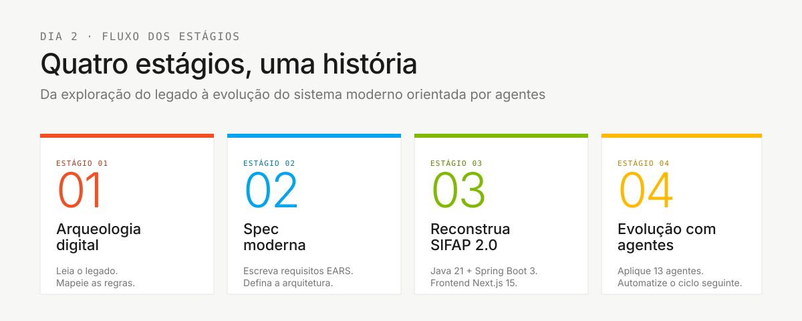
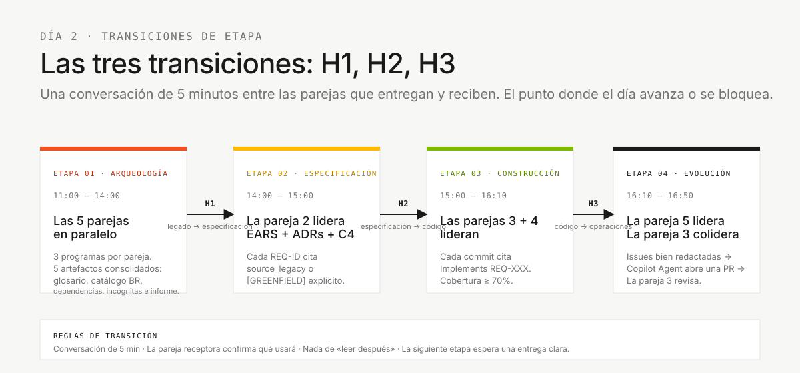

# Flujo del equipo: cómo cinco integrantes cubren 10 personas

> **Ruta:** [Kit del equipo](README.md) › **Flujo del equipo**

**Mantén este documento fijado en tu pantalla durante toda la inmersión.** Responde a las cuatro preguntas esenciales: qué fase del SDLC lideran tus personas, quién aporta las entradas de tu trabajo, quién recibe tu entrega y cuándo pedir ayuda.

  

| Campo | Valor |
|---|---|
| **Público objetivo** | Todos los participantes de la inmersión |
| **Prerrequisitos** | Leer este documento antes de las fichas de personas |
| **Tiempo estimado** | 10 minutos |
| **Resultado esperado** | Sabes qué hace cada pareja, cuándo lo hace y quién recibe el trabajo después |

---

## Dónde encaja en el SDLC



Las cinco parejas trabajan **en paralelo dentro de cada etapa** y el liderazgo cambia a medida que avanza el SDLC. Las tres transiciones entre etapas (**H1** legado -> especificación, **H2** especificación -> código, **H3** código -> operaciones) son los puntos en los que el día fluye o se atasca. Nadie se queda inactivo. Nadie repite trabajo.

---

## 1. Las cinco parejas y sus fases del SDLC

Cada integrante elige **una pareja** (dos personas). Las dos personas de una pareja comparten la responsabilidad del trabajo. No hay una transición interna entre ellas. Colaboran continuamente.

| # | Pareja | Personas | Fase del SDLC que lidera |
|---|---|---|---|
| 1 | **Visión** | Responsable de Producto + Especialista en Requisitos | Descubrimiento + Especificación |
| 2 | **Arquitectura** | Arquitecto Empresarial + Arquitecto de Software | Especificación + Diseño |
| 3 | **Implementación** | Líder Técnico + Desarrollador | Implementación + Evolución |
| 4 | **Calidad** | DBA + Ingeniero de Calidad | Implementación (datos + pruebas) |
| 5 | **Operaciones** | Ingeniero DevOps + Redactor Técnico | Transversal + Evolución |

> Los kits de personas residen juntos en [`05-personas/`](05-personas/) como referencia de los roles. Los artefactos activos ya están consolidados en `.github/`: lee el `PERSONA.md` de tu rol y valida los agentes, prompts y skills en la raíz del repositorio.


### Distribución sugerida dentro de cada pareja

| Pareja | Enfoque de la persona A | Enfoque de la persona B |
|---|---|---|
| 1 - Visión | **PO**: alcance, valor, prioridades y narrativa de la demo | **RE**: requisitos EARS, criterios de aceptación y REQ-ID |
| 2 - Arquitectura | **EA**: dependencias externas y decisiones de alcance | **SA**: límites y plan técnico de la porción seleccionada |
| 3 - Implementación | **TL**: estándares, revisión de PR y orquestación de agentes | **Dev**: código Java + TypeScript y pruebas unitarias |
| 4 - Calidad | **DBA**: esquema PostgreSQL y migraciones Flyway | **QA**: escenarios BDD, puertas de cobertura y pruebas de contrato |
| 5 - Operaciones | **DevOps**: Terraform, GitHub Actions y secretos | **TW**: glosario, revisión de claridad de los ADR, runbook y README |

Rota dentro de la pareja cada ~45 minutos para que nadie monopolice el conocimiento.

---

## 2. Cronograma (8 horas, Día 2, 10:00-18:00)

> [!IMPORTANT]
> La configuración de Copilot, Docker y la clonación del repositorio deben estar listas **antes de las 10:00**. En la mañana del Día 2, a las 10:00, el equipo solo confirma que todo se abre. No instala desde cero. Sin la configuración lista, el cronograma no se cumple.


| Horario | Bloque | Parejas que lideran | Parejas de apoyo |
|---|---|---|---|
| **10:00-10:15** | Apertura + confirmación de parejas | Persona facilitadora | Cada integrante confirma sus dos personas y abre su `PERSONA.md` |
| **10:15-10:45** | Validación de la configuración + kits de personas | Pareja 3 + Pareja 5 | Git, Java/Node, Docker, Spec-Kit `specify version` y Copilot Chat |
| **10:45-11:00** | Orientación rápida sobre el legado | Pareja 1 + Pareja 4 | Descripción general de los 15 programas Natural + cuatro DDM |
| **11:00-12:00** | **Etapa 1** - Arqueología (parte 1) | Las cinco parejas en paralelo | Cada pareja recibe tres programas: descubrimiento + extracción |
| **12:00-13:30** | Almuerzo | - | - |
| **13:30-14:00** | **Etapa 1** - Síntesis + **Transición H1** | La **Pareja 1** consolida evidencia + alcance | La Pareja 5 aclara términos; la Pareja 2 identifica dependencias |
| **14:00-15:00** | **Etapa 2** - Especificación moderna | **Pareja 2** (EA + SA) | La Pareja 1 valida el alcance · La Pareja 5 revisa la claridad · **Transición H2** al final |
| **15:00-16:10** | **Etapa 3** - Implementación | **Pareja 3** (TL + Dev), **Pareja 4** (DBA + QA) | La Pareja 5 prepara la estructura inicial de CI · **Transición H3** al final |
| **16:10-16:50** | **Etapa 4** - Evolución con agentes | **Pareja 5** (DevOps + TW) | La **Pareja 3** escribe Issues y revisa las PR del agente |
| **16:50-17:00** | Margen + preparación de la demo | Todos | Cada equipo ensaya 30 segundos por persona |
| **17:00-17:30** | **Demos de los equipos** (~3 min cada una) | Todo el equipo | El PO lidera · La persona facilitadora controla el tiempo |
| **17:30-17:50** | Retrospectiva | Todos | Mantener / Cambiar / Probar - por persona |
| **17:50-18:00** | Cierre + comentarios finales | Persona facilitadora | - |

> [!NOTE]
> Nadie se queda inactivo. Las parejas que no lideran una etapa siguen teniendo trabajo de apoyo concreto. Véase §4.

---

## 3. Mapa de transiciones



Cada pareja tiene trabajo concreto en cada etapa. Los puntos críticos son las tres transiciones (H1, H2, H3). La regla siempre es la misma: **una conversación en vivo de cinco minutos** entre la pareja que deja una etapa y la que entra en la siguiente.

**Cómo leer el diagrama de transiciones:**

- Las flechas son dependencias que bloquean el avance. Sin `spec.md`, `plan.md` y `tasks.md` de la porción seleccionada, las Parejas 3 y 4 no pueden empezar correctamente.
- Cada transición es una conversación de cinco minutos entre parejas. "Solo lee el documento" no basta. Hablen en vivo.

---

## 4. Qué hace cada pareja en cada etapa

Ninguna pareja se queda inactiva. Incluso cuando no lidera, sigue teniendo trabajo de apoyo explícito.

| Pareja | Etapa 1 (Arqueología) | Etapa 2 (Especificación) | Etapa 3 (Implementación) | Etapa 4 (Evolución) |
|---|---|---|---|---|
| **1 - Visión** | **Lidera.** Extrae reglas; el PO prioriza el alcance. | Valida EARS; aprueba el alcance en H2. | Permanece disponible para aclarar requisitos. Construye la narrativa de la demo. | Ensaya la demo. |
| **2 - Arquitectura** | Mapea evidencia y dependencias relevantes para la porción seleccionada. | **Lidera.** `spec.md`, `plan.md` y `tasks.md`; registra las decisiones que bloquean el avance. | Permanece disponible para preguntas sobre límites; revisa las PR que afectan a contratos. | Valida IaC frente a las decisiones existentes. |
| **3 - Implementación** | Define convenciones (ramas, plantilla de PR, DoD) y la estructura de destino del prototipo. | Comenta la viabilidad; estima la complejidad. | **Lidera.** Código, pruebas e integración. | **Colidera.** Delegación en modo Agent y revisión de PR. |
| **4 - Calidad** | Lee los DDM y planifica el mapeo del esquema. | Comenta las implicaciones para los datos; escribe los primeros escenarios BDD. | **Lidera.** Esquema, migraciones y cobertura de pruebas. | Puerta final de cobertura; pruebas de contrato en CI. |
| **5 - Operaciones** | Construye el glosario y los términos que apoyan la porción seleccionada. | Revisa la claridad y las decisiones de alcance. | Prepara la estructura del pipeline de CI. | **Lidera.** Una delegación pequeña; CI/IaC solo si es relevante. |

---

## 5. Primeros 45 minutos: lista de verificación por pareja

Entre las **10:00 y las 10:45**, **todas las parejas** realizan las mismas cuatro acciones. La especialización empieza después.

- [ ] **Paso 1: lee `00-TEAM-FLOW.md` (este archivo).** (10 min)
- [ ] **Paso 2: lee el `PERSONA.md` de ambos kits en [`05-personas/`](05-personas/).** (15 min)
- [ ] **Paso 3: valida el `.github/` consolidado.** `ls .github/agents .github/prompts .github/instructions .github/skills` - los agentes, prompts, instrucciones y skills ya se incluyen listos. (5 min)
- [ ] **Paso 4: abre Copilot Chat, ejecuta el prompt de prueba de humo y valida las herramientas locales.** (15 min)

### Primera acción de cada pareja en arqueología, a las 11:00

| Pareja | Acción a las 11:00 |
|---|---|
| **1 - Visión** | El PO abre [`00-TEAM-FLOW.md`](00-TEAM-FLOW.md) y el cronograma del día; el RE abre [`01-archaeology/legacy-sifap/natural-programs/`](01-archaeology/legacy-sifap/natural-programs/) e inicia el catálogo de reglas. |
| **2 - Arquitectura** | El EA abre [`01-archaeology/legacy-sifap/legacy-docs/`](01-archaeology/legacy-sifap/legacy-docs/) y registra las dependencias que afectan a la porción seleccionada; el SA prepara preguntas sobre límites. |
| **3 - Implementación** | El TL define la estrategia de ramas, la plantilla de PR, la definición de terminado y las rutas estándar (`backend/`, `frontend/`, `infra/` cuando sea necesario). |
| **4 - Calidad** | El DBA abre [`01-archaeology/legacy-sifap/adabas-ddms/`](01-archaeology/legacy-sifap/adabas-ddms/) e inicia el mapeo de campos; QA prepara la estrategia de pruebas del prototipo que creará el equipo. |
| **5 - Operaciones** | DevOps planifica el trabajo de CI/IaC que el equipo creará en este repositorio; el TW abre la plantilla de [`01-archaeology/glossary.md`](01-archaeology/glossary.md). |

---

## 6. La regla de los 20 minutos

> [!IMPORTANT]
> **Si tú o tu pareja llevan 20 minutos atascados en el mismo problema, deténganse y pidan ayuda.**

La regla se aplica a todos. Pedir ayuda no es una debilidad. Quedarse en silencio e insistir a solas pone en riesgo el cronograma del equipo.

### Escala para pedir ayuda

| Tiempo sin avanzar | Con quién hablar |
|---|---|
| 5 min | Prueba Copilot Chat con otro enfoque o consulta con la persona de tu pareja |
| 10 min | Habla con la pareja inmediatamente anterior o posterior a la tuya (véase §3) |
| 20 min | Habla con la Pareja 3 (el TL coordina al equipo) |
| 30 min | Levanta la mano para llamar a una persona facilitadora (cinta azul) |

### Cómo pedir ayuda (formato de tres líneas)

```text
1. Objetivo: qué intento lograr
2. Intentos: qué he probado ya (y qué ocurrió)
3. Bloqueo: qué me impide avanzar ahora mismo
```

Mal: "Esto no funciona".

Bien: "Objetivo: validar CPF en `BeneficioService`. Intentos: `@CPF` de Bean Validation y validación manual. Bloqueo: necesito confirmar si el Sistema de Fiscalización y Administración de Pagos (SIFAP) acepta CPF de usuarios extranjeros en un formato diferente".

---

## 7. Definición de terminado por transición

### Transición H1: del legado a la especificación (final de la Etapa 1, ~14:00)

**Responsable:** Pareja 1 (Visión)
**Destinatarios:** Pareja 2 (Arquitectura), Pareja 5 (Operaciones)

| Artefacto | Ruta | Terminado significa |
|---|---|---|
| Catálogo de reglas | `01-archaeology/business-rules-catalog.md` | Las reglas candidatas de la porción seleccionada tienen registrada la fuente `.NSN` o `.ddm` |
| Informe de descubrimiento | `01-archaeology/discovery-report.md` | Porción acotada, evidencia y preguntas abiertas para la funcionalidad elegida |
| Materiales de apoyo consultados | `01-archaeology/` | El glosario, las dependencias y los misterios aparecen solo cuando ayudan a explicar la porción seleccionada |

### Transición H2: de la especificación al código (final de la Etapa 2, ~15:00)

**Responsable:** Pareja 2 (Arquitectura)
**Destinatarios:** Pareja 3 (Implementación), Pareja 4 (Calidad)

| Artefacto | Ruta | Terminado significa |
|---|---|---|
| Especificación formal | `specs/<NNN>-<feature>/spec.md` | Funcionalidad acotada con REQ-ID, EARS y `source_legacy:` en cada requisito |
| Plan formal | `specs/<NNN>-<feature>/plan.md` | Las decisiones, los riesgos y el enfoque son suficientes para iniciar la implementación |
| Tareas formales | `specs/<NNN>-<feature>/tasks.md` | El orden de implementación y pruebas está definido para la funcionalidad |
| Decisión de alcance | `02-modern-spec/scope-decisions.md` | El PO confirmó qué entra en el alcance y qué sigue pospuesto |

### Transición H3: del código a operaciones (final de la Etapa 3, ~16:10)

**Responsable:** Pareja 3 (Implementación)
**Destinatarios:** Pareja 5 (Operaciones)

| Artefacto | Ruta | Terminado significa |
|---|---|---|
| Backend funcional | `backend/` | `mvn test` está en verde; OpenAPI está documentado |
| Frontend funcional | `frontend/` | `npm test` está en verde; los flujos principales son utilizables |
| Migraciones | `backend/src/main/resources/db/migration/` | Los scripts Flyway están numerados y son idempotentes (responsabilidad de la Pareja 4) |
| Informe de cobertura | Artefacto de CI | Cobertura de líneas de backend >= 70%, frontend >= 60% (la Pareja 4 lo verifica) |

---

## 8. Patrones de comunicación

| Patrón | Cuándo | Ejemplo |
|---|---|---|
| **Reunión breve de pie** | En cada transición de etapa (4x) | Ronda de dos minutos, una frase por pareja: "Terminamos X, estamos haciendo Y, nos bloquea Z" |
| **Puesta al día de la pareja** | Cada 30 minutos dentro de una etapa | "¿Seguimos los dos alineados?" |
| **Sincronización entre parejas** | Durante las transiciones | Conversación de cinco minutos, sin diapositivas |
| **Comentarios en PR** | De forma asíncrona entre parejas | Menciona explícitamente a la pareja receptora (`@par-3`) |
| **Hora de concentración** | Últimos 30 minutos de la Etapa 3 | Sin reuniones; todos programan o prueban |

---

## 9. Antipatrones: no hagas esto

| Antipatrón | Haz esto en su lugar |
|---|---|
| Una persona de la pareja hace todo | Rota cada ~45 minutos para que la otra persona mantenga la práctica |
| Omitir una transición | Mantén la conversación de cinco minutos entre parejas en cada transición |
| La Pareja 4 (Calidad) espera hasta el final de la Etapa 3 para empezar | La Pareja 4 escribe escenarios BDD en cuanto existen REQ-ID (a mitad de la Etapa 2) |
| La Pareja 5 (Operaciones) se queda inactiva hasta la Etapa 4 | La Pareja 5 lidera el trabajo del glosario en la Etapa 1, la claridad de los ADR en la Etapa 2 y la estructura inicial de CI en la Etapa 3 |
| La Pareja 1 (Visión) desaparece después de la Etapa 1 | El PO valida el alcance en H2 y ensaya la demo en la Etapa 4 |
| La Pareja 3 integra sin revisión | Cada PR recibe al menos una revisión de otra pareja |

---

## 10. Referencia rápida

| Pregunta | Dónde encontrar la respuesta |
|---|---|
| ¿Cuál es mi pareja? | §1 (tabla de las cinco parejas) |
| ¿Qué hace mi pareja en la etapa N? | §4 (matriz pareja x etapa) |
| ¿No puedes avanzar? | Regla de los 20 minutos (§6) |
| ¿Necesito una transición? | Criterios de definición de terminado (§7) |
| ¿Qué modo de Copilot? | `09-cheat-sheets/copilot-3-modes.md` |
| ¿Qué modelo? | `09-cheat-sheets/model-routing.md` |
| ¿Qué comando de Spec-Kit? | `09-cheat-sheets/spec-kit-workflow.md` |

---

### Sigue leyendo

| Anterior | Siguiente |
|---|---|
| [Primeros 15 minutos](00-START-HERE.md)<br/><sub>Recorrido inicial con cinco pasos numerados para que cualquier persona pueda empezar.</sub> | [Configuración](00-SETUP.md)<br/><sub>Configuración del portátil: Git, VS Code, Copilot, Spec-Kit y protección de ramas.</sub> |

<sub>[Volver al índice del kit](README.md)</sub>
