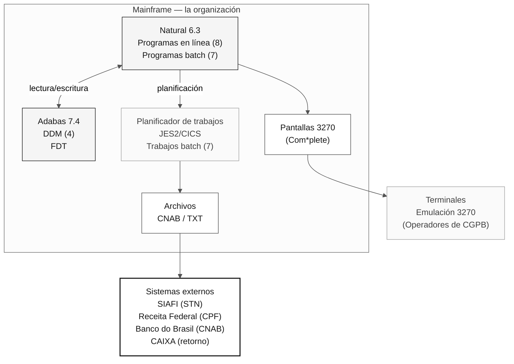

# SIFAP — Sistema de Fiscalización y Administración de Pagos

> **Ruta:** [Kit del equipo](../../README.md) › [Etapa 1](../README.md) › **SIFAP heredado**

**Documentación técnica del sistema heredado SIFAP.** Contiene la historia, la arquitectura, el inventario de programas y las orientaciones de lectura para la Etapa 1 de arqueología.

| Campo | Valor |
|---|---|
| **Público** | Todas las parejas durante la Etapa 1 |
| **Prerrequisitos** | Ninguno: el punto de entrada al sistema heredado |
| **Etapa** | Etapa 1 — Arqueología |
| **Resultado esperado** | Comprender el contexto del sistema antes de abrir los archivos `.NSN` |

  

> **Clasificación:** Documento interno — la organización / SUPDE / DESIF
> **Versión del sistema:** 4.1.2
> **Entorno:** Producción — mainframe de la organización / Oficina Regional de Brasília
> **Lenguaje:** Natural 6.3.12 | Base de datos: Adabas 7.4.3

---

## 1. Propósito del sistema

**SIFAP — el Sistema de Fiscalización y Administración de Pagos** gestiona, controla y fiscaliza los pagos de beneficios sociales administrados por el Gobierno Federal en todo el país.

El sistema atiende las siguientes necesidades operativas:

- **Registro y mantenimiento** de beneficiarios de programas sociales federales;
- **Cálculo y procesamiento** de la nómina mensual;
- **Fiscalización y auditoría** de pagos realizados, incluido el cruce de datos de registro;
- **Generación de archivos de remesa** para las instituciones financieras pagadoras;
- **Conciliación financiera** con SIAFI (Sistema Integrado de Administración Financiera del Gobierno Federal);
- **Emisión de informes de gestión y operativos** para los organismos gestores.

### 1.1. Organismos atendidos

| Sigla | Organismo | Responsabilidad |
| --------- | -------------------------------------------------- | ---------------------------------------------- |
| MDAS | Ministerio de Desarrollo y Asistencia Social | Gestión de programas de transferencia de ingresos |
| SENARC | Secretaría Nacional de Renta de Ciudadanía | Regulación y supervisión de beneficios |
| CGPB | Coordinación General de Procesamiento de Beneficios | Operación directa del procesamiento mensual |
| DEFIS | Departamento de Fiscalización | Auditoría y control de pagos indebidos |
| CGTI/MDAS | Coordinación General de Tecnología de la Información | Interfaz técnica con la organización |

SIFAP es un sistema fundamental para el ciclo de pagos de beneficios y está clasificado como **sistema de misión crítica** por el Comité de Gobernanza de TI de MDAS.

---

## 2. Historia

### 2.1. Cronología

| Año | Evento | Notas |
| -------- | ---------------------------------------------- | ------------------------------------------------------------------------------------------------------------------------------------------------------------------------------------------------------------------- |
| **1997** | Desarrollo inicial de SIFAP | Natural 4.2 / Adabas 6.1. Equipo de ocho analistas de SUPDE/DESIF coordinado por Roberto Meirelles. Plazo original: 14 meses. Entregado en 18 meses. |
| **1998** | Puesta en producción (v1.0) | Módulos CADBENEF, CADPROG y CONSBENF. Registro inicial de 1.2 millones de beneficiarios migrados del sistema anterior (SIPAG/DOS). |
| **1999** | Primera actualización importante (v2.0) | Implementación del procesamiento batch para los ciclos mensuales de pagos. Programas BATCHPGT y BATCHREL. Integración con Banco do Brasil para la remesa de archivos CNAB 240. |
| **2002** | Integración con SIAFI (v2.5) | Módulo de conciliación financiera. Programa BATCHCON para la conciliación automática de órdenes bancarias. Aprobado por STN. |
| **2005** | Migración tecnológica (v3.0) | Actualización a Natural 6.3 / Adabas 7.4. Nuevo módulo de auditoría (RELAUDIT). Creación del DDM AUDIT. Refactorización parcial de los programas de cálculo. |
| **2008** | Iniciativa de documentación técnica | Proyecto de documentación liderado por Fernanda Oliveira (analista de negocio). **Completado parcialmente**: cubre solo los módulos de registro. Los módulos de cálculo y batch siguen sin documentación formal. |
| **2012** | Intento de documentar las reglas de negocio | Iniciativa de CGTI/MDAS. El trabajo de descubrimiento se detuvo tras la jubilación de tres analistas clave. Produjo "RN-SIFAP-2012-parcial.doc" (47 páginas, incompleto). |
| **2015** | Última funcionalidad significativa (v4.0) | Módulo CALCDSCT: cálculo de deducciones legales. Implementado por Marcos Antônio Ferreira, el último programador de Natural con conocimiento completo del sistema. |
| **2018** | Último mantenimiento (v4.1.2) | Correcciones de seguridad (parches de Adabas). Ajuste del manejo de tiempos de espera en BATCHPGT. Actualización de tablas de tramos de deducción. No se añadieron funcionalidades nuevas. |

### 2.2. Nota sobre la continuidad

Desde 2018, SIFAP opera en **modo de mantenimiento mínimo**. No hay funcionalidades nuevas previstas. El contrato de soporte cubre solo correcciones de emergencia y ajustes de tablas de parámetros.

---

## 3. Equipo original

A continuación se enumera el equipo que desarrolló y mantuvo SIFAP a lo largo de los años. **La mayoría de sus integrantes se jubilaron o se trasladaron a otras unidades**, lo que genera un riesgo significativo de pérdida de conocimiento.

| Nombre | Rol | Período | Situación actual |
| ----------------------------- | ----------------------------------------- | --------- | ---------------------------------------------------------------------------------------------------------------------------------------------- |
| Roberto Carlos Meirelles | Analista Sénior de Sistemas (Coordinador) | 1997–2010 | Jubilado (2010). Responsable de la arquitectura original y de las decisiones de modelado de datos. |
| Fernanda Cristina de Oliveira | Analista de Negocio | 1997–2012 | Jubilada (2012). La única persona que documentó parcialmente las reglas de negocio. Autora de "RN-SIFAP-2012-parcial.doc". |
| Marcos Antônio Ferreira | Programador Sénior de Natural | 2001–2017 | Trasladado a SUPDE/DESIN (2017). Último desarrollador con conocimiento completo del código. Implementó CALCDSCT y las refactorizaciones de 2005. |
| Cláudia Regina dos Santos | DBA de Adabas | 1997–2008 | Jubilada (2008). Diseñó los cuatro DDM y las rutinas de copia de seguridad/recuperación. |
| José Aparecido Lima | Programador de Natural | 1997–2005 | Jubilado (2005). Responsable de los módulos batch originales. |
| Patrícia Helena Moura | Analista de Sistemas | 2003–2016 | Trasladada a SUPDE/DEGED (2016). Trabajó en la integración con SIAFI y en el módulo de auditoría. |
| Antônio Carlos Ribeiro | Analista de Soporte / Operación | 1999–2014 | Jubilado (2014). Poseía el conocimiento operativo de la planificación y supervisión batch. |
| Luciana Barbosa de Freitas | Programadora Júnior de Natural | 2010–2018 | Activa en SUPDE/DESIF. Única integrante que permanece en el equipo con algún conocimiento del sistema, aunque limitado a los módulos de consulta. |

> **ADVERTENCIA:** El conocimiento técnico detallado de las reglas de cálculo (CALCBENF, CALCCORR, CALCDSCT) existe **exclusivamente en el código fuente**. No hay documentación funcional actualizada de estos módulos.

---

## 4. Arquitectura del sistema

### 4.1. Descripción general



### 4.2. Capa de programas Natural

Los programas Natural de SIFAP están organizados en la biblioteca Natural **SIFAP** y se dividen en:

- **Programas en línea (interactivos):** se ejecutan mediante emulación de terminal 3270 usando mapas Natural (pantallas). Acceden a ellos los operadores de CGPB y DEFIS.
- **Programas batch:** se ejecutan en un planificador JES2, mensualmente (nómina) o bajo demanda (informes y conciliación).
- **Subprogramas y copycode:** rutinas utilitarias compartidas (validación de CPF, cálculo de dígitos de control y formato de importes).

### 4.3. Base de datos — DDM de Adabas

SIFAP usa cuatro DDM (módulos de definición de datos) en Adabas:

| DDM | Archivo Adabas (FNR) | Descripción | Registros (estimación de 2018) |
| ------------------- | -------------------- | ----------------------------------------------------------------------------------------------------------- | ------------------------------ |
| **BENEFICIARY** | FNR 150 | Registros de beneficiarios: datos personales, documentación, dirección, estado del registro e historial de estados | ~4,200,000 |
| **SOCIAL-PROGRAM** | FNR 151 | Registros de programas sociales: reglas de elegibilidad, tramos de valores y parámetros de cálculo | ~45 (registros de parámetros) |
| **PAYMENT** | FNR 152 | Registros de pagos: importe bruto, deducciones, importe neto, fecha de abono, banco pagador y estado | ~180,000,000 |
| **AUDIT** | FNR 153 | Log de auditoría: acciones de usuarios, modificaciones de registros y eventos de fiscalización | ~25,000,000 |

**Notas de modelado:**

- Los nombres de campos siguen la **convención abreviada de la década de 1990** (por ejemplo, `BN-NM-BENEF` = nombre del beneficiario, `PG-VL-BRUTO` = importe bruto del pago, `AU-DT-OCORR` = fecha del evento de auditoría).
- Los campos de importes usan el formato decimal empaquetado.
- Adabas no gestiona la integridad referencial: toda la validación ocurre en los programas Natural.
- El DDM SOCIAL-PROGRAM contiene campos MU (multivalor) y PE (grupo periódico) para almacenar tramos de valores por ejercicio fiscal.

### 4.4. Procesamiento batch

El ciclo mensual de procesamiento batch sigue esta secuencia:

1. **BATCHPGT** — Procesamiento principal de la nómina (se ejecuta el primer día hábil del mes; ventana batch de cuatro horas)
2. **BATCHCON** — Conciliación con los archivos de retorno de Banco do Brasil / CAIXA
3. **BATCHREL** — Generación de informes de gestión posteriores al procesamiento

**Ventana batch:** de 22:00 a 06:00 (hora de Brasília)
**Tiempo medio de ejecución de BATCHPGT:** 3h20min (referencia: ciclo de febrero de 2018)
**Volumen mensual procesado:** ~3,800,000 pagos

### 4.5. Interfaz del operador

Las pantallas de SIFAP usan **mapas Natural** en formato 3270 (24 filas × 80 columnas), accesibles mediante un emulador de terminal. La navegación usa códigos de transacción (por ejemplo, `SF01` = registro de beneficiarios, `SF05` = consulta, `SF10` = informe de auditoría).

---

## 5. Inventario de programas

### 5.1. Módulo de registro

| Programa | Descripción | Autor | Año | Último cambio | Estado |
| --------- | ------------------------------------------------------- | -------------- | ---- | -------------- | -------- |
| CADBENEF | Registro de beneficiarios: creación, actualización y baja | R. Meirelles | 1997 | 2015 | Producción |
| CADDEPEN | Dependientes vinculados al beneficiario titular | J. A. Lima | 1998 | 2008 | Producción |
| CADPROG | Registro de programas sociales: parámetros y tramos de valores | F. C. Oliveira | 1997 | 2015 | Producción |

### 5.2. Módulo de cálculo

| Programa | Descripción | Autor | Año | Último cambio | Estado |
| -------- | ---------------------------------------------------- | -------------- | ---- | -------------- | -------- |
| CALCBENF | Cálculo del importe del beneficio: reglas por programa/tramo | R. Meirelles | 1998 | 2015 | Producción |
| CALCCORR | Correcciones y reajustes: índices anuales | M. A. Ferreira | 2005 | 2015 | Producción |
| CALCDSCT | Cálculo de deducciones legales (descuentos en nómina, IR) | M. A. Ferreira | 2015 | 2018 | Producción |

### 5.3. Módulo de validación

| Programa | Descripción | Autor | Año | Último cambio | Estado |
| -------- | -------------------------------------------------------- | -------------- | ---- | -------------- | -------- |
| VALBENEF | Validación de datos de registro del beneficiario (CPF, NIS) | R. Meirelles | 1997 | 2005 | Producción |
| VALELEG | Validación de elegibilidad según las reglas del programa | F. C. Oliveira | 1999 | 2012 | Producción |
| VALDOCS | Validación de documentos justificativos: lista de verificación por tipo | P. H. Moura | 2003 | 2008 | Producción |

### 5.4. Módulo batch

| Programa | Descripción | Autor | Año | Último cambio | Estado |
| -------- | ----------------------------------------------------- | ----------- | ---- | -------------- | -------- |
| BATCHPGT | Procesamiento mensual de la nómina: generación de abonos | J. A. Lima | 1999 | 2018 | Producción |
| BATCHREL | Generación de informes batch (totales, resúmenes) | J. A. Lima | 1999 | 2008 | Producción |
| BATCHCON | Conciliación financiera: retorno bancario frente a SIAFI | P. H. Moura | 2002 | 2012 | Producción |

### 5.5. Módulo de consultas e informes

| Programa | Descripción | Autor | Año | Último cambio | Estado |
| -------- | --------------------------------------------------- | -------------- | ---- | -------------- | -------- |
| CONSBENF | Consulta de beneficiarios: pantalla 3270 con filtros | R. Meirelles | 1997 | 2005 | Producción |
| RELPGT | Informe de pagos: por período/programa/UF | P. H. Moura | 2003 | 2012 | Producción |
| RELAUDIT | Informe de auditoría: eventos y discrepancias | M. A. Ferreira | 2005 | 2015 | Producción |

### 5.6. Subprogramas y copycode (documentación parcial)

| Componente | Tipo | Descripción |
| ---------- | ----------- | ------------------------------------------------ |
| VALCPF | Subprograma | Validación de CPF (dígito de control) |
| VALNISN | Subprograma | Validación de NIS/NIT |
| FMTVLR | Copycode | Formato de valores monetarios |
| FMTDT | Copycode | Formato y validación de fechas |
| LOGAUDIT | Subprograma | Escribe un registro de auditoría |
| CALCIDX | Subprograma | Aplica un índice de corrección (tabla interna) |

> **Nota:** Pueden existir otros subprogramas no catalogados. El inventario anterior refleja el trabajo de descubrimiento realizado en 2008.

---

## 6. Volúmenes de datos

### 6.1. Volumen actual de datos (referencia: marzo de 2018)

| Métrica | Volumen |
| --------------------------------------------- | ---------------------- |
| Beneficiarios registrados (activos + inactivos) | ~4,200,000 registros |
| Beneficiarios activos | ~3,850,000 registros |
| Programas sociales parametrizados | 45 programas |
| Registros de pagos (historial completo) | ~180,000,000 registros |
| Registros de auditoría | ~25,000,000 registros |
| Pagos procesados por ciclo mensual | ~3,800,000 |
| Archivo mensual de remesa CNAB | ~380 MB |
| Espacio total en disco de Adabas (ASSO + DATA) | ~120 GB |

### 6.2. Picos de procesamiento

- **Pico mensual:** procesamiento de la nómina, el primer día hábil de cada mes
- **Pico anual:** reajuste de beneficios (enero), reprocesamiento completo con índices nuevos
- **Pico extraordinario:** pagos complementarios o 13.er beneficio (cuando se autoriza por decreto)

### 6.3. Crecimiento

El volumen de registros de la tabla PAYMENT crece aproximadamente **46 millones de registros/año** (3.8M × 12 meses + reversiones y pagos complementarios). No hay una política de purga implementada. Los registros más antiguos datan de **1998**.

---

## 7. Criticidad operativa

### 7.1. Clasificación

| Atributo | Valor |
| -------------------------- | ------------------------------------------------------------------- |
| **Nivel de criticidad** | **Nivel 1 — Misión crítica** |
| **SLA de disponibilidad** | 99.5% (excluida la ventana de mantenimiento) |
| **Ventana de mantenimiento** | Domingos, 02:00–06:00 |
| **Familias afectadas** | ~4,000,000 familias en todo el país |
| **Plan de contingencia** | Procesamiento manual con hojas de cálculo (último recurso, nunca activado) |

### 7.2. Impacto de la indisponibilidad

La indisponibilidad de SIFAP provoca directamente:

- **Retrasos en los pagos de beneficios** a familias en situación de vulnerabilidad social;
- **Imposibilidad de realizar consultas** en la red de atención (CRAS, oficinas de MDAS);
- **Incumplimiento de los plazos legales** para los abonos en cuenta;
- **Repercusiones institucionales** ante el Ministerio y la prensa.

### 7.3. Registro de incidentes significativos

| Fecha | Incidente | Impacto | Resolución |
| -------- | ---------------------------------------------------------------- | ------------------------------------------ | ---------------------------------------------------------------------------------------------------------------------- |
| mar/2016 | Tiempo de espera agotado en BATCHPGT: ciclo con volumen inusual (4.1M pagos) | Retraso de 18 horas en la nómina | Aumento de MAXTIME en JCL; optimización de la lectura secuencial en FNR 152. Corrección permanente aplicada en v4.1.2 (2018). |
| ene/2014 | Fallo de conciliación con SIAFI: discrepancia de totales | 3,200 pagos duplicados detectados | Corrección manual + ajuste de BATCHCON para validar el hash total. |
| sep/2009 | Corrupción parcial de un índice Adabas (FNR 150) | Sistema no disponible durante 6 horas | Recuperación mediante ADASAV. Procedimiento de copia de seguridad revisado por Cláudia Regina dos Santos. |

---

## 8. Sistemas integrados

| Sistema | Organismo/Entidad | Tipo de integración | Descripción |
| --------------------------- | ------------------------------------ | -------------------------- | ---------------------------------------------------------------------------------------------------------------------------------------------- |
| **SIAFI** | Secretaría del Tesoro Nacional (STN) | Batch (archivo TXT) | Envía órdenes bancarias y recibe confirmaciones de pago. Conciliación mensual mediante BATCHCON. |
| **CPF / Receita Federal** | Receita Federal do Brasil | En línea (consulta) | Validación de CPF durante la creación y actualización del registro. Consulta mediante una transacción Natural con un tiempo de espera de 30 segundos. |
| **Banco do Brasil** | BB — Centro de pagos | Batch (archivo CNAB 240) | Remesa de abonos para pago en cuenta. Archivo de retorno con confirmaciones y rechazos. |
| **CAIXA Econômica Federal** | CAIXA — Pagos sociales | Batch (archivo CNAB 240) | Canal alternativo de pago para beneficiarios con cuentas en CAIXA. Integración añadida en 2004. |
| **CadÚnico** | MDAS / SENARC | Batch (archivo posicional) | Recepción periódica de actualizaciones de registro de Cadastro Único. Procesadas mediante un trabajo específico no catalogado en el inventario principal. |

> **Nota:** La integración con CadÚnico se implementó como medida de emergencia en 2006 y **no sigue el patrón de arquitectura** de los demás módulos. El programa responsable no está incluido en el inventario oficial.

---

## 9. Notas importantes

> **Este documento refleja el estado del conocimiento en marzo de 2018. Gran parte de la información siguiente consiste en advertencias recurrentes del equipo de soporte.**

### 9.1. Documentación parcial y desactualizada

- La documentación funcional cubre **solo los módulos de registro** (iniciativa de 2008).
- "RN-SIFAP-2012-parcial.doc" contiene reglas de negocio descubiertas en 2012, pero está **incompleto** (47 páginas de un total estimado de más de 200).
- No existe documentación técnica de los programas de cálculo (CALCBENF, CALCCORR, CALCDSCT). Las reglas existen **exclusivamente en el código fuente**.
- Los comentarios del código fuente están en portugués, pero son **escasos y con frecuencia están desactualizados**.

### 9.2. Reglas de negocio en el código

- Varias reglas de negocio críticas se implementaron directamente en programas Natural **sin documentación correspondiente**.
- El programa CALCBENF contiene aproximadamente **4,800 líneas** de código, con lógica condicional anidada hasta siete niveles.
- Las constantes codificadas directamente representan parámetros de cálculo cuyo significado **no es evidente** sin conocer el contexto normativo de la época.

### 9.3. Pérdida de conocimiento

- De los ocho integrantes originales del equipo, **solo una permanece** en DESIF (Luciana Barbosa de Freitas), con conocimiento limitado a los módulos de consulta.
- Marcos Antônio Ferreira (trasladado en 2017) es el último profesional con conocimiento completo del sistema, pero ya no está asignado al proyecto.
- **Recomendación registrada en 2016 (no implementada):** realizar sesiones de transferencia de conocimiento antes de las jubilaciones previstas.

### 9.4. Interdependencias sin documentar

- Algunos programas usan **áreas de datos globales (GDA)** compartidas cuyas dependencias no están mapeadas.
- Casi todos los programas llaman al subprograma LOGAUDIT, pero su comportamiento varía según parámetros sin documentar.
- El orden de ejecución de los trabajos batch es **crítico** y está registrado solo en los JCL de producción y en la memoria operativa del equipo.

### 9.5. Convenciones de nombres

Los nombres de campos de los DDM siguen la convención abreviada típica de la década de 1990:

| Prefijo | Entidad | Ejemplos |
| ------- | --------------- | ---------------------------------------- |
| `BN-` | Beneficiario | `BN-NM-BENEF`, `BN-NR-CPF`, `BN-CD-SIT` |
| `PS-` | Programa social | `PS-NM-PROG`, `PS-VL-MIN`, `PS-VL-MAX` |
| `PG-` | Pago | `PG-VL-BRUTO`, `PG-VL-LIQ`, `PG-DT-CRED` |
| `AU-` | Auditoría | `AU-DT-OCORR`, `AU-CD-ACAO`, `AU-NR-USR` |

Los nombres de campos se limitan a **20 caracteres** y usan abreviaturas estandarizadas: `NM` (nombre), `NR` (número), `CD` (código), `DT` (fecha), `VL` (valor), `QT` (cantidad), `SG` (sigla), `IN` (indicador).

---

## 10. Estructura de directorios de este escenario

```
02-cenario-sifap-legado/
├── README.md ← este documento
├── natural-programs/ ← programas Natural (.NSN) - código fuente
├── adabas-ddms/ ← DDM (módulos de definición de datos) - definiciones de datos
├── legacy-docs/ ← documentación original parcial (2008/2012)
└── demo/ ← demo interactiva de terminal (Etapa 1)
```

---

## Documentos relacionados

- [`01-archaeology/LEGACY-EXPLORATION-CHECKLIST.md`](../LEGACY-EXPLORATION-CHECKLIST.md): puerta obligatoria antes de iniciar la Etapa 2.
- [`01-archaeology/GUIDE.md`](../GUIDE.md): recorrido con horarios para leer este sistema heredado.
- [`02-modern-spec/GUIDE.md`](../../02-modern-spec/GUIDE.md): siguiente paso, especificación moderna (EARS) con `source_legacy:` apuntando a archivos de esta carpeta.

---

### Sigue leyendo

| Anterior | Siguiente |
|---|---|
| [GUÍA de la Etapa 1](../GUIDE.md)<br/><sub>Recorrido de 90 minutos con horarios.</sub> | [Cómo leer Natural](HOW-TO-READ-NATURAL.md)<br/><sub>Tutorial de sintaxis para quienes no desarrollan software.</sub> |

<sub>[Volver al índice del kit](../../README.md)</sub>
