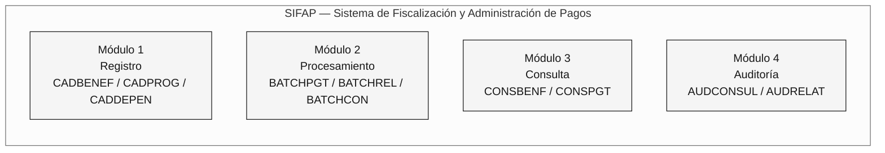
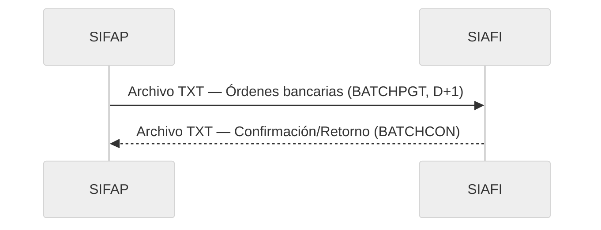
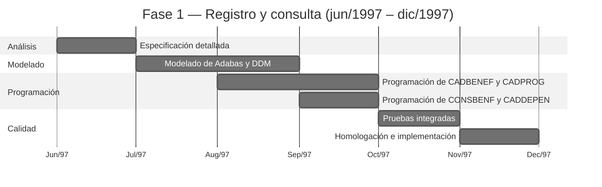
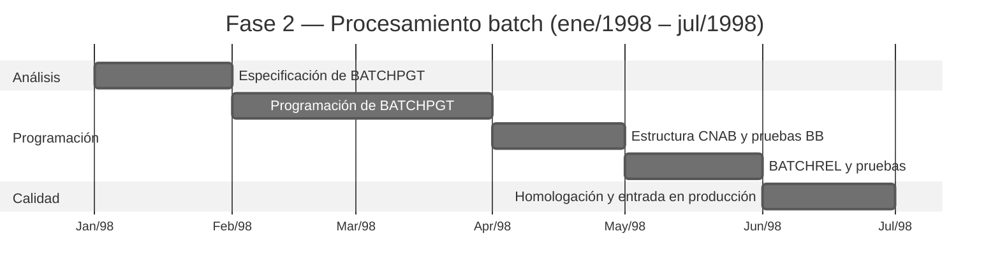

---

title: "Proyecto SIFAP - Documento de arquitectura técnica"
author: "Roberto Carlos Ferreira - Analista Sénior de Sistemas"
date: "1997-05-20"
version: "1.0.0"
classification: "CONFIDENTIAL"
project: "SIFAP - Sistema de Fiscalización y Administración de Pagos"
sponsor: "SUPDE/DESIF - la organización"
client: "SAS/MPAS - Secretaría de Asistencia Social"
---

> [!NOTE]
> Este es un documento histórico reconstruido para el ejercicio de arqueología de la inmersión SIFAP 2.0. El documento simula la documentación técnica original de 1997 tal como la habría producido el equipo SUPDE/DESIF. Se conservaron intencionalmente el lenguaje de la época y los nombres de las personas y unidades organizativas. **Este documento no debe utilizarse como especificación actual del sistema.** Las lagunas e incoherencias señaladas en los comentarios forman parte del ejercicio: representan los verdaderos desafíos de arqueología que el equipo debe investigar.

<!-- ====================================================================== -->
<!-- PROYECTO SIFAP - DOCUMENTO DE ARQUITECTURA TÉCNICA -->
<!-- Versión 1.0.0 - Mayo de 1997 -->
<!-- la organización - la organización federal de procesamiento de datos -->
<!-- Superintendencia de Desarrollo - SUPDE -->
<!-- División de Desarrollo de Sistemas Fiscales - DESIF -->
<!-- ====================================================================== -->

# PROYECTO SIFAP - DOCUMENTO DE ARQUITECTURA TÉCNICA

**SISTEMA DE FISCALIZACIÓN Y ADMINISTRACIÓN DE PAGOS**

---

|                      |                                       |
| -------------------- | ------------------------------------- |
| **Documento:** | ARQ-SIFAP-1997-v1.0 |
| **Clasificación:** | CONFIDENCIAL |
| **Fecha de emisión:** | 20/05/1997 |
| **Proyecto:** | SIFAP - Desarrollo inicial |
| **Plazo previsto:** | 14 meses (jun/1997 - jul/1998) |
| **Equipo:** | 8 analistas/programadores de SUPDE/DESIF |
| **Coordinador:** | Roberto Carlos Ferreira |
| **Gerencia:** | Antônio Marcos Silva - Gerente de SUPDE |

---

> **Presentación**
>
> Este documento describe la arquitectura técnica propuesta para SIFAP - Sistema de Fiscalización y Administración de Pagos, que desarrollará el equipo SUPDE/DESIF de la organización en respuesta a la demanda de la Secretaría de Asistencia Social del Ministerio de Previsión y Asistencia Social (SAS/MPAS).
>
> SIFAP reemplazará el sistema actual SIPAG/DOS, desarrollado en Clipper y operado en microcomputadoras de las oficinas regionales. La migración a una plataforma mainframe busca garantizar la centralización de los datos, la integridad de la información y una capacidad de procesamiento adecuada para el crecimiento previsto de los programas sociales federales.
>
> Este documento se elaboró durante la fase de diseño, antes de empezar a programar, y representa la **visión de arquitectura planificada** para el sistema.

---

## 1. Introducción

### 1.1. Contexto

El Gobierno Federal, a través del Ministerio de Previsión y Asistencia Social, administra varios programas de transferencia de ingresos para familias en situación de vulnerabilidad social. Actualmente, el control de estos pagos se realiza mediante el sistema SIPAG/DOS, una aplicación desarrollada en Clipper 5.2 que opera de manera descentralizada en las regionales de la organización.

La descentralización de SIPAG/DOS provoca los siguientes problemas:

- Imposibilidad de consolidar los datos nacionales de manera oportuna;
- Riesgo de duplicación de registros entre regiones;
- Dificultad para auditar y supervisar;
- Limitación del volumen de procesamiento (máximo de 200,000 registros por región);
- Falta de integración con los sistemas financieros federales (SIAFI).

### 1.2. Objetivo de SIFAP

Desarrollar un sistema centralizado, en una plataforma mainframe, capaz de:

- Gestionar un registro nacional unificado de beneficiarios;
- Procesar la nómina mensual con un volumen proyectado de hasta 5 millones de beneficiarios;
- Integrarse con SIAFI para la conciliación financiera automatizada;
- Proporcionar mecanismos de auditoría y fiscalización;
- Garantizar una disponibilidad y seguridad compatibles con la criticidad de la operación.

### 1.3. Plataforma tecnológica seleccionada

Tras evaluar las alternativas disponibles en la infraestructura de la organización, se seleccionó la siguiente plataforma:

| Componente | Producto | Versión | Justificación |
| ---------- | ---------- | ------- | ----------------------------------------------------------------------------------------------------------------------------- |
| Lenguaje | Natural | 4.2.6 | Estándar de la organización para desarrollo en mainframe. Mayor productividad que COBOL para aplicaciones de registro y consulta. |
| SGBD | Adabas | 6.1.4 | SGBD invertido, de alto rendimiento para consultas con múltiples descriptores. Estándar de la organización. |
| Monitor TP | Com\*plete | 6.1.2 | Monitor de teleprocesamiento para pantallas 3270. Integrado con Natural. |
| Planificador | JES2 | MVS/ESA | Subsistema estándar para procesamiento batch. |
| S. O. | MVS/ESA | 5.2.2 | Sistema operativo mainframe de la organización - Regional de Brasília. |

> **Nota:** La elección de Natural/Adabas sigue la directriz técnica de SUPDE (NT-SUPDE-003/1996), que establece esta plataforma como estándar para nuevos sistemas de registro y procesamiento de tamaño mediano o grande.

---

## 2. Arquitectura modular

### 2.1. Módulos previstos

SIFAP se organizará en **4 módulos funcionales**:



#### Módulo 1 - REGISTRO

Responsable de mantener los datos de registro de beneficiarios, dependientes y programas sociales.

| Programa previsto | Descripción | Prioridad |
| ----------------- | --------------------------------------------------------- | ---------- |
| CADBENEF | Registro de beneficiarios - alta, modificación y baja | Fase 1 |
| CADPROG | Registro de programas sociales y parametrización | Fase 1 |
| CADDEPEN | Registro de dependientes del beneficiario | Fase 1 |

#### Módulo 2 - PROCESAMIENTO

Responsable del procesamiento batch de la nómina y de la generación de archivos para integración.

| Programa previsto | Descripción | Prioridad |
| ----------------- | ------------------------------------------- | ---------- |
| BATCHPGT | Procesamiento mensual de la nómina | Fase 2 |
| BATCHREL | Generación de informes batch (totalizadores) | Fase 2 |
| BATCHCON | Conciliación financiera con SIAFI | Fase 3 |

#### Módulo 3 - CONSULTA

Responsable de las consultas en línea sobre registros y pagos.

| Programa previsto | Descripción | Prioridad |
| ----------------- | ------------------------------------------------- | ---------- |
| CONSBENF | Consulta de beneficiarios mediante múltiples criterios | Fase 1 |
| CONSPGT | Consulta de pagos por beneficiario/período | Fase 2 |

#### Módulo 4 - AUDITORÍA

Responsable del registro y la consulta de trazas de auditoría e incidencias de fiscalización.

| Programa previsto | Descripción | Prioridad |
| ----------------- | --------------------------------------------------- | ---------- |
| AUDCONSUL | Consulta de trazas de auditoría por período/usuario | Fase 3 |
| AUDRELAT | Informe de incidencias de auditoría | Fase 3 |

> **Total previsto:** 11 programas, distribuidos en 3 fases de desarrollo.

---

## 3. Modelo de datos

### 3.1. DDM previstos

SIFAP utilizará **3 DDM** (módulos de definición de datos) en Adabas:

```mermaid
%%{init: {'theme':'neutral','themeVariables':{'fontFamily':'ui-sans-serif, system-ui, sans-serif','primaryColor':'#F5F5F5','primaryTextColor':'#171717','primaryBorderColor':'#171717','lineColor':'#525252','secondaryColor':'#FFFFFF','tertiaryColor':'#FAFAFA','background':'#FFFFFF'}}}%%
erDiagram
    BENEFICIARY {
        string BN-NR-CPF PK
        string BN-NM-BENEF DE
        date BN-DT-NASC
        string BN-CD-SIT DE
        string BN-CD-PROG DE
        string BN-NR-NIS
        string BN-CD-REGIAO DE
        int BN-QT-DEPEND
        decimal BN-VL-RENDA-PC
        date BN-DT-ULT-ATUAL
        string BN-CD-BANCO
        string BN-CD-AGENCIA
        string BN-NR-CONTA
    }

    SOCIAL-PROGRAM {
        string PS-CD-PROG PK
        string PS-NM-PROG
        decimal PS-VL-MIN
        decimal PS-VL-MAX
        string PS-IN-ATIVO
        date PS-DT-INICIO
        date PS-DT-FIM
        string PS-VL-FAIXAS PE
    }

    PAYMENT {
        int PG-NR-SEQ PK
        string PG-NR-CPF DE
        string PG-CD-PROG DE
        string PG-AA-MM-REF DE
        decimal PG-VL-BRUTO
        decimal PG-VL-LIQ
        date PG-DT-CRED
        string PG-CD-STATUS DE
        string PG-CD-BANCO
    }

    BENEFICIARY ||--o{ PAYMENT : "genera"
    BENEFICIARY }o--|| SOCIAL-PROGRAM : "vinculado a"
```

Leyenda: PK = clave primaria (superdescriptor) · DE = descriptor (índice Adabas) · PE = grupo periódico · MU = campo multivalor

<!-- El DDM AUDIT (FNR 153) no estaba incluido en el proyecto original.
 Se añadió en 2005, durante la migración a Natural 6.3/Adabas 7.4,
 a petición del Departamento de Fiscalización (DEFIS).
 Los programas de auditoría (AUDCONSUL, AUDRELAT) previstos en este
 documento fueron reemplazados por el programa RELAUDIT en 2005. -->

### 3.2. Convención de nombres de campos

Adoptaremos la siguiente convención para los nombres de campos Adabas, de acuerdo con el estándar de nombres de SUPDE (NT-SUPDE-007/1995):

| Prefijo | Entidad |
| ------- | --------------- |
| `BN-` | Beneficiario |
| `PS-` | Programa social |
| `PG-` | Pago |

Los sufijos indican el tipo de dato:

| Sufijo | Significado | Ejemplo |
| ------ | ---------------------- | -------------- |
| `NM-` | Nombre/descripción | `BN-NM-BENEF` |
| `NR-` | Número/código numérico | `BN-NR-CPF` |
| `CD-` | Código/clasificación | `BN-CD-SIT` |
| `DT-` | Fecha | `PG-DT-CRED` |
| `VL-` | Valor monetario | `PG-VL-BRUTO` |
| `QT-` | Cantidad | `BN-QT-DEPEND` |
| `IN-` | Indicador (Y/N) | `PS-IN-ATIVO` |
| `SG-` | Sigla | (reservado) |

> **Restricción:** Nombres de campos limitados a 20 caracteres, según la limitación de Natural 4.2.

### 3.3. Estimación del volumen inicial

| DDM | Volumen inicial | Crecimiento estimado/año | Proyección a 5 años |
| --------------- | -------------------------- | ------------------------ | --------------- |
| BENEFICIARY | 1,200,000 (migración de SIPAG) | 300,000 | 2,700,000 |
| SOCIAL-PROGRAM | 15 | 5 | 40 |
| PAYMENT | 0 (nuevo) | 14,400,000 (1.2M x 12) | 72,000,000 |

> **Nota sobre la proyección:** Consideramos un crecimiento lineal del 25% anual en el registro de beneficiarios, compatible con la expansión prevista de los programas sociales del Gobierno Federal. La proyección puede variar en función de nuevas políticas públicas.

---

## 4. Flujo de procesamiento batch

### 4.1. Diagrama del flujo planificado

```mermaid
%%{init: {'theme':'neutral','themeVariables':{'fontFamily':'ui-sans-serif, system-ui, sans-serif','primaryColor':'#F5F5F5','primaryTextColor':'#171717','primaryBorderColor':'#171717','lineColor':'#525252','secondaryColor':'#FFFFFF','tertiaryColor':'#FAFAFA','background':'#FFFFFF'}}}%%
TB flowchart
    classDef step fill:#F5F5F5,stroke:#171717,color:#171717
    classDef artifact fill:#FAFAFA,stroke:#A3A3A3,color:#404040
    classDef result fill:#FFFFFF,stroke:#171717,color:#171717,stroke-width:2px

    START["Inicio del ciclo<br/>(1.er día hábil)"]:::step
    PGT["BATCHPGT<br/>1. Leer BENEFICIARY<br/>2. Calcular el importe<br/>3. Escribir PAYMENT<br/>4. Generar CNAB"]:::step
    CNAB["Archivo CNAB<br/>(remesa BB)<br/>Envío D+1"]:::artifact
    REL["BATCHREL<br/>Informes<br/>totalizadores"]:::step
    RET["Retorno BB<br/>(D+3)"]:::artifact
    CON["BATCHCON<br/>Conciliación<br/>CNAB x SIAFI"]:::result

    START --> PGT
    PGT --> CNAB
    PGT --> REL
    CNAB --> RET
    RET --> CON
```

### 4.2. Planificación batch prevista

| Trabajo | Frecuencia | Hora de inicio | Ventana | Dependencia |
| --------- | -------------- | ------- | ------ | ---------------------- |
| SIFAP-PGT | Mensual (1.er DU) | 22:00 | 4h | Ninguna |
| SIFAP-REL | Mensual (2.º DU) | 06:00 | 1h | SIFAP-PGT (RC=0) |
| SIFAP-CON | Mensual (5.º DU) | 22:00 | 2h | Recepción del retorno BB |

<!-- En la práctica, la planificación difirió de lo previsto. BATCHREL pasó a
 ejecutarse tanto antes (modo previo, D-1) como después (D+5) de
 BATCHPGT. BATCHCON se adelantó a D+4. Además, el programa
 VALELEG empezó a ejecutarse en modo batch (D-2), lo que no estaba
 previsto en este proyecto original. -->

### 4.3. Estimación del tiempo de procesamiento

A partir de pruebas de rendimiento realizadas en el entorno de homologación de la organización (mainframe IBM 9672-R36, 256 MB de RAM):

| Trabajo | Volumen base | Tiempo estimado | Nota |
| --------- | -------------------- | -------------- | --------------------------------------- |
| SIFAP-PGT | 1,200,000 registros | 1h30min | Procesamiento secuencial con entrada/salida de Adabas |
| SIFAP-REL | N/A | 20min | Lectura de totalizadores |
| SIFAP-CON | ~1,200,000 registros | 45min | Cruce entre CNAB y PAYMENT |

> **Supuesto:** Estos tiempos son estimaciones basadas en el volumen inicial. El crecimiento de la base de beneficiarios implicará un aumento proporcional del tiempo de procesamiento. Se recomienda revisar el dimensionamiento cuando el volumen alcance 2,500,000 registros.

<!-- El volumen alcanzó 4,200,000 en 2018. El tiempo de procesamiento de BATCHPGT
 llegó a 3h20min (referencia: feb/2018), con un incidente de tiempo de espera agotado en
 marzo/2016 al procesar 4.1M registros. La revisión del dimensionamiento
 recomendada en este documento nunca se realizó formalmente. -->

---

## 5. Integración con SIAFI

### 5.1. Modelo de integración previsto

La integración con SIAFI - Sistema Integrado de Administración Financiera del Gobierno Federal se realizará según el siguiente modelo:



**Formato previsto:** Archivo de texto posicional, con estructura definida por STN (Secretaría del Tesoro Nacional), según la Instrucción Normativa STN n.º 04/1996.

**Medio de transmisión:** Transferencia mediante VTAM/SNA entre los mainframes de la organización y STN.

**Frecuencia:** Mensual, D+2 después del procesamiento de la nómina.

### 5.2. Campos del archivo de integración con SIAFI

| Posición | Tamaño | Campo | Formato |
| ------- | ------- | ---------------------------------------------------- | ------- |
| 001-002 | 02 | Tipo de registro (01=Cabecera, 02=Detalle, 99=Tráiler) | N |
| 003-016 | 14 | CPF del beneficiario | N |
| 017-056 | 40 | Nombre del beneficiario | A |
| 057-069 | 13 | Importe de la orden bancaria (11 enteros + 2 decimales) | N |
| 070-077 | 08 | Fecha de abono (YYYMMDD) | N |
| 078-080 | 03 | Código del banco pagador | N |
| 081-084 | 04 | Código de sucursal | N |
| 085-094 | 10 | Número de cuenta | N |
| 095-100 | 06 | Año/mes de referencia (YYYYMM) | N |
| 101-110 | 10 | Código de orden bancaria SIAFI | N |
| 111-130 | 20 | Reserva para uso futuro | A |

<!-- La integración con SIAFI no se implementó según esta estructura.
 En 2002, cuando se llevó a cabo efectivamente la integración (versión 2.5),
 se redefinió la estructura junto con STN, con campos adicionales
 para totalizador hash y código de programa social. El programa
 BATCHCON implementó la conciliación según la estructura revisada.
 Este documento original no refleja la versión implementada. -->

---

## 6. Seguridad y control de acceso

### 6.1. Modelo de acceso

El control de acceso a SIFAP se implementará en dos niveles:

1. **Nivel Natural Security:** Control de acceso a la biblioteca SIFAP y sus objetos, gestionado por Natural Security (NATSEC). Perfiles definidos:

- OPERATOR: acceso a programas de registro y consulta;
- SUPERVISOR: acceso completo, incluidas bajas y parametrización;
- AUDITOR: acceso de solo lectura a todos los módulos + informes de auditoría.

1. **Nivel de aplicación:** Verificación adicional mediante el GDA de sesión (Global Data Area), que contiene el código de usuario, el perfil y la región de origen.

### 6.2. Traza de auditoría

Cada operación que modifique datos en el sistema (alta, modificación, baja) generará un registro de auditoría que contenga:

- Código de usuario;
- Fecha y hora de la operación;
- Programa que originó la operación;
- Tipo de operación (I=Alta, A=Modificación, E=Baja);
- Identificación del registro afectado;
- Valores anteriores y posteriores (para modificaciones).

> **Nota de diseño:** En la fase inicial, los registros de auditoría se escribirán en campos de tipo MU (multivalor) del DDM BENEFIC, el archivo de beneficiarios, utilizando un grupo periódico (PE) para el historial. Este enfoque simplifica la implementación y evita crear un DDM adicional.

<!-- Esta decisión se revirtió en 2005, cuando el volumen de
 auditoría en el PE del DDM BENEFIC provocó una degradación grave
 del rendimiento. Se creó entonces el DDM AUDIT (FNR 153) como entidad
 separada y se refactorizó el subprograma LOGAUDIT para escribir en este
 nuevo DDM. La DBA Cláudia Regina dos Santos lideró la migración de
 los registros de auditoría existentes al nuevo archivo Adabas. -->

---

## 7. Evolución prevista

### 7.1. Hoja de ruta de funcionalidades

La evolución de SIFAP se planifica en las siguientes fases, sujetas a aprobación y priorización por parte del comité de gestión del proyecto:

| Fase | Plazo previsto | Funcionalidad | Prioridad |
| ---------- | -------------- | ----------------------------------------------------------------------------------------------------------------------------------------------------------------------- | ----------- |
| **Fase 1** | jun-dic/1997 | Módulos de registro y consulta (CADBENEF, CADDEPEN, CADPROG, CONSBENF) | Obligatoria |
| **Fase 2** | ene-jul/1998 | Módulo de procesamiento batch (BATCHPGT, BATCHREL) | Obligatoria |
| **Fase 3** | ago-dic/1998 | Módulo de auditoría (AUDCONSUL, AUDRELAT) + conciliación SIAFI (BATCHCON) | Deseable |
| **Fase 4** | 1.er semestre/1999 | Módulo de validación (VALBENEF, VALDOCS) - validación automatizada de registros | Deseable |
| **Fase 5** | 2.º semestre/1999 | Generación de informes de gestión avanzados - gráficos y consolidaciones | Opcional |
| **Fase 6** | 1.er semestre/2000 | **Módulo web** - interfaz de consulta mediante Intranet para los organismos gestores (SENARC, SAS). Tecnología prevista: Natural Web Interface + servidor HTTP de la organización. | Opcional |
| **Fase 7** | 2.º semestre/2000 | Integración en línea con la Receita Federal para validar CPF en tiempo real | Opcional |

<!-- Balance de la evolución real (anotación retrospectiva):

 Fase 1: COMPLETADA (dic/1997) - según lo previsto, con un retraso de 2 meses.

 Fase 2: COMPLETADA (jul/1998) - según lo previsto. Entrada en producción
 de v1.0 con los módulos CADBENEF, CADDEPEN, CADPROG, CONSBENF, BATCHPGT,
 BATCHREL.

 Fase 3: PARCIALMENTE COMPLETADA (2002/2005) - BATCHCON se implementó
 en 2002 (versión 2.5), con una estructura SIAFI distinta de la prevista. Los
 programas de auditoría AUDCONSUL y AUDRELAT NUNCA se implementaron
 según el diseño. En 2005, se reemplazaron por el programa RELAUDIT,
 con un alcance reducido.

 Fase 4: COMPLETADA CON CAMBIOS (1999/2003) - VALBENEF se implementó
 en 1999 (Fase 2 de v2.0). VALDOCS se implementó en 2003 por Patrícia
 Helena Moura. También se incorporó el programa VALELEG (validación de
 elegibilidad), que NO estaba incluido en el proyecto original.

 Fase 5: NUNCA IMPLEMENTADA - Los informes avanzados nunca se
 desarrollaron. Los informes de SIFAP siguen en formato de texto de 132
 columnas para impresora matricial.

 Fase 6: NUNCA IMPLEMENTADA - El "módulo web" previsto para 2000 nunca
 pasó del papel. La tecnología Natural Web Interface no fue adoptada por
 la organización. El acceso a SIFAP sigue siendo exclusivamente mediante emulación 3270.

 Fase 7: IMPLEMENTADA DE OTRA FORMA (2002) - La consulta del CPF en
 la Receita Federal se implementó en 2002, pero mediante una transacción CICS y no
 mediante integración directa en línea, como estaba previsto.

 FUNCIONALIDADES NO PREVISTAS:
 - CALCCORR (cálculo de correcciones/reajustes) - implementado en 2005
 por Marcos Antônio Ferreira durante la migración a Natural 6.3.
 - CALCDSCT (cálculo de descuentos) - implementado en 2015 a petición
 de SENARC. Este módulo NO estaba incluido en ninguna planificación anterior.
 - RELPGT (informe de pagos) - implementado en 2003 por Patrícia
 Helena Moura. Reemplazó parte de la funcionalidad de BATCHREL.
 - DDM AUDIT (FNR 153) - creado en 2005. El proyecto original preveía
 la auditoría como PE en el DDM BENEFIC.
 - Integración con CadÚnico - implementada de emergencia en 2006, sin
 programa catalogado en el inventario oficial. -->

### 7.2. Supuestos para la evolución

- Mantenimiento de un equipo de al menos 4 analistas/programadores de Natural dedicados a SIFAP;
- Disponibilidad de un entorno de homologación en el mainframe de la organización;
- Apoyo del comité de gestión de SAS/MPAS para definir requisitos;
- Estabilidad de la plataforma Natural/Adabas en la organización (sin previsión de discontinuación);
- Presupuesto para adquirir licencias de Natural Web Interface (Fase 6).

### 7.3. Consideraciones sobre el módulo web (Fase 6)

El módulo web previsto para el 1.er semestre de 2000 utilizará la tecnología **Natural Web Interface** (NWI), que permite mostrar pantallas Natural como páginas HTML accesibles mediante un navegador web. La organización está evaluando esta tecnología y debería aprobarla antes de finales de 1998.

La interfaz web de SIFAP permitirá:

- Consultar beneficiarios por CPF, NIS o nombre (equivalente a CONSBENF);
- Consultar pagos por período;
- Emitir extractos para los organismos gestores;
- Acceder mediante la Intranet de la organización (red INFOVIA del Gobierno Federal).

> **Nota:** La viabilidad técnica de NWI depende de la aprobación del Comité de Arquitectura de la organización. Si NWI no se aprueba, evaluar una alternativa con **Entire X** (middleware Natural-HTTP) o el desarrollo de un frontend separado en Java/Servlet con acceso a Adabas mediante JDBC.

---

## 8. Cronograma de desarrollo

### 8.1. Fase 1 - Registro y consulta



### 8.2. Fase 2 - Procesamiento batch



---

## 9. Equipo del proyecto

| Nombre | Rol en el proyecto | Unidad |
| ----------------------------- | -------------------------------------- | ----------- |
| Roberto Carlos Ferreira | Coordinador Técnico / Arquitecto | SUPDE/DESIF |
| Maria Helena Costa | Coordinadora de DESIF / Patrocinadora Técnica | SUPDE/DESIF |
| José Aparecido Lima | Programador de Natural - Módulo batch | SUPDE/DESIF |
| Fernanda Cristina de Oliveira | Analista de Negocio / Especificación | SUPDE/DESIF |
| Cláudia Regina dos Santos | DBA de Adabas - Modelado de datos | SUPDE/DESIF |
| Antônio Carlos Ribeiro | Analista de Soporte - Infraestructura | SUPDE/DESIF |
| Mário Sérgio Andrade | Programador de Natural - Módulo de registro | SUPDE/DESIF |
| Sandra Lúcia Pereira | Programadora de Natural - Módulo de consulta | SUPDE/DESIF |

> **Nota:** Mário Sérgio Andrade y Sandra Lúcia Pereira fueron retirados del proyecto en diciembre de 1997 por reasignación interna. Los demás integrantes del equipo asumieron sus actividades, lo que contribuyó al retraso de 4 meses respecto al plazo original del proyecto (14 meses previstos → 18 meses reales).

---

## 10. Riesgos identificados

| # | Riesgo | Probabilidad | Impacto | Mitigación |
| --- | ---------------------------------------------------------------- | ------------- | ------- | ------------------------------------------------ |
| R1 | Retraso en la migración de datos de SIPAG/DOS | Alta | Alto | Iniciar el mapeo de datos en paralelo con la Fase 1 |
| R2 | Indisponibilidad del entorno de homologación | Media | Alto | Solicitar un entorno dedicado a SUPDE |
| R3 | Cambios en los requisitos por parte de SAS/MPAS durante el desarrollo | Alta | Medio | Congelar los requisitos por fase |
| R4 | Salida de integrantes del equipo por traslado | Media | Alto | Documentar y compartir conocimiento |
| R5 | Limitaciones de rendimiento de Adabas con volúmenes superiores a 2M registros | Baja | Alto | Monitorear y optimizar descriptores |
| R6 | Discontinuación de Natural/Adabas por parte de la organización | Baja | Crítico | Seguir las directrices técnicas de SUPDE |

> **Nota sobre R4:** Este riesgo se materializó parcialmente con la salida de Mário Sérgio y Sandra Lúcia en diciembre/1997. La mitigación mediante documentación y transferencia de conocimiento se implementó parcialmente, pero la práctica no se mantuvo durante toda la vida del sistema.

---

## 11. Aprobaciones

Este documento fue revisado y aprobado para iniciar el desarrollo, según las firmas siguientes:

---

**Roberto Carlos Ferreira**
Analista Sénior de Sistemas - SUPDE/DESIF
Coordinador Técnico del Proyecto SIFAP
Brasilia, 20 de mayo de 1997

---

**Maria Helena Costa**
Coordinadora - DESIF/SUPDE
Brasília, 22 de mayo de 1997

---

**Antônio Marcos Silva**
Gerente - SUPDE
Superintendencia de Desarrollo
Brasília, 26 de mayo de 1997

---

## Apéndice A - Glosario del proyecto

| Término | Definición |
| ---------- | --------------------------------------------------------------------------------------- |
| Adabas | Adaptable Database System - SGBD de Software AG usado en el mainframe de la organización |
| CNAB | Centro Nacional de Automatización Bancaria - estándar de archivos para transacciones bancarias |
| Com\*plete | Monitor de teleprocesamiento de Software AG para pantallas 3270 |
| DDM | Módulo de definición de datos - definición lógica del acceso a archivos Adabas en Natural |
| FROM | Descriptor - campo indexado en Adabas, usado como criterio de búsqueda |
| FDT | Tabla de definición de campos - definición física de los campos de un archivo Adabas |
| FNR | Número de archivo - número que identifica un archivo en Adabas |
| GDA | Global Data Area - área de datos compartida entre programas Natural en la sesión |
| INFOVIA | Red de comunicación de datos del Gobierno Federal |
| JES2 | Job Entry Subsystem - subsistema de gestión de trabajos batch en MVS |
| LDA | Local Data Area - área de datos local de un programa Natural |
| MU | Valor múltiple - campo que puede contener varios valores en Adabas |
| Natural | Lenguaje de programación 4GL de Software AG para entornos mainframe |
| NWI | Natural Web Interface - tecnología para mostrar pantallas Natural como HTML |
| PE | Grupo periódico - grupo de campos que se repiten en Adabas (historial) |
| SIAFI | Sistema Integrado de Administración Financiera del Gobierno Federal |
| SIPAG/DOS | Sistema de Pagos - aplicación Clipper anterior a SIFAP |
| SNA | Systems Network Architecture - protocolo de comunicación de IBM |
| STN | Secretaría del Tesoro Nacional |
| VTAM | Virtual Telecommunications Access Method - software de comunicaciones de IBM |

---

**the organization - the federal data processing organization**
**Confidential Document**
**Reproduction and distribution restricted to the scope of the SIFAP project**

---

[Volver al escenario heredado](../README.md)
