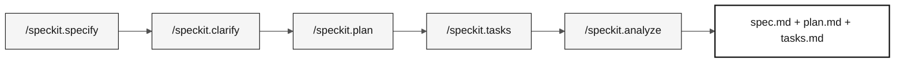

# Etapa 2 — Especificación (60 min)

> **Ruta:** [Kit del equipo](../README.md) › [Etapa 2](README.md) › **GUÍA**

**Esta guía conduce a la Pareja 2 paso a paso en la creación de los artefactos de Spec-Kit: requisitos EARS trazables, un plan técnico y tareas implementables, desde el inicio hasta la transición H2.**

  

| Campo | Valor |
|---|---|
| **Público objetivo** | Pareja 2 (Arquitecto Empresarial + Arquitecto de Software); la Pareja 1 valida el alcance; la Pareja 5 revisa la claridad |
| **Prerrequisitos** | Transición H1 aceptada; programas `.NSN` y DDM del legado leídos |
| **Tiempo estimado** | 60 min |
| **Etapa** | Etapa 2 — Especificación |
| **Resultado esperado** | `specs/<NNN>-<feature>/spec.md`, `plan.md` y `tasks.md` con trazabilidad completa |

---

## Concepto: desarrollo guiado por especificaciones

El desarrollo guiado por especificaciones (SDD) es la práctica de escribir la especificación de la funcionalidad, los requisitos, el plan técnico y las tareas antes de escribir cualquier código. El objetivo es garantizar que todos los integrantes del equipo entiendan qué se debe construir, por qué y cómo comprobar que se construyó correctamente.

Para SIFAP, esto significa que, antes de crear el endpoint de cálculo de beneficios, el equipo documenta exactamente qué regla del programa `.NSN` original se está modernizando, los criterios de aceptación y las pruebas que validan el comportamiento.

GitHub Spec-Kit automatiza este flujo mediante comandos de barra en Copilot Chat.

### Flujo de Spec-Kit



---

## Regla de ubicación de artefactos

Los entregables formales de GitHub Spec-Kit residen exclusivamente en:

```text
specs/<NNN>-<feature>/
├── spec.md
├── plan.md
└── tasks.md
```

`spec.md` contiene los requisitos EARS, `plan.md` registra el plan técnico y `tasks.md` ordena el trabajo implementable. No crees archivos paralelos con nombres heredados en `02-modern-spec/`.

`02-modern-spec/` contiene material de apoyo para la etapa. Sus plantillas y [`scope-decisions.md`](scope-decisions.md) registran decisiones de alcance, compromisos y referencias para la conversación. No reemplazan los tres artefactos formales de la funcionalidad.

> [!CAUTION]
> **PUERTA OBLIGATORIA de trazabilidad.** Antes de redactar cualquier requisito EARS, lee el programa o DDM que lo sustenta. Cada REQ-ID de `specs/<NNN>-<feature>/spec.md` necesita una línea `source_legacy:` que apunte a `01-archaeology/legacy-sifap/.../*.NSN` o `*.ddm`. Una capacidad sin equivalente en el legado usa `[GREENFIELD]` con una justificación. Sin esto, la CI rechaza la PR.

---

## Concepto: notación EARS

EARS (Easy Approach to Requirements Syntax) es una notación estructurada para escribir requisitos de software sin ambigüedades. Cada requisito empieza con una palabra clave que clasifica el tipo de comportamiento.

**Por qué importa:** los requisitos en lenguaje natural son ambiguos. "El sistema debe calcular el beneficio" no dice cuándo, para quién ni qué sucede si falla. La notación EARS elimina esta ambigüedad.

**Los 5 patrones EARS:**

| Patrón | Palabra clave | Estructura | Ejemplo de SIFAP |
|---|---|---|---|
| **Ubicuo** | (ninguna) | El `<system>` shall `<action>`. | El sistema shall registrar la fecha y la hora de cada cambio en un beneficio. |
| **Guiado por eventos** | When | When `<event>`, el `<system>` shall `<action>`. | When se procesa el pago, el sistema shall emitir un recibo. |
| **Guiado por estados** | While | While `<state>`, el `<system>` shall `<action>`. | While el beneficiario tiene el estado suspendido, el sistema shall bloquear los pagos. |
| **Comportamiento no deseado** | If / Then | If `<condition>`, then el `<system>` shall `<handling action>`. | If el CPF proporcionado no existe en la base de datos, then el sistema shall devolver HTTP 422 con un mensaje de error. |
| **Funcionalidad opcional** | Where | Where `<feature is active>`, el `<system>` shall `<action>`. | Where está habilitada la auditoría avanzada, el sistema shall registrar la dirección IP de cada acceso. |

**REQ-ID:** cada requisito recibe un identificador único con el formato `REQ-NNN` (por ejemplo, `REQ-001`). Este ID aparece en commits (`Implements REQ-001`), PR y pruebas para trazar el comportamiento del código hasta la especificación.

---

## Concepto: ADR (registro de decisión de arquitectura)

Un ADR es un documento breve que registra una decisión de arquitectura: la opción seleccionada, las alternativas consideradas y la justificación. Un ADR no es burocracia; es memoria institucional. Sin él, en seis meses nadie recordará por qué se seleccionó PostgreSQL en lugar de MongoDB.

**Cuándo crear un ADR en la Etapa 2:** solo cuando una decisión bloquee `plan.md`. Usa la plantilla de [`templates/ADR.template.md`](templates/ADR.template.md) o ejecuta `/generate-adr` en Copilot Chat.

**Error común:** crear ADR para decisiones obvias o ya documentadas en otro lugar. Si la decisión cabe en un comentario de commit, no necesita un ADR.

---

## Concepto: contexto delimitado

Un contexto delimitado es un límite explícito dentro del cual un modelo de dominio es válido y coherente. Es el concepto central del diseño guiado por el dominio que permite dividir un sistema grande en partes más pequeñas y cohesionadas.

**En SIFAP:** el módulo de pagos tiene sus propias reglas, entidades y vocabulario. El módulo de fiscalización tiene los suyos. Cuando los dos necesitan comunicarse, lo hacen mediante una interfaz bien definida en lugar de compartir tablas u objetos internos.

**Para la inmersión:** usa `/carve-bounded-contexts` en Copilot Chat y completa [`templates/bounded-contexts.template.md`](templates/bounded-contexts.template.md) como referencia para `plan.md`.

---

## Cronograma

| Horario | Actividad | Salida |
|---|---|---|
| 14:00–14:05 | Confirmar la evidencia de la transición H1 y seleccionar una funcionalidad acotada. | Nombre `NNN-<feature>` y alcance aprobado por el PO. |
| 14:05–14:25 | Ejecutar `/speckit.specify` y `/speckit.clarify`. | `specs/<NNN>-<feature>/spec.md` con requisitos trazables. |
| 14:25–14:40 | Ejecutar `/speckit.plan`. | `plan.md` con las decisiones y los riesgos necesarios para la implementación. |
| 14:40–14:50 | Ejecutar `/speckit.tasks`. | `tasks.md` priorizado, con pruebas de reglas de negocio. |
| 14:50–14:55 | Ejecutar `/speckit.analyze` y corregir las lagunas que bloquean el avance. | Referencias y artefactos coherentes. |
| 14:55–15:00 | Realizar la transición H2. | Alcance, archivos formales y primera tarea para las Parejas 3 y 4. |

> [!WARNING]
> Si un paso consume el tiempo disponible, reduce la funcionalidad. No completes requisitos, contratos, arquitectura ni criterios de aceptación basándote en suposiciones.

---

## Paso a paso

- [ ] **Confirma la evidencia.** Vuelve a leer los hallazgos registrados en la Etapa 1 antes de seleccionar la funcionalidad.
- [ ] **Asigna un nombre a la carpeta.** Crea `specs/<NNN>-<feature>/` con un nombre que refleje el comportamiento, no la solución técnica.
- [ ] **Ejecuta `/speckit.specify`.** Genera `spec.md` con REQ-ID, patrones EARS y `source_legacy:`.
- [ ] **Ejecuta `/speckit.clarify`.** Resuelve las ambigüedades antes de planificar.
- [ ] **Ejecuta `/speckit.plan`.** Documenta arquitectura, datos, riesgos y contratos en `plan.md`.
- [ ] **Ejecuta `/speckit.tasks`.** Divide el plan en tareas pequeñas con pruebas en `tasks.md`.
- [ ] **Ejecuta `/speckit.analyze`.** Corrige las lagunas entre la especificación, el plan y las tareas.
- [ ] **Registra las decisiones de alcance.** Completa [`scope-decisions.md`](scope-decisions.md) con lo que se seleccionó, se pospuso o se marcó como greenfield.
- [ ] **Realiza la transición H2.** Presenta en vivo a las Parejas 3 y 4 (véase más abajo).

---

## Apoyo y decisiones de alcance

- Registra lo que se seleccionó, se pospuso o se marcó como greenfield en [`scope-decisions.md`](scope-decisions.md), vinculando la decisión a la carpeta de `specs/`.
- Usa [`ADR-TEMPLATE.md`](ADR-TEMPLATE.md) solo para una decisión que bloquee el plan. La etapa no tiene una meta de cantidad de ADR.
- Un boceto de contextos o un diagrama puede apoyar la conversación, pero C4 L1/L2/L3 y una arquitectura completa no son prerrequisitos para la transición H2. La justificación técnica necesaria corresponde a `plan.md`.

---

## Transición H2

La Pareja 2 presenta en vivo a las Parejas 3 y 4:

1. La ruta de la carpeta `specs/<NNN>-<feature>/`.
2. La funcionalidad seleccionada, los requisitos y sus entradas `source_legacy:`.
3. La primera tarea implementable y las pruebas esperadas.
4. Los riesgos, las decisiones de alcance y las preguntas que aún necesitan respuesta.

---

## Criterios de finalización

- [ ] Una funcionalidad pequeña tiene `spec.md`, `plan.md` y `tasks.md` en `specs/<NNN>-<feature>/`.
- [ ] Cada requisito tiene un `source_legacy:` válido o un `[GREENFIELD]` justificado.
- [ ] `tasks.md` incluye pruebas junto con la implementación de reglas de negocio.
- [ ] Las decisiones de alcance están registradas en `02-modern-spec/`.
- [ ] El PO confirmó el alcance y la transición H2 se realizó a más tardar a las 15:00.

---

## Errores comunes y cómo evitarlos

| Síntoma | Causa | Corrección |
|---|---|---|
| Falta `source_legacy:` en `spec.md` | Requisito escrito sin consultar el sistema heredado | Vuelve a leer el programa `.NSN` correspondiente antes de escribir el requisito EARS |
| `spec.md` contiene requisitos vagos ("el sistema debe funcionar correctamente") | No se usó la notación EARS | Reescribe con uno de los 5 patrones EARS |
| `plan.md` vacío o copiado de otro proyecto | Plan basado en suposiciones | Ejecuta `/speckit.plan` con el contexto real de la funcionalidad |
| Se crea un ADR para cada decisión | Confusión entre un ADR y un comentario de código | Reserva los ADR para decisiones que bloquearían el plan si no estuvieran registradas |
| La CI rechaza la PR | `source_legacy:` ausente o no válido | Corrige la ruta al archivo `.NSN` o `.ddm` correspondiente |

---

## Referencias

- [Ficha de referencia de Spec-Kit](../09-cheat-sheets/spec-kit-workflow.md)
- [Notación EARS](../07-concepts/05-ears-notation.md)
- [Registros de decisiones de arquitectura](../07-concepts/06-architecture-decision-records.md)
- [Spec-Kit oficial](https://github.com/github/spec-kit)
- [Sistema heredado SIFAP](../01-archaeology/legacy-sifap/)

---

### Sigue leyendo

| Anterior | Siguiente |
|---|---|
| [Etapa 1 — Arqueología](../01-archaeology/README.md)<br/><sub>Resumen de la arqueología y enlaces a la GUÍA detallada.</sub> | [Etapa 3 — Implementación](../03-implementation/GUIDE.md)<br/><sub>15:00–16:10 · Java 21 + Spring Boot + Next.js, con pruebas.</sub> |

<sub>[Volver al índice del kit](../README.md)</sub>
