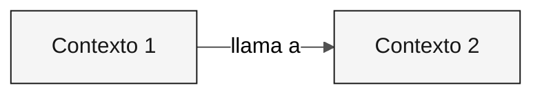

---

title: "Plantilla: contextos delimitados"
description: "Estructura para definir contextos delimitados mediante /carve-bounded-contexts"
author: "Paula Silva, ingeniera de software nativo de IA, Global Black Belt para las Américas en Microsoft"
date: "2026-04-29"
version: "1.0.0"
status: "approved"
tags: ["template", "bounded-contexts", "architect", "stage-2"]
---

<!-- Uso: ejecuta /carve-bounded-contexts. Duplica el bloque de contexto para cada contexto. -->

# Mapa de contextos delimitados

 

> **Ruta:** [Kit del equipo](../../README.md) › [Etapa 2](../README.md) › Plantillas › **bounded-contexts**

> [!NOTE]
> Este archivo es una PLANTILLA. Cópiala al repositorio de tu equipo y complétala con datos reales. No edites el original.

---

## Concepto: contexto delimitado

Un contexto delimitado es un límite explícito dentro del cual un modelo de dominio es válido y coherente. El término proviene del diseño guiado por el dominio (DDD) y proporciona la base para definir los módulos de un Monolito Modular.

**Por qué importa:** en SIFAP, el módulo de pagos usa el término "beneficiario" de una manera, mientras que el módulo de fiscalización puede usar el mismo término con reglas diferentes. Definir contextos delimitados evita que se distorsione un único modelo para atender todos los contextos a la vez, lo que provoca acoplamiento no deseado y dificulta la evolución.

**Monolito Modular:** arquitectura en la que los contextos delimitados son módulos Java independientes dentro de una única JVM. Cada módulo tiene sus propias capas (`domain/`, `application/`, `infrastructure/`) y se comunica con otros módulos solo mediante interfaces públicas definidas.

**Strangler Fig:** patrón de migración incremental en el que el sistema moderno crece alrededor del sistema heredado y reemplaza las funcionalidades una a una. SIFAP 2.0 no necesita reemplazar todo a la vez. Cada contexto delimitado puede modernizarse de forma independiente.

---

## Evaluaciones de hipótesis

### <!-- placeholder: Nombre --> — <!-- placeholder: ACEPTADA / RECHAZADA -->

| Criterio | Evaluación | Evidencia |
|---|---|---|
| Cohesión | <!-- placeholder --> | <!-- placeholder --> |
| Acoplamiento | <!-- placeholder --> | <!-- placeholder --> |
| Frecuencia de cambios | <!-- placeholder --> | <!-- placeholder --> |

---

## Contextos delimitados finales

### <!-- placeholder: Nombre del contexto -->

| Campo | Valor |
|---|---|
| **Responsabilidad** | <!-- placeholder --> |
| **Datos propios** | <!-- placeholder --> |
| **Interfaz pública** | <!-- placeholder --> |
| **Por qué es un contexto propio** | <!-- placeholder --> |

---

## Comunicación entre contextos

| Origen | Destino | Mecanismo | Datos |
|---|---|---|---|
| <!-- placeholder --> | <!-- placeholder --> | <!-- placeholder --> | <!-- placeholder --> |

---

> [!IMPORTANT]
> Definición de terminado: hipótesis evaluadas, rechazos documentados, de 2 a 5 contextos con nombre y diagrama Mermaid que se renderiza sin errores.

---

### Sigue leyendo

| Anterior | Siguiente |
|---|---|
| [GUÍA de la Etapa 2](../GUIDE.md) Instrucciones paso a paso. | [Plantilla de ADR](ADR.template.md) Plantilla de ADR. |

[Volver al índice del kit](../../README.md)
