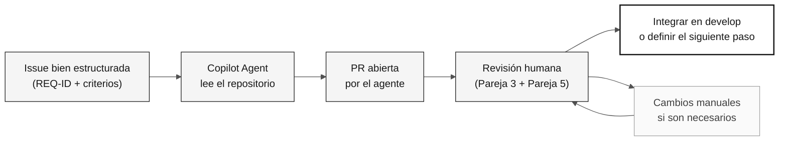

# Etapa 4 — Evolución con agentes (40 min)

> **Ruta:** [Kit del equipo](../README.md) › [Etapa 4](README.md) › **GUÍA**

**Esta guía conduce a la Pareja 5 en la experimentación con el modo Agent de GitHub Copilot: escribir una Issue bien estructurada, delegarla al agente, revisar la PR resultante y registrar evidencia honesta de lo que funcionó.**

  

| Campo | Valor |
|---|---|
| **Público objetivo** | La Pareja 5 (DevOps + Redactor Técnico) lidera; la Pareja 3 colidera la revisión técnica |
| **Prerrequisitos** | Transición H3 recibida; prototipo funcional de la Etapa 3; comando de build conocido |
| **Tiempo estimado** | 40 min |
| **Etapa** | Etapa 4 — Evolución |
| **Resultado esperado** | Issue creada, delegación registrada e informe de experiencia completado |

> [!NOTE]
> Horario oficial: 16:10–16:50 en [`00-TEAM-FLOW.md`](../00-TEAM-FLOW.md). La Pareja 5 lidera y la Pareja 3 colidera la revisión técnica.

---

## Concepto: modo Agent de GitHub Copilot

El modo Agent de GitHub Copilot permite delegar trabajo de forma autónoma. Proporcionas una Issue con suficiente contexto y el agente lee el repositorio, escribe código, crea pruebas y abre una pull request.

**Por qué importa:** el agente no inventa requisitos. Lee lo que escribiste en la Issue y en `spec.md`. Si la Issue es vaga, la PR será vaga. Si la Issue es precisa, la PR tiene posibilidades de aprobarse sin cambios importantes.

**Diferencias entre los modos de Copilot:**

| Modo | Cuándo usarlo | Control humano |
|---|---|---|
| **Ask** | Preguntas, explicaciones y consultas específicas | Total |
| **Plan** | Planificar un cambio antes de ejecutarlo | Alto |
| **Agent** | Delegar una tarea bien definida con autonomía | Revisión posterior a la ejecución |

**Ciclo Issue → Agente → PR → Revisión:**

---

## Concepto: IaC con Terraform y CI/CD con GitHub Actions

**Terraform** es la herramienta de infraestructura como código (IaC) usada en esta inmersión. Describe recursos de Azure (App Service, PostgreSQL y Key Vault) en archivos `.tf` y los crea de forma repetible y auditable.

> [!CAUTION]
> Nunca ejecutes `terraform apply` durante la inmersión. Valida con `terraform plan` y documenta el resultado. El aprovisionamiento real de infraestructura queda fuera del alcance de la inmersión.

**GitHub Actions** es el motor de CI/CD. Un pipeline bien configurado valida automáticamente cada PR: compila, ejecuta pruebas, verifica la trazabilidad (la presencia de `source_legacy:`) y, opcionalmente, despliega.

---

## Objetivo

Experimenta con una delegación pequeña y deja evidencia honesta del resultado. Esta etapa no promete que un agente abra una PR, que se cree Terraform ni que se realice una integración antes de la demo.

---

## Cronograma

| Horario | Actividad | Resultado |
|---|---|---|
| 16:10–16:15 | Recibir la transición H3, confirmar el build y seleccionar un pendiente pequeño. | Alcance seguro para delegar o registrar en el backlog. |
| 16:15–16:25 | Escribir una Issue con contexto, REQ-ID, ruta de la funcionalidad, criterios verificables, elementos fuera del alcance y método de prueba. | Issue creada o borrador listo para crearla. |
| 16:25–16:35 | Delegar a Copilot Agent, si está disponible, y observar el estado inicial. | Delegación registrada sin esperar la implementación completa. |
| 16:35–16:45 | Si existe una PR, realizar una revisión humana. De lo contrario, registrar el estado y preparar una revisión posterior a la inmersión. | Comentarios de revisión o un siguiente paso explícito. |
| 16:45–16:50 | Actualizar el informe de experiencia e informar al equipo para la demo. | Relato basado en hechos de lo que funcionó, falló o sigue pendiente. |

Usa [`../.github/prompts/stage-evolution-write-github-issue.prompt.md`](../.github/prompts/stage-evolution-write-github-issue.prompt.md) como lista de verificación para redactar. No pidas al agente que invente requisitos, arquitectura, fuentes del legado ni criterios de aceptación faltantes.

---

## Paso a paso

- [ ] **Recibe la transición H3.** Confirma el estado del build e identifica un pendiente pequeño y bien delimitado.
- [ ] **Escribe la Issue.** Usa la lista de verificación de `.github/prompts/stage-evolution-write-github-issue.prompt.md`.
- [ ] **Verifica que la Issue incluya:** REQ-ID con entradas `source_legacy:` existentes en `spec.md`, criterios de aceptación verificables, alcance limitado y un método de prueba.
- [ ] **Delega a Copilot Agent.** Registra la hora de inicio y observa el estado inicial.
- [ ] **Revisa la PR**, si está disponible, siguiendo los criterios de abajo.
- [ ] **Registra lo ocurrido** en el informe de experiencia, independientemente del resultado.
- [ ] **Informa al equipo** del estado para la demo.

---

## Límites de alcance

> [!IMPORTANT]
> Estos límites garantizan que la inmersión termine con evidencia real, no con promesas.

- La Issue referencia `specs/<NNN>-<feature>/spec.md`, `plan.md` y `tasks.md` cuando el pendiente proviene de una funcionalidad especificada.
- Cada rama `impl/<NNN>-<feature>` parte de `develop` y abre una PR hacia `develop`; no existe una rama `stage`.
- Revisa cada PR del agente como una PR humana. No la integres automáticamente.
- CI/CD y Terraform son opcionales durante este intervalo. Valida o documenta lo que ya exista. No crees infraestructura solo para cumplir una meta.

> [!CAUTION]
> Nunca ejecutes `terraform apply` durante la inmersión.

---

## Revisión rápida de PR

Antes de aprobar una PR generada por el agente, confirma:

- [ ] El alcance sigue limitado a la Issue y los REQ-ID referenciados.
- [ ] Los requisitos y las entradas `source_legacy:` referenciados ya existen en `spec.md`.
- [ ] Se atendieron las pruebas, la validación de entradas y la documentación cuando correspondía.
- [ ] No hay secretos, dependencias sin una decisión ni cambios fuera del alcance.
- [ ] La PR tiene como destino `develop` y recibió una revisión por pares.

---

## Criterios de finalización

- [ ] Se creó una Issue pequeña o se dejó como borrador revisable.
- [ ] Se registró el resultado de la delegación (PR, ejecución en curso, fallo o falta de disponibilidad) sin promesas.
- [ ] Una PR disponible recibió revisión humana; si no existe una PR, se registró un siguiente paso.
- [ ] Se completó el informe de experiencia.
- [ ] Se comunicó el estado de CI/IaC para la demo sin ejecutar `terraform apply`.

---

## Referencias

- [Informe de experiencia del equipo](agent-experience-report.md)
- [Plantilla del informe](templates/agent-experience-report.template.md)
- [Agente de etapa @evolution](../06-stage-agents/04-evolution/README.md)
- [Ficha: 3 modos de Copilot](../09-cheat-sheets/copilot-3-modes.md)

---

### Sigue leyendo

| Anterior | Siguiente |
|---|---|
| [Etapa 3 — Implementación](../03-implementation/GUIDE.md) 15:00–16:10 · Java 21 + Spring Boot + Next.js, con pruebas. | [Informe de experiencia](agent-experience-report.md) Complétalo al final de la etapa. |

[Volver al índice del kit](../README.md)
