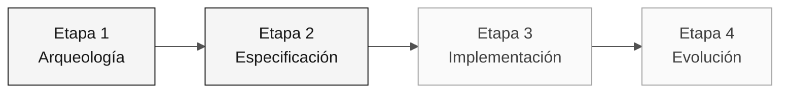

# Persona — Responsable de Producto

> **Ruta:** [Kit del equipo](../../README.md) › [Personas](../OVERVIEW.md) › [Responsable de Producto](README.md) › **PERSONA**

**Perfil completo de la persona Responsable de Producto.** Define la misión, las responsabilidades por etapa, las herramientas, la transición y las rúbricas de evaluación.

| Campo | Valor |
|---|---|
| **Rol** | Responsable de Producto |
| **Pareja** | 1 · Visión (con el Especialista en Requisitos) |
| **Etapas activas** | Lidera la 1 (priorización) y la 2 (aprobación del alcance); apoya la 3 y la 4 |
| **Artefactos producidos** | Glosario, lista priorizada, sección Alcance/Fuera del alcance e issues para el agente |
| **Artefactos consumidos** | Catálogo de reglas (Arqueología), mapa de integraciones (EA) |
| **Entrega a** | Pareja 2 (Arquitectura) en la Etapa 1; Pareja 3 (Implementación) mediante la aprobación del alcance |

 

---

## Concepto

El Responsable de Producto se encarga de traducir las necesidades de negocio en un alcance ejecutable. En la industria del software, el PO define el "porqué" —qué problema resuelve el producto— y decide qué se incluye o excluye de cada ciclo de entrega.

En una modernización de legado como SIFAP (Sistema de Fiscalización y Administración de Pagos), este rol es aún más crítico. Los sistemas de 29 años acumulan reglas implícitas que solo tienen sentido cuando alguien conoce su historia. El PO conecta cada decisión técnica con evidencia confirmada y prioridades. Sin este rol activo, el equipo corre el riesgo de modernizar código que no es importante para el negocio.

**Ejemplo concreto de SIFAP:** el programa `SIFAP001.NSN` contiene lógica de cálculo de beneficios rurales. El PO decide si la regla de redondeo del cálculo se incluye en la primera versión o pasa al backlog, basándose en el impacto real, no en preferencias técnicas.

---

## Dónde trabajas en el SDLC

- **Recibe de:** nadie: tú abres el ciclo
- **Entrega a:** Pareja 2 (Arquitectura) en la Etapa 1; Pareja 3 (Implementación) mediante la aprobación del alcance

---

## Responsabilidades por etapa

| **Etapa** | Qué haces | Entregable que depende de ti |
|---|---|---|
| **1 · Arqueología** | Lideras la elaboración del glosario y capturas los "porqués" de las reglas. Mantienes una lista de preguntas de negocio abiertas. | Glosario + lista priorizada de puntos que aclarar |
| **2 · Especificación** | Decides qué se incluye en v1 y qué pasa al backlog. Tienes la última palabra sobre el alcance. | Sección "Alcance y fuera del alcance" de la especificación |
| **3 · Implementación** | Validas que las historias de usuario sigan reflejando el negocio a medida que surge el código. Desbloqueas las dudas funcionales. | Criterios de aceptación funcional por funcionalidad |
| **4 · Evolución** | Escribes las dos issues que consumirá el agente. Validas que la PR entregada resuelva la necesidad de negocio. | Dos issues bien escritas en `.github/ISSUE_TEMPLATE/` |

---

## Kit de la persona

| **Artefacto** | Propósito |
|---|---|
| `.github/agents/product-owner.agent.md` | Agente de Copilot configurado para especificación, backlog y aceptación |
| `/spec` — `persona-product-owner-spec.prompt.md` | Escribe una sección de `specs/<NNN>-<feature>/spec.md` a partir de historias de usuario en EARS |
| `/update-spec` — `persona-product-owner-update-spec.prompt.md` | Actualiza la especificación cuando cambia una funcionalidad |
| `/acceptance-check` — `persona-product-owner-acceptance-check.prompt.md` | Comprueba si el código cumple los criterios de aceptación |

---

## Herramientas y primitivas

- **Copilot Chat** para refinar historias de usuario y criterios de aceptación.
- **GitHub Spec-Kit** en la Etapa 2: usa `/speckit.specify` y `/speckit.clarify` para convertir el alcance en requisitos comprobables.
- **Prompts y skills del kit** — atajos para escribir historias, recortar el alcance y comunicar riesgos.

**Fichas de referencia relevantes:**

- [`../../09-cheat-sheets/copilot-3-modes.md`](../../09-cheat-sheets/copilot-3-modes.md) — cuándo usar Ask, Plan y Agent.
- [`../../09-cheat-sheets/spec-kit-workflow.md`](../../09-cheat-sheets/spec-kit-workflow.md) — `/speckit.specify` y `/speckit.clarify`.

---

## Lista de verificación de incorporación

- [ ] **Lee este perfil.** Misión, responsabilidades y transición.
- [ ] **Abre el `README.md` del kit.** Confirma que los agentes y prompts aparezcan en Copilot Chat.
- [ ] **Identifica tu pareja.** Consulta [00-TEAM-FLOW.md](../../00-TEAM-FLOW.md).
- [ ] **Anota la transición.** De quién recibes y a quién entregas al final de cada etapa.
- [ ] **Ten un ejemplo de issue bien escrita.** Consulta la plantilla en [`../../04-evolution/GUIDE.md`](../../04-evolution/GUIDE.md).

---

## Cómo tener éxito en este rol

- Di "eso queda fuera de v1" tres veces al día sin dudar.
- Conecta cada ADR con un impacto concreto en el usuario o la operación.
- Protege el enfoque del equipo cuando alguien sugiera refactorizar algo que ya funciona.
- Escribe las dos issues de la Etapa 4 con suficiente contexto para que el agente trabaje sin hacer preguntas.

---

## Errores comunes y cómo evitarlos

| **Síntoma** | Causa | Corrección |
|---|---|---|
| El equipo implementa funcionalidades de poco valor | No se recortó el alcance explícitamente | Enumera lo que queda fuera del alcance con tanta claridad como lo que entra |
| El agente de la Etapa 4 produce un resultado genérico | Las issues se escribieron sin contexto de negocio | Incluye criterios de aceptación concretos y una referencia al REQ-ID |
| La Etapa 3 termina incompleta | No se priorizó una funcionalidad acotada | Elige una funcionalidad completa de extremo a extremo, no la mitad de tres |
| Las discusiones técnicas consumen el tiempo del PO | El PO entra en detalles de implementación | Deriva la discusión al SA o al TL y registra la decisión como supuesto |

---

## 3 ejemplos de prompts

1. **(Chat)** "Analiza los programas asignados a nuestra pareja y enumera las reglas confirmadas. Para cada una, propón una decisión de alcance con justificación."
2. **(Chat)** "Revisa estas 3 historias de usuario y reescríbelas como issues de GitHub en el formato que consume Copilot Agent. Incluye contexto, requisitos funcionales como lista de verificación y criterios de aceptación."
3. **(Chat)** "El equipo quiere implementar más funcionalidades de las que permite el tiempo disponible. Ayúdame a priorizar según el impacto, el riesgo y la evidencia disponible."

---

## Si no puedes avanzar

| **Situación** | Qué hacer |
|---|---|
| Bloqueo en la priorización | Compara impacto, riesgo, dependencias y tiempo disponible; registra la decisión |
| No sabes cómo escribir una issue | Copia la plantilla de [`../../04-evolution/GUIDE.md`](../../04-evolution/GUIDE.md) y adáptala |
| El equipo quiere incluir todo en el alcance | Di: "Tenemos 70 minutos para implementar; elijan una funcionalidad acotada" |
| Una pregunta de negocio no tiene respuesta | Documéntala como supuesto y continúa |

---

## Dependencias

| **Persona** | Relación | Artefacto |
|---|---|---|
| Especialista en Requisitos | Depende de ti | Priorización de las reglas que se convertirán en EARS |
| Líder Técnico | Depende de ti | Alcance definido para ajustar la Etapa 3 |
| Desarrollador | Depende de ti (Etapa 4) | Issues bien escritas para el agente |
| Arquitecto Empresarial | Dependes de esta persona | Mapa de integraciones para las decisiones de alcance |

---

## Cómo se te evalúa

- **Rúbrica A2 (Coherencia de la especificación):** alcance claro y elementos fuera del alcance documentados.
- **Rúbrica A7 (Experiencia con agentes):** issues con suficiente contexto para que el agente produzca una PR útil.
- **Rúbrica A6 (Colaboración):** un PO que protege el enfoque del equipo.

---

### Sigue leyendo

| Anterior | Siguiente |
|---|---|
| [Descripción general de las 10 personas](../OVERVIEW.md) Tabla comparativa: pareja, liderazgo de etapa y opciones de emergencia. | [Especialista en Requisitos](../02-requirements-engineer/PERSONA.md) Pareja 1 · Visión · escribe EARS con source_legacy. |

[Volver al índice del kit](../../README.md)
