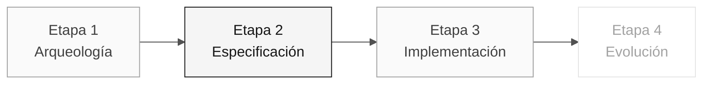

# Persona — Especialista en Requisitos

> **Ruta:** [Kit del equipo](../../README.md) › [Personas](../OVERVIEW.md) › [Especialista en Requisitos](README.md) › **PERSONA**

**Perfil completo de la persona Especialista en Requisitos.** Define la misión, las responsabilidades por etapa, las herramientas, la transición y las rúbricas de evaluación.

| Campo | Valor |
|---|---|
| **Rol** | Especialista en Requisitos |
| **Pareja** | 1 · Visión (con el Responsable de Producto) |
| **Etapas activas** | Lidera la 2 (EARS); apoya la 1 y la 3 |
| **Artefactos producidos** | Catálogo de reglas, sección "Requisitos funcionales" en EARS y especificación viva |
| **Artefactos consumidos** | Priorización del PO y programas `.NSN` de la Etapa 1 |
| **Entrega a** | Pareja 2 (Arquitectura) en la Etapa 2 |

 

---

## Concepto

El Especialista en Requisitos transforma las reglas descubiertas en el sistema heredado en requisitos formales y comprobables. En la industria, este profesional garantiza que el sistema que se construye resuelva el problema correcto y que exista una forma objetiva de verificar que se construyó correctamente.

En SIFAP (Sistema de Fiscalización y Administración de Pagos), las reglas de negocio están codificadas de forma tácita en Natural, sin documentación actualizada, comentarios ni manual. El RE extrae estas reglas de los programas `.NSN`, las clasifica (regla de negocio, validación, cálculo, integración) y las convierte a EARS (Easy Approach to Requirements Syntax) con trazabilidad explícita mediante `source_legacy:`.

**Ejemplo concreto de SIFAP:** el programa `SIFAP003.NSN` contiene una rutina de validación de CPF del beneficiario. El RE lee el código Natural, identifica la regla, asigna un REQ-ID (por ejemplo, `REQ-042`) y escribe el requisito en EARS: "El sistema SHALL validar el CPF del beneficiario antes de procesar el pago." Con `source_legacy: 01-archaeology/legacy-sifap/natural-programs/SIFAP003.NSN`.

---

## Dónde trabajas en el SDLC

- **Recibe de:** PO (priorización) y Etapa 1 (catálogo de reglas)
- **Entrega a:** Pareja 2 (Arquitectura) en la Etapa 2

---

## Responsabilidades por etapa

| **Etapa** | Qué haces | Entregable que depende de ti |
|---|---|---|
| **1 · Arqueología** | Extraes reglas candidatas de los programas Natural. Las clasificas como regla de negocio, validación, cálculo o integración. | Catálogo de reglas (tabla) |
| **2 · Especificación** | Conviertes el catálogo en requisitos EARS. Mantienes la trazabilidad legado → requisito. Estructuras la especificación junto con el PO. | Sección "Requisitos funcionales" en notación EARS |
| **3 · Implementación** | Respondes preguntas sobre los requisitos durante la programación. Ajustas la redacción cuando surge una ambigüedad real. | Especificación viva, no congelada |
| **4 · Evolución** | Revisas si las dos issues cubren un requisito nuevo o ajustan uno existente. | Coherencia entre las issues y la especificación |

---

## Kit de la persona

| **Artefacto** | Propósito |
|---|---|
| `.github/agents/requirements-engineer.agent.md` | Agente de Copilot configurado para análisis de requisitos |
| `/spec-sync` — `persona-requirements-engineer-spec-sync.prompt.md` | Sincroniza la especificación con los cambios del código |
| `/contradiction-check` — `persona-requirements-engineer-contradiction-check.prompt.md` | Detecta conflictos entre requisitos |
| `/ears-convert` — `persona-requirements-engineer-ears-convert.prompt.md` | Convierte texto libre a EARS |
| `.github/instructions/requirements.instructions.md` | Convenciones de documentación de requisitos |

---

## Herramientas y primitivas

- **GitHub Spec-Kit** — `/speckit.specify` es el espacio de trabajo principal. Specify CLI genera la base de la especificación que se refina en EARS.
- **Copilot Chat** para validar la coherencia entre requisitos.
- **MCP/filesystem** del repositorio para recorrer los archivos `.NSN` heredados y relacionarlos con los requisitos.
- Prompts y skills del kit — extracción de reglas y conversión a EARS.

**Fichas de referencia relevantes:**

- [`../../09-cheat-sheets/spec-kit-workflow.md`](../../09-cheat-sheets/spec-kit-workflow.md) — `/speckit.specify` y `/speckit.clarify` con ejemplos EARS.
- [`../../09-cheat-sheets/model-routing.md`](../../09-cheat-sheets/model-routing.md) — cuándo usar Claude Sonnet 4.6 frente a Opus 4.6.

---

## Lista de verificación de incorporación

- [ ] **Lee este perfil.** Misión, responsabilidades y transición.
- [ ] **Abre el `README.md` del kit.** Confirma que los agentes y prompts aparezcan en Copilot Chat.
- [ ] **Repasa los 6 patrones EARS.** Abre la sección "Notación EARS" de [`../../02-modern-spec/GUIDE.md`](../../02-modern-spec/GUIDE.md).
- [ ] **Identifica tu pareja.** Consulta [00-TEAM-FLOW.md](../../00-TEAM-FLOW.md).
- [ ] **Anota la transición.** De quién recibes y a quién entregas al final de cada etapa.

---

## Cómo tener éxito en este rol

- Tus requisitos usan verbos activos y son comprobables.
- Cada regla del legado tiene trazabilidad explícita al requisito moderno mediante `source_legacy:`.
- Dices "esto es ambiguo; necesitamos una decisión" antes de que se escriba código.
- Usas los seis patrones EARS sin confundirlos (ubicuo, guiado por eventos, guiado por estados, no deseado, opcional, complejo).

---

## Errores comunes y cómo evitarlos

| **Síntoma** | Causa | Corrección |
|---|---|---|
| El requisito no tiene criterio de verificación | Se escribió como párrafo, no como EARS | Reescribe con el verbo "SHALL" y una condición explícita |
| La regla del legado no tiene equivalente | Arqueología incompleta | Revisa el catálogo de reglas antes de cerrar la especificación |
| El requisito duplica el contenido de un ADR | Confusión entre un requisito y una decisión de diseño | Un requisito describe comportamiento; un ADR registra una decisión de arquitectura |
| "El sistema debe usar Redis" entra en la especificación | Confusión entre requisito e implementación | Un requisito funcional no menciona tecnología |

---

## 3 ejemplos de prompts

1. **(Chat)** "Lee esta regla del SIFAP heredado y conviértela a notación EARS: [pegar la regla]. Identifica cuál de los 6 patrones EARS se aplica y explica por qué."
2. **(Chat)** "Analiza estos 5 requisitos EARS y encuentra: (a) ambigüedades que necesiten una decisión del PO, (b) dependencias entre ellos y (c) requisitos en conflicto."
3. **(Plan)** "En `spec.md`, planifica requisitos EARS para las reglas confirmadas del catálogo. Elige el patrón EARS según el comportamiento observado."

---

## Si no puedes avanzar

| **Situación** | Qué hacer |
|---|---|
| No conoces EARS | Abre la sección "Notación EARS" de [`../../02-modern-spec/GUIDE.md`](../../02-modern-spec/GUIDE.md): 6 patrones con ejemplos |
| Requisito ambiguo | Escribe dos interpretaciones y pregunta al PO cuál es correcta |
| Muchas reglas y poco tiempo | Prioriza las reglas según el riesgo y el impacto registrados por el equipo |
| Spec-Kit no funciona | Restablece la herramienta antes de crear artefactos formales; estos pertenecen a `specs/<NNN>-<feature>/spec.md` |

---

## Dependencias

| **Persona** | Relación | Artefacto |
|---|---|---|
| Responsable de Producto | Dependes de esta persona | Priorización de reglas |
| Desarrollador | Depende de ti | Requisitos claros para implementar |
| Ingeniero de Calidad | Depende de ti | Requisitos comprobables con criterios de verificación |
| Arquitecto de Software | Depende de ti | Requisitos para diseñar contextos delimitados |

---

## Cómo se te evalúa

- **Rúbrica A2 (Coherencia de la especificación):** requisitos en EARS, numerados y trazables al sistema heredado.
- **Rúbrica A1 (Arqueología):** catálogo de reglas con clasificación.
- Criterio: "Cada requisito tiene un verbo activo y es comprobable."

---

### Sigue leyendo

| Anterior | Siguiente |
|---|---|
| [Responsable de Producto](../01-product-owner/PERSONA.md) Pareja 1 · Visión · valida el alcance y las prioridades. | [Arquitecto Empresarial](../03-enterprise-architect/PERSONA.md) Pareja 2 · Arquitectura · C4 + ADR estructurales. |

[Volver al índice del kit](../../README.md)
