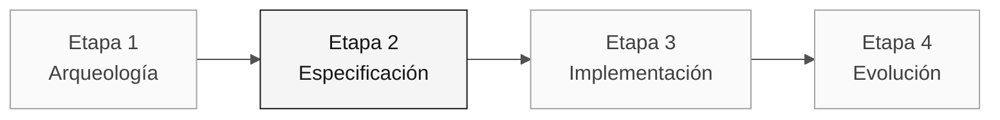

# Persona — Arquitecto Empresarial

> **Ruta:** [Kit del equipo](../../README.md) › [Personas](../OVERVIEW.md) › [Arquitecto Empresarial](README.md) › **PERSONA**

**Perfil completo de la persona Arquitecto Empresarial.** Define la misión, las responsabilidades por etapa, las herramientas, la transición y las rúbricas de evaluación.

| Campo | Valor |
|---|---|
| **Rol** | Arquitecto Empresarial |
| **Pareja** | 2 · Arquitectura (con el Arquitecto de Software) |
| **Etapas activas** | Lidera la 2 (C4 + ADR estructurales); apoya la 1 y la 4 |
| **Artefactos producidos** | Mapa de dependencias externas, ADR de topología y validación de contratos |
| **Artefactos consumidos** | Catálogo de reglas (Pareja 1), requisitos de integración (RE) |
| **Entrega a** | Pareja 3 (Implementación) y Pareja 4 (Calidad) en la Etapa 2; Pareja 5 (Operaciones) para Terraform |

 

---

## Concepto

El Arquitecto Empresarial contempla el sistema dentro de su ecosistema organizativo y técnico. En la industria, este rol garantiza que las soluciones nuevas encajen en el contexto existente: contratos con sistemas externos, estándares corporativos de seguridad y requisitos de gobernanza.

En SIFAP (Sistema de Fiscalización y Administración de Pagos), esto significa SIAFI, Banco do Brasil, INCRA, MDA y otros sistemas gubernamentales internos. El EA sabe dónde están los contratos, cuáles son frágiles y cuáles pueden modificarse sin desencadenar una cadena de efectos imprevistos. Sin este mapeo, el equipo de implementación puede crear un servicio que funcione localmente, pero falle en producción porque rompe un contrato de integración.

**Ejemplo concreto de SIFAP:** el programa `SIFAP007.NSN` llama a SIAFI de forma síncrona para confirmar pagos. El EA identifica este contrato, evalúa la fragilidad de la integración y decide si la estrategia de coexistencia debe ser síncrona o asíncrona, antes de que se escriba código.

---

## Dónde trabajas en el SDLC

- **Recibe de:** Pareja 1 (Visión) en la Etapa 1 — catálogo de reglas y alcance
- **Entrega a:** Pareja 3 (Implementación) y Pareja 4 (Calidad) en la Etapa 2; Pareja 5 (Operaciones) para Terraform

---

## Responsabilidades por etapa

| **Etapa** | Qué haces | Entregable que depende de ti |
|---|---|---|
| **1 · Arqueología** | Identificas dependencias y contratos externos que afectan a la porción seleccionada. | Evidencia de integración relevante |
| **2 · Especificación** | Registras solo las decisiones de topología que bloquean el plan. | ADR de topología o decisión de alcance cuando sea necesario |
| **3 · Implementación** | Validas que la implementación respete los contratos diseñados. Apoyas a DevOps con Terraform de alto nivel. | Validación de la estructura desplegada |
| **4 · Evolución** | Evalúas si las issues de la Etapa 4 tienen implicaciones de arquitectura que requieren revisión previa. | Evaluación de impacto |

---

## Kit de la persona

| **Artefacto** | Propósito |
|---|---|
| `.github/agents/enterprise-architect.agent.md` | Agente de Copilot configurado para arquitectura y seguridad |
| `/create-constitution` — `persona-enterprise-architect-create-constitution.prompt.md` | Crea o actualiza `.specify/memory/constitution.md` |
| `/create-adr` — `persona-enterprise-architect-create-adr.prompt.md` | Crea un ADR a partir de una decisión del equipo |
| `/architecture-review` — `persona-enterprise-architect-architecture-review.prompt.md` | Revisa un diseño propuesto frente a contratos y riesgos |
| `.github/instructions/security.instructions.md` | Convenciones de seguridad |
| `.github/instructions/infrastructure.instructions.md` | Convenciones de IaC |

---

## Herramientas y primitivas

- **Mermaid** y **C4** para diagramas de contexto y contenedores.
- **Copilot Chat** para poner a prueba las decisiones de topología.
- **GitHub Spec-Kit** con `/speckit.plan`: convierte la especificación en un plan técnico, decisiones y contratos revisables.
- Skills del kit — prompts estructurados para el análisis de dependencias.

**Fichas de referencia relevantes:**

- [`../../09-cheat-sheets/spec-kit-workflow.md`](../../09-cheat-sheets/spec-kit-workflow.md) — `/speckit.plan` y `/speckit.analyze`.
- [`../../09-cheat-sheets/model-routing.md`](../../09-cheat-sheets/model-routing.md) — usa Claude Opus 4.6 para el análisis del impacto arquitectónico.

---

## Lista de verificación de incorporación

- [ ] **Lee este perfil.** Misión, responsabilidades y transición.
- [ ] **Abre el `README.md` del kit.** Confirma que los agentes y prompts aparezcan en Copilot Chat.
- [ ] **Identifica tu pareja.** Consulta [00-TEAM-FLOW.md](../../00-TEAM-FLOW.md).
- [ ] **Mapea las integraciones externas.** Enumera SIAFI, BB, INCRA y otros sistemas presentes en los programas `.NSN` asignados.
- [ ] **Anota la transición.** Ten claro quién recibe el mapa de dependencias y para qué artefacto.

---

## Cómo tener éxito en este rol

- Cualquier integrante no técnico del equipo puede comprender el diagrama C4 de nivel 1 en 30 segundos.
- Tus ADR nombran el "camino no elegido" y explican por qué.
- Fundamentas la estrategia Strangler Fig —coexistencia del SIFAP heredado con SIFAP 2.0— en razonamiento técnico, no en modas.
- Acuerdas con el Arquitecto de Software dónde termina tu alcance y empieza el suyo.

---

## Errores comunes y cómo evitarlos

| **Síntoma** | Causa | Corrección |
|---|---|---|
| El diagrama resulta incomprensible para las personas no técnicas | Se usó C4 L3/L4 donde bastaba L1/L2 | Usa primero L1; profundiza solo para una pregunta técnica específica |
| Se ignoran las integraciones reales | Atención excesiva a la estructura interna | Enumera SIAFI, BB y los demás durante la arqueología |
| Trabajo duplicado con el Arquitecto de Software | No se definió el límite de responsabilidades | Acuerden al principio: el EA se ocupa de lo externo; el SA, de lo interno |
| ADR genérico sin valor | "Usaremos Spring Boot" no es una decisión del EA | Un ADR del EA responde a "¿cómo nos conectamos con X?", no a "¿qué framework usamos?" |

---

## 3 ejemplos de prompts

1. **(Chat)** "Crea un diagrama C4 de nivel 1 con los actores y sistemas externos confirmados por el equipo."
2. **(Chat)** "Para esta dependencia externa, ¿qué riesgos de disponibilidad debemos evaluar? Propón alternativas y sus compromisos."
3. **(Chat)** "Compara las opciones de integración planteadas por el equipo y estructura un ADR sin anticipar la decisión."

---

## Si no puedes avanzar

| **Situación** | Qué hacer |
|---|---|
| No conoces C4 | Usa un diagrama de flujo Mermaid sencillo: cajas = sistemas, flechas = integraciones. Etiqueta las flechas |
| Dedicaste demasiado tiempo al nivel 3 de C4 | Detente. Nivel 1 + nivel 2 son suficientes para esta inmersión |
| No conoces Mermaid | Pide a Copilot: "Crea un diagrama C4 de nivel 1 en Mermaid a partir de estos actores e integraciones confirmados" |
| Desacuerdo con el Arquitecto de Software | Escribe un ADR con ambas opciones y pide al equipo que vote |

---

## Dependencias

| **Persona** | Relación | Artefacto |
|---|---|---|
| Arquitecto de Software | Depende de ti | Dependencias y decisiones que afectan a la porción seleccionada |
| Ingeniero DevOps | Depende de ti | Topología para Terraform |
| Desarrollador | Depende de ti (indirectamente) | Contratos de integración |
| Especialista en Requisitos | Dependes de esta persona | Requisitos de integración |

---

## Cómo se te evalúa

- **Rúbrica A1 (Arqueología):** mapa de dependencias comprensible para personas no técnicas.
- **Rúbrica A2 (Coherencia de la especificación):** los ADR nombran el "camino no elegido".
- Criterio: "Las decisiones de alcance y las dependencias relevantes son trazables."

---

### Sigue leyendo

| Anterior | Siguiente |
|---|---|
| [Especialista en Requisitos](../02-requirements-engineer/PERSONA.md) Pareja 1 · Visión · escribe EARS con source_legacy. | [Arquitecto de Software](../04-software-architect/PERSONA.md) Pareja 2 · Arquitectura · contextos delimitados y módulos. |

[Volver al índice del kit](../../README.md)
