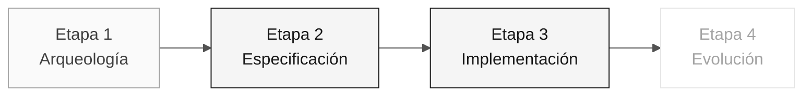

# Persona — Arquitecto de Software

> **Ruta:** [Kit del equipo](../../README.md) › [Personas](../OVERVIEW.md) › [Arquitecto de Software](README.md) › **PERSONA**

**Perfil completo de la persona Arquitecto de Software.** Define la misión, las responsabilidades por etapa, las herramientas, la transición y las rúbricas de evaluación.

| Campo | Valor |
|---|---|
| **Rol** | Arquitecto de Software |
| **Pareja** | 2 · Arquitectura (con el Arquitecto Empresarial) |
| **Etapas activas** | Lidera la 2 (contextos delimitados, módulos) y la 3 (revisión estructural) |
| **Artefactos producidos** | `plan.md`, `CODEMAP.md`, estructura de paquetes de Spring y ADR de diseño interno |
| **Artefactos consumidos** | Evidencia de dependencias (EA), REQ-ID (RE) |
| **Entrega a** | Pareja 3 (Implementación) en la Etapa 2 — `plan.md` claro y primera tarea |

 

---

## Concepto

El Arquitecto de Software define la estructura interna del sistema: cómo se organizan los módulos, dónde empiezan y terminan los contextos delimitados (una técnica del diseño guiado por el dominio para separar responsabilidades) y qué contratos se exponen entre las partes del sistema.

En la industria, este rol es responsable de mantener el sistema verdaderamente modular: que los cambios en un módulo no rompan otros de forma inesperada. En un Monolito Modular (un único proceso desplegado con código organizado en módulos independientes), el SA garantiza que se mantenga la modularidad del código incluso bajo presión de plazos.

En SIFAP (Sistema de Fiscalización y Administración de Pagos), el SA define los contextos delimitados del sistema moderno (por ejemplo, `pagamento`, `beneficiario`, `fiscalizacao`) y cómo se corresponde cada uno con los programas Natural heredados. Esta decisión orienta toda la Etapa 3.

**Ejemplo concreto de SIFAP:** los programas `SIFAP001.NSN` a `SIFAP005.NSN` gestionan la lógica de pagos. El SA determina que estos programas pertenecen al contexto delimitado `pagamento`, crea la estructura de paquetes `br.gov.sifap.pagamento.{domain,application,infrastructure}` y documenta la decisión.

---

## Dónde trabajas en el SDLC

- **Recibe de:** Arquitecto Empresarial (evidencia de dependencias) y Especialista en Requisitos (REQ-ID)
- **Entrega a:** Pareja 3 (Implementación) en la Etapa 2 — `plan.md` claro y primera tarea

---

## Responsabilidades por etapa

| **Etapa** | Qué haces | Entregable que depende de ti |
|---|---|---|
| **1 · Arqueología** | Identificas conceptos recurrentes y dependencias relevantes para la porción seleccionada. | Evidencia para debatir los límites de los contextos |
| **2 · Especificación** | Escribes el plan técnico de la funcionalidad y registras una decisión solo cuando bloquea la tarea. | `plan.md` y ADR de apoyo, si es necesario |
| **3 · Implementación** | Estableces la estructura inicial del proyecto Spring (paquetes, capas). Revisas las PR que atraviesan límites de contextos. | `pom.xml` + distribución de módulos + revisión de PR estructurales |
| **4 · Evolución** | Validas que la PR del agente respete los límites. Rechazas las integraciones que rompen la modularidad. | Modularidad preservada |

---

## Kit de la persona

| **Artefacto** | Propósito |
|---|---|
| `.github/agents/software-architect.agent.md` | Agente de Copilot configurado para arquitectura de software |
| `/codemap` — `persona-software-architect-codemap.prompt.md` | Genera o actualiza el `CODEMAP.md` del proyecto |
| `/impl-plan` — `persona-software-architect-impl-plan.prompt.md` | Crea el plan técnico de implementación |
| `/api-validate` — `persona-software-architect-api-validate.prompt.md` | Valida los contratos de API frente a la especificación |
| `.github/instructions/backend.instructions.md` | Convenciones de backend Java |
| `.github/instructions/frontend.instructions.md` | Convenciones de frontend Next.js |

---

## Herramientas y primitivas

- **Copilot Plan** para diseñar las estructuras iniciales de los módulos antes de implementarlos.
- **GitHub Spec-Kit** — `/speckit.plan` y `/speckit.analyze` para planes, contratos y coherencia.
- **Mermaid / C4** para diagramas de contexto y componentes.
- Skills del kit — prompts para elegir entre patrones (hexagonal frente a paquetes por capas).

**Fichas de referencia relevantes:**

- [`../../09-cheat-sheets/spec-kit-workflow.md`](../../09-cheat-sheets/spec-kit-workflow.md) — `/speckit.plan`, `/speckit.tasks` y `/speckit.analyze`.
- [`../../09-cheat-sheets/model-routing.md`](../../09-cheat-sheets/model-routing.md) — Claude Opus 4.6 para decisiones; Sonnet 4.6 para edición por lotes.

---

## Lista de verificación de incorporación

- [ ] **Lee este perfil.** Misión, responsabilidades y transición.
- [ ] **Abre el `README.md` del kit.** Confirma que los agentes y prompts aparezcan en Copilot Chat.
- [ ] **Identifica tu pareja.** Consulta [00-TEAM-FLOW.md](../../00-TEAM-FLOW.md).
- [ ] **Coordínate con el EA.** Define dónde empieza y termina el alcance de cada persona.
- [ ] **Anota la transición.** Ten claro quién recibe `plan.md` y qué debe contener.

---

## Cómo tener éxito en este rol

- La organización de paquetes refleja contextos delimitados, no capas técnicas.
- Tus ADR son breves, específicos y citan la funcionalidad correspondiente en `specs/<NNN>-<feature>/` cuando sea pertinente.
- El Monolito Modular sigue siendo un monolito en el despliegue, pero modular en el código.
- Redefines los límites cuando hay evidencia, en lugar de "pedir perdón después".

---

## Errores comunes y cómo evitarlos

| **Síntoma** | Causa | Corrección |
|---|---|---|
| Código organizado por capas (controller/service/repository) | El SA no definió explícitamente los contextos delimitados | Crea paquetes por contexto de negocio, no por tipo técnico |
| ADR genérico sin valor | "Usaremos Spring Boot" no es una decisión de arquitectura | Un ADR del SA responde a "¿cómo organizamos X?" o "¿qué patrón usamos aquí?" |
| Dos contextos importan clases uno del otro | No se respetó el límite del contexto | Expón solo interfaces públicas; nunca uses importaciones directas entre contextos |
| Arquitectura hexagonal estricta donde no aporta valor | Patrón aplicado por costumbre | Elige el patrón que mejor atienda al contexto; registra la elección |

---

## 3 ejemplos de prompts

1. **(Chat)** "A partir de estos requisitos EARS, propón hipótesis de límites de contextos. Para cada hipótesis, enumera la evidencia, las entidades y las dependencias."
2. **(Plan)** "En el proyecto Spring Boot, planifica la estructura de paquetes de un nuevo contexto delimitado 'notification' siguiendo el patrón existente (domain/application/infrastructure)."
3. **(Chat)** "Revisa esta PR e identifica importaciones que atraviesen los límites de los contextos delimitados. Para cada infracción, sugiere cómo aislarla."

---

## Si no puedes avanzar

| **Situación** | Qué hacer |
|---|---|
| Los contextos delimitados no están claros | Empieza por la evidencia de cohesión, acoplamiento y frecuencia de cambio; no supongas los límites |
| La decisión sobre los límites está bloqueada | Vuelve a la evidencia del legado y registra la pregunta; no crees un diagrama como sustituto de la confirmación |
| El equipo se organizó por capas en lugar de contextos | No refactorices ahora: documéntalo en el ADR y corrígelo si queda tiempo |
| No sabes si algo pertenece al dominio o a la aplicación | "Si es una regla de negocio pura, es dominio. Si orquesta, es aplicación." |

---

## Dependencias

| **Persona** | Relación | Artefacto |
|---|---|---|
| Arquitecto Empresarial | Dependes de esta persona | Evidencia de dependencias para el plan técnico |
| Desarrollador | Depende de ti | Estructura de paquetes para implementar |
| Líder Técnico | Depende de ti | Patrones de módulos que debe hacer cumplir |
| DBA | Depende de ti | Límites de contextos para el modelo de datos |

---

## Cómo se te evalúa

- **Rúbrica A2 (Especificación):** plan técnico coherente con los requisitos y la evidencia.
- **Rúbrica A3 (Integridad técnica):** contextos delimitados respetados en el código.
- Criterio: "Ninguna importación atraviesa un límite de contexto sin justificación."

---

### Sigue leyendo

| Anterior | Siguiente |
|---|---|
| [Arquitecto Empresarial](../03-enterprise-architect/PERSONA.md) Pareja 2 · Arquitectura · C4 + ADR estructurales. | [Líder Técnico](../05-technical-lead/PERSONA.md) Pareja 3 · Implementación · estándares y revisión. |

[Volver al índice del kit](../../README.md)
