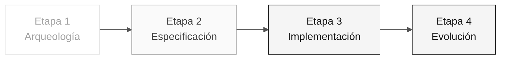

# Persona — Líder Técnico

> **Ruta:** [Kit del equipo](../../README.md) › [Personas](../OVERVIEW.md) › [Líder Técnico](README.md) › **PERSONA**

**Perfil completo de la persona Líder Técnico.** Define la misión, las responsabilidades por etapa, las herramientas, la transición y las rúbricas de evaluación.

| Campo | Valor |
|---|---|
| **Rol** | Líder Técnico |
| **Pareja** | 3 · Implementación (con el Desarrollador) |
| **Etapas activas** | Lidera la 3 (estándares, revisión) y colidera la 4; apoya la 2 |
| **Artefactos producidos** | Estándares de implementación, revisiones de PR y aplicación funcionando de extremo a extremo |
| **Artefactos consumidos** | REQ-ID, ADR y C4 (Pareja 2) |
| **Entrega a** | Pareja 5 (Operaciones) en la Etapa 3 — código en ejecución |

  

---

## Concepto

El Líder Técnico conecta la arquitectura definida en el papel con el código escrito cada día. En la industria, este rol define los estándares de implementación (convenciones de código, estilo de pruebas y estructura de módulos), desbloquea al equipo cuando alguien se atasca en un detalle técnico y responde por la calidad técnica de las entregas.

En SIFAP (Sistema de Fiscalización y Administración de Pagos), el TL garantiza que la aplicación creada por el equipo realmente funcione de extremo a extremo al finalizar la Etapa 3, no solo que compile. Esto incluye decisiones como qué capa recibe la anotación `@Transactional`, cómo se manejan los errores y cómo se estructuran las pruebas de integración.

**Ejemplo concreto de SIFAP:** cuando el Desarrollador implementa el endpoint de consulta de beneficios, el TL revisa la PR para verificar que la lógica de negocio esté en la capa correcta, que la prueba cubra los flujos correctos y de error y que ninguna importación atraviese un límite de contexto delimitado.

---

## Dónde trabajas en el SDLC

- **Recibe de:** Pareja 2 (Arquitectura) en la Etapa 2 — REQ-ID + ADR + C4
- **Entrega a:** Pareja 5 (Operaciones) en la Etapa 3 — código en ejecución

---

## Responsabilidades por etapa

| **Etapa** | Qué haces | Entregable que depende de ti |
|---|---|---|
| **1 · Arqueología** | Participas en el análisis priorizando los programas críticos. Estimas la complejidad. | Priorización basada en el esfuerzo |
| **2 · Especificación** | Validas que la especificación quepa en los 70 minutos de la Etapa 3. Señalas lo que "no cabe". | Ajuste del alcance |
| **3 · Implementación** | Desbloqueas. Decides los estándares (estilo de pruebas, transacciones y manejo de errores). Revisas cada PR. | Aplicación funcionando de extremo a extremo |
| **4 · Evolución** | Revisas la PR del agente línea por línea antes de integrarla. | PR con calidad de producción |

---

## Kit de la persona

| **Artefacto** | Propósito |
|---|---|
| `.github/agents/tech-lead.agent.md` | Agente de Copilot configurado para gobernanza técnica |
| `/setup-project` — `persona-technical-lead-setup-project.prompt.md` | Inicializa la estructura del proyecto |
| `/routing-table` — `persona-technical-lead-routing-table.prompt.md` | Genera una tabla de selección de modelos por tarea |
| `/audit-context` — `persona-technical-lead-audit-context.prompt.md` | Audita el contexto enviado a Copilot |

---

## Herramientas y primitivas

- **Copilot Plan** para refactorización por lotes con una secuencia clara.
- **Copilot Chat** como compañero para decisiones de diseño locales.
- **GitHub Spec-Kit** — apoyo en `/speckit.tasks`, `/speckit.analyze` y la transición a `/speckit.implement`.
- **Git MCP** para revisión de PR.

**Fichas de referencia relevantes:**

- [`../../09-cheat-sheets/copilot-3-modes.md`](../../09-cheat-sheets/copilot-3-modes.md) — alternas constantemente entre los tres modos.
- [`../../09-cheat-sheets/spec-kit-workflow.md`](../../09-cheat-sheets/spec-kit-workflow.md) — `/speckit.tasks` y `/speckit.implement`.
- [`../../09-cheat-sheets/model-routing.md`](../../09-cheat-sheets/model-routing.md) — selección de modelos por tipo de tarea.

---

## Lista de verificación de incorporación

- [ ] **Lee este perfil.** Misión, responsabilidades y transición.
- [ ] **Abre el `README.md` del kit.** Confirma que los agentes y prompts aparezcan en Copilot Chat.
- [ ] **Identifica tu pareja.** Consulta [00-TEAM-FLOW.md](../../00-TEAM-FLOW.md).
- [ ] **Define 2 estándares clave.** Antes de que empiece la Etapa 3, elige las convenciones de transacciones y pruebas.
- [ ] **Anota la transición.** Ten claro qué debe recibir DevOps al final de la Etapa 3.

---

## Cómo tener éxito en este rol

- Responde una pregunta técnica en menos de 5 minutos. No dejes a nadie inactivo.
- Escribe revisiones que hagan avanzar la PR, no que la bloqueen.
- Elige dos estándares clave al inicio de la Etapa 3 y mantenlos como no negociables (por ejemplo, `@Transactional` solo en la capa de servicios).
- Mantén `main` en verde en todo momento.

---

## Errores comunes y cómo evitarlos

| **Síntoma** | Causa | Corrección |
|---|---|---|
| Desarrollador bloqueado durante más de 20 minutos | El TL escribe código en lugar de desbloquear | Detén lo que estés haciendo y responde la pregunta |
| PR bloqueada por detalles estéticos | Revisión centrada en el estilo, no en la corrección | Revisa los criterios: comportamiento correcto, prueba presente y ningún límite vulnerado |
| El estándar cambia a mitad de la Etapa 3 | No se registró la decisión al principio | Define los estándares antes de empezar y documéntalos en `CODEMAP.md` |
| La aplicación no funciona al final | No se identificó el cuello de botella a tiempo | Ejecuta una prueba de integración completa cada 30 minutos |

---

## 3 ejemplos de prompts

1. **(Chat)** "Revisa esta PR: verifica que siga las 3 capas (domain/application/infrastructure), que la prueba cubra los flujos correctos y de error y que ninguna importación atraviese un contexto delimitado."
2. **(Chat)** "Tenemos 70 minutos. Ayuda a comparar estas funcionalidades según la evidencia, las dependencias y el esfuerzo para elegir una funcionalidad acotada; no completes los requisitos faltantes."
3. **(Chat)** "El entorno local falla con este error: [pegar]. Diagnostica la causa raíz y propón una corrección."

---

## Si no puedes avanzar

| **Situación** | Qué hacer |
|---|---|
| El entorno local no se inicia | Comprueba: ¿está ocupado el puerto 5432? ¿Son correctas las versiones de Java/Node? ¿Interfieren contenedores antiguos? ¿Qué error aparece en los logs del backend? |
| El equipo avanza despacio | Detente y redistribuye: "Dev A se encarga del endpoint, Dev B de la migración y QA de la prueba. Integramos en 45 minutos." |
| La PR tiene conflictos | Ejecuta `git pull --rebase` y resuélvelos. No dejes que la rama diverja sin coordinarte con tu pareja |
| No sabes cómo elegir un estándar | Usa la especificación, los ADR y las instrucciones del kit como fuentes; documenta la decisión en la PR |

---

## Dependencias

| **Persona** | Relación | Artefacto |
|---|---|---|
| Arquitecto de Software | Dependes de esta persona | Estructura de paquetes definida |
| Responsable de Producto | Dependes de esta persona | Alcance ajustado |
| Desarrollador | Depende de ti | Estándares y revisiones |
| Ingeniero de Calidad | Depende de ti | Pipeline en verde para ejecutar pruebas |
| Ingeniero DevOps | Depende de ti | Build estable para el pipeline |

---

## Cómo se te evalúa

- **Rúbrica A3 (Integridad técnica):** la aplicación creada por el equipo funciona localmente y en CI.
- **Rúbrica A6 (Colaboración):** nadie permanece bloqueado durante más de 20 minutos.
- Criterio: "`main` en verde en todo momento, PR revisadas en menos de 15 minutos."

---

### Sigue leyendo

| Anterior | Siguiente |
|---|---|
| [Arquitecto de Software](../04-software-architect/PERSONA.md) Pareja 2 · Arquitectura · contextos delimitados y módulos. | [Desarrollador](../06-developer/PERSONA.md) Pareja 3 · Implementación · Java + Next.js + pruebas. |

[Volver al índice del kit](../../README.md)
