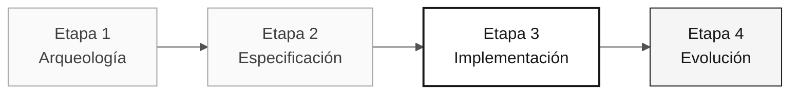

# Persona — Desarrollador

> **Ruta:** [Kit del equipo](../../README.md) › [Personas](../OVERVIEW.md) › [Desarrollador](README.md) › **PERSONA**

**Perfil de referencia de la persona Desarrollador en la inmersión de modernización de SIFAP.**

  

| Campo | Valor |
|---|---|
| **Rol** | Desarrollador |
| **Pareja** | Pareja 3 — Implementación (con el Líder Técnico) |
| **Etapas activas** | Etapa 3 — Implementación (lidera); Etapa 4 — Evolución (apoya) |
| **Artefactos producidos** | Backend (Java 21 + Spring Boot 3.3), frontend (Next.js 15), pruebas (JUnit 5 + Testcontainers + Vitest) y PR revisables |
| **Artefactos consumidos** | Requisitos EARS (Especialista en Requisitos), estructura de paquetes y contextos delimitados (Arquitecto de Software), migraciones Flyway (DBA) |
| **Entrega a** | Ingeniero de Calidad — código comprobable; Ingeniero DevOps — build estable |

---

## Qué es esta persona

El Desarrollador escribe el código. En la modernización de SIFAP (Sistema de Fiscalización y Administración de Pagos), esta persona traduce programas Natural y estructuras DDM/Adabas a Java 21 con Spring Boot 3.3, implementa el frontend en Next.js 15 con TypeScript estricto y garantiza que cada requisito EARS se convierta en un endpoint funcional con pruebas aprobadas.

Dentro del marco Agentic Legacy Modernization, el Desarrollador trabaja en la capa de traducción (agente de traducción — Etapa 3) y acompaña al agente de revisión en la Etapa 4, interviniendo cuando Copilot Agent se desvía de los estándares de arquitectura definidos por el equipo.

## Dónde trabajas en el SDLC

| Etapa | Responsabilidad | Entregable |
|---|---|---|
| **1 — Arqueología** | Leer programas Natural con Copilot Chat y producir un resumen comprensible para el equipo | Resúmenes narrativos de los programas |
| **2 — Especificación** | Trabajar en pareja con el Especialista en Requisitos para anticipar problemas de implementación | Notas preventivas en la especificación |
| **3 — Implementación** | Implementar, probar, abrir una PR, revisar la PR de la pareja e iterar | Backend + frontend de la porción priorizada |
| **4 — Evolución** | Acompañar a Copilot Agent, intervenir cuando sea necesario y terminar lo que el agente no completó | PR del agente lista para integrarse |

## Responsabilidad principal

Transformar la especificación en código ejecutable usando Copilot de forma deliberada: modo Ask para comprender, modo Plan para planificar cambios en varios archivos y modo Agent para delegar tareas bien definidas. Crear commits todos los días.

## Competencias clave

- Implementación en Java 21: records, interfaces selladas, hilos virtuales, Optional y Bean Validation
- Implementación en TypeScript: Next.js 15 App Router, Server Actions y `strict: true`
- TDD con JUnit 5, Testcontainers y Vitest
- Refactorización incremental con commits separados por intención
- Alternancia deliberada entre los tres modos de Copilot

## Kit de la persona

| Artefacto | Ruta | Uso |
|---|---|---|
| Agente de implementación | `.github/agents/implementer.agent.md` | Implementación, TDD y corrección de errores |
| Prompt `/implement` | `.github/prompts/persona-developer-implement.prompt.md` | Iniciar la implementación a partir de una especificación |
| Prompt `/fix-bug` | `.github/prompts/persona-developer-fix-bug.prompt.md` | Ciclo comprender → reproducir → corregir → verificar |
| Prompt `/tdd` | `.github/prompts/persona-developer-tdd.prompt.md` | Escribir una prueba antes de implementar |
| Prompt `/refactor` | `.github/prompts/persona-developer-refactor.prompt.md` | Refactorizar sin cambiar el comportamiento |

## Herramientas y modos de Copilot

| Herramienta / Modo | Cuándo usarlo |
|---|---|
| **Copilot Ask** | Comprender el código Natural heredado y debatir el diseño antes de implementar |
| **Copilot Plan** | Modo principal en la Etapa 3: planificar cambios que afecten a varios archivos |
| **Copilot Agent** | Etapa 4: delegar tareas bien definidas a partir de Issues |
| **Spec-Kit** (`/speckit.tasks`, `/speckit.implement`) | Consumir los artefactos del Arquitecto de Software y del Especialista en Requisitos |
| **GitHub MCP** | Trabajar con Issues y PR sin salir de VS Code |

## Fichas de referencia recomendadas

- [`09-cheat-sheets/copilot-3-modes.md`](../../09-cheat-sheets/copilot-3-modes.md) — mapa para el día; úsalo constantemente
- [`09-cheat-sheets/spec-kit-workflow.md`](../../09-cheat-sheets/spec-kit-workflow.md) — `/speckit.tasks`, `/speckit.implement` y `/speckit.analyze`
- [`09-cheat-sheets/model-routing.md`](../../09-cheat-sheets/model-routing.md) — Haiku 4.5 para fragmentos sencillos, Sonnet 4.6 de forma predeterminada y Opus 4.6 para diseño

## Cómo desempeñarte bien

- [ ] **Usa los tres modos de Copilot deliberadamente.** Chat no siempre es el modo adecuado.
- [ ] **Mantén pequeños los commits y revisables las PR.** Un tema por PR.
- [ ] **Escribe las pruebas al mismo tiempo que el código.** Nunca después.
- [ ] **No inviertas en abstracciones prematuras durante la Etapa 3.** Prefiere la claridad a la elegancia.

## Errores comunes y cómo evitarlos

| Síntoma | Causa | Corrección |
|---|---|---|
| Rama enorme que acumula cambios durante horas | PR sin un enfoque claro | Abre una PR por funcionalidad o capa |
| Copilot Agent usado para una tarea sencilla | Modo incorrecto seleccionado | Reserva Agent para tareas con un alcance claro y artefactos de entrada completos |
| Se descubre código sin pruebas a las 4 p. m. | TDD pospuesto | Escribe la prueba antes de pasar al siguiente comportamiento |
| Larga espera por Opus 4.6 | Modelo sobredimensionado | Usa Sonnet 4.6 de forma predeterminada; Opus solo para decisiones de diseño |

## Combinaciones con otras personas

| Combinación | Nota |
|---|---|
| **Desarrollador + Líder Técnico** | Muy habitual; implementas mientras el TL revisa y define estándares |
| **Desarrollador + Ingeniero de Calidad** | Escribes la funcionalidad y las pruebas en la misma sesión |
| **Desarrollador + Ingeniero DevOps** | Para equipos pequeños; empaquetas y entregas |

## Prompts listos para usar

1. **(Ask)** _"Explica el código heredado seleccionado e identifica solo comportamientos confirmados. Después, propón preguntas antes de implementarlos en Java."_
2. **(Plan)** _"Selecciona los archivos de la funcionalidad priorizada. Planifica el cambio en dominio, aplicación, infraestructura, datos y pruebas."_
3. **(Agent)** _"Implementa la funcionalidad descrita en esta Issue: [pegar la issue]. Sigue la arquitectura de tres capas e incluye pruebas."_

## Opciones de emergencia

| Situación | Qué hacer |
|---|---|
| El código no compila | Ejecuta `mvn test-compile` para ver el error exacto; suele ser una importación faltante |
| No se conoce la estructura de paquetes | Consulta la estructura definida por el equipo: `domain/` → `application/` → `infrastructure/` |
| Copilot genera código inadecuado | Cambia de Ask a Plan: selecciona los archivos relevantes y describe el cambio |
| Una prueba falla sin motivo evidente | Lee el error: un NPE suele indicar un mock faltante; una aserción incorrecta indica un valor esperado erróneo |

## Dependencias

| Persona | Relación | Artefacto |
|---|---|---|
| Arquitecto de Software | Dependes de esta persona | Estructura de paquetes y contextos delimitados |
| Especialista en Requisitos | Dependes de esta persona | Requisitos EARS que debes implementar |
| Líder Técnico | Depende de ti | PR para revisar |
| Ingeniero de Calidad | Depende de ti | Código comprobable |
| DBA | Dependes de esta persona | Migraciones y modelo de datos |

## Cómo se te evalúa

- **Rúbrica A3 — Integridad técnica:** endpoints funcionales y pruebas aprobadas
- **Rúbrica A4 — Uso deliberado de Copilot:** alternancia deliberada entre Ask, Plan y Agent
- **Criterio:** commits pequeños, PR revisables y pruebas escritas junto con el código

---

### Sigue leyendo

| Anterior | Siguiente |
|---|---|
| [Líder Técnico — PERSONA](../05-technical-lead/PERSONA.md) Pareja 3 — Implementación — estándares y revisión de código. | [DBA — PERSONA](../07-dba/PERSONA.md) Pareja 4 — Calidad — migraciones Flyway y optimización de consultas. |

[Volver al índice del kit](../../README.md)
