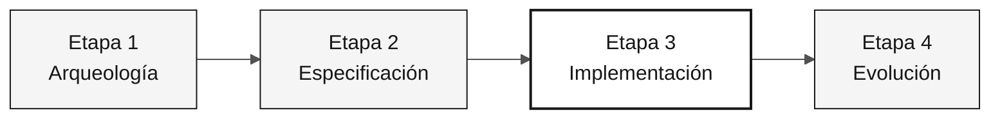

# Persona — DBA

> **Ruta:** [Kit del equipo](../../README.md) › [Personas](../OVERVIEW.md) › [DBA](README.md) › **PERSONA**

**Perfil de referencia de la persona DBA en la inmersión de modernización de SIFAP.**

 -404040?style=flat-square) 

| Campo | Valor |
|---|---|
| **Rol** | DBA (Administrador de Bases de Datos) |
| **Pareja** | Pareja 4 — Calidad (con el Ingeniero de Calidad) |
| **Etapas activas** | Etapa 1 (mapeo de DDM), Etapa 2 (modelo lógico + ADR), Etapa 3 (lidera el esquema), Etapa 4 (valida la integridad) |
| **Artefactos producidos** | Mapa de DDM a entidades relacionales, ADR de base de datos, migraciones Flyway, índices y datos iniciales de prueba |
| **Artefactos consumidos** | DDM de Adabas (Etapa 1), contextos delimitados (Arquitecto de Software), requisitos EARS (Especialista en Requisitos) |
| **Entrega a** | Desarrollador — migraciones listas para JPA; Ingeniero DevOps — esquema estable para Terraform |

---

## Qué es esta persona

El DBA es responsable de la capa de datos de SIFAP 2.0. En la modernización del legado, esto significa leer los 4 DDM de Adabas —que describen estructuras MU (multivalor), PE (periódicas) y FDT (tabla de definición de archivos)—, traducirlos a un esquema relacional normalizado de PostgreSQL 16 y garantizar que las migraciones Flyway sean idempotentes, reversibles y seguras para el despliegue continuo.

Por qué importa: el modelo de datos es la base de las entidades JPA del Desarrollador y de la infraestructura aprovisionada por DevOps. Un esquema frágil o unas migraciones irreversibles comprometen toda la Etapa 3 y generan riesgos graves en producción.

Dentro del marco Agentic Legacy Modernization, el DBA trabaja en la fase de evaluación (Etapa 1) y en la fase de traducción de la capa de datos (Etapa 3).

## Dónde trabajas en el SDLC

| Etapa | Responsabilidad | Entregable |
|---|---|---|
| **1 — Arqueología** | Leer los 4 DDM, mapear los campos MU/PE a posibles entidades relacionales e identificar los campos clave | Mapa de DDM a entidades relacionales |
| **2 — Especificación** | Diseñar el modelo lógico de datos y escribir el ADR de PostgreSQL (referencia: ADR 002) | Modelo de datos + ADR 002 |
| **3 — Implementación** | Escribir migraciones Flyway, definir índices, cargar datos de prueba y responder preguntas sobre JPA/Hibernate | Esquema PostgreSQL + datos iniciales |
| **4 — Evolución** | Verificar que las PR de Copilot Agent cambien el esquema de forma segura (migración nueva, nunca ediciones retroactivas) | Integridad del esquema preservada |

## Responsabilidad principal

Traducir el modelo Adabas necesario para el alcance seleccionado a un esquema relacional PostgreSQL que preserve la integridad del negocio sin heredar las estructuras antiguas de Adabas. Garantizar migraciones idempotentes y trazabilidad completa de los cambios del esquema.

## Competencias clave

- Lectura de DDM de Adabas: campos simples, MU (multivalor) y PE (periódicos)
- Diseño de esquemas relacionales normalizados en PostgreSQL 16
- Migraciones Flyway: nombres, idempotencia y estrategia expand-contract
- Indexación basada en consultas reales identificadas en los programas Natural
- Auditoría de consultas JPA/JPQL para prevenir N+1 e inyección SQL

## Kit de la persona

| Artefacto | Ruta | Uso |
|---|---|---|
| Agente DBA | `.github/agents/dba.agent.md` | Modelado de datos, migraciones y auditoría SQL |
| Prompt `/migration` | `.github/prompts/persona-dba-migration.prompt.md` | Planificar y escribir una migración Flyway |
| Prompt `/query-audit` | `.github/prompts/persona-dba-query-audit.prompt.md` | Auditar el rendimiento y la seguridad de las consultas |
| Instrucciones de base de datos | `.github/instructions/database.instructions.md` | Convenciones obligatorias de base de datos |

## Herramientas y modos de Copilot

| Herramienta / Modo | Cuándo usarlo |
|---|---|
| **Copilot Ask** | Traducir DDM de Adabas a SQL de PostgreSQL; comprender la semántica de los campos heredados |
| **Copilot Plan** | Planificar lotes de migraciones; crear varios archivos Flyway a la vez |
| **PostgreSQL MCP** (si está disponible) | Inspeccionar el esquema en ejecución y realizar consultas exploratorias |
| **Spec-Kit** (`/speckit.plan`) | Declarar el modelo de datos para el Arquitecto de Software y el Desarrollador |

## Fichas de referencia recomendadas

- [`09-cheat-sheets/spec-kit-workflow.md`](../../09-cheat-sheets/spec-kit-workflow.md) — declarar el modelo de datos para `/speckit.plan` y revisarlo con `/speckit.analyze`
- [`09-cheat-sheets/model-routing.md`](../../09-cheat-sheets/model-routing.md) — Sonnet 4.6 es suficiente para la mayor parte del trabajo con SQL

## Cómo desempeñarte bien

- [ ] **Haz reversible cada migración.** Nunca edites una migración existente; crea una nueva: `V5__fix_xxx.sql`.
- [ ] **Documenta las decisiones de mapeo MU/PE.** Registra por qué un campo MU se convirtió en una tabla relacionada en lugar de una columna `JSONB`.
- [ ] **Indexa las consultas críticas del ciclo mensual.** Regla práctica: un campo en `WHERE` o `JOIN` de una tabla con más de 100,000 filas necesita un índice.
- [ ] **Mantén el almacén de auditoría como solo anexado.** Ningún `DELETE` en el esquema de auditoría.

## Errores comunes y cómo evitarlos

| Síntoma | Causa | Corrección |
|---|---|---|
| El esquema usa columnas `JSONB` para datos estructurados | Costumbre de la flexibilidad de Adabas | Normaliza los campos PE y MU en tablas relacionadas con claves foráneas |
| La migración rompe el entorno de un compañero | Migración no idempotente | Nunca alteres un archivo de migración existente; crea un archivo con una versión superior |
| Falta un índice en una tabla crítica | Índice no basado en evidencia | Identifica las consultas en los programas Natural antes de definir los índices |
| Desnormalización por costumbre | Replicación del modelo Adabas | Empieza por el modelo relacional canónico y desnormaliza solo con evidencia de rendimiento medida |

## Combinaciones con otras personas

| Combinación | Nota |
|---|---|
| **DBA + Desarrollador** | Escribes tus migraciones y algunas consultas JPA |
| **DBA + Ingeniero DevOps** | Gestionas PostgreSQL y el Terraform que lo aprovisiona en Azure |

## Prompts listos para usar

1. **(Ask)** _"Lee el DDM asignado al equipo y propón alternativas de mapeo relacional, incluidos los compromisos que debemos decidir."_
2. **(Plan)** _"Planifica una migración Flyway para los campos, relaciones e índices que necesita el requisito EARS priorizado."_
3. **(Ask)** _"Revisa este esquema e identifica las restricciones e índices que necesitan evidencia antes de crearse."_

## Opciones de emergencia

| Situación | Qué hacer |
|---|---|
| Formato DDM desconocido | Abre `01-archaeology/legacy-sifap/adabas-ddms/`: los comentarios ayudan a explicar cada campo |
| Migración rota | Nunca edites una migración existente. Crea una nueva: `V5__fix_xxx.sql` |
| No sabes qué índice crear | Para un campo en `WHERE` o `JOIN` de una tabla con más de 100,000 filas, crea el índice |
| PostgreSQL no está disponible | Comprueba si Docker está en ejecución: `docker ps \| grep postgres` |

## Dependencias

| Persona | Relación | Artefacto |
|---|---|---|
| Arquitecto de Software | Dependes de esta persona | Límites de contextos para el modelo |
| Desarrollador | Depende de ti | Migraciones listas para JPA |
| Ingeniero DevOps | Depende de ti | Esquema estable para Terraform |
| Ingeniero de Calidad | Depende de ti | Datos iniciales de prueba |

## Cómo se te evalúa

- **Rúbrica A3 — Integridad técnica:** migraciones idempotentes y esquema coherente con las entidades JPA
- **Rúbrica A1 — Arqueología:** mapa de DDM a entidades relacionales documentado
- **Criterio:** el almacén de auditoría es de solo anexado: ningún `DELETE` en el esquema de auditoría

---

### Sigue leyendo

| Anterior | Siguiente |
|---|---|
| [Desarrollador — PERSONA](../06-developer/PERSONA.md) Pareja 3 — Implementación — Java 21 + Next.js 15 + pruebas. | [Ingeniero de Calidad — PERSONA](../08-qa-engineer/PERSONA.md) Pareja 4 — Calidad — pruebas de equivalencia y cobertura. |

[Volver al índice del kit](../../README.md)
