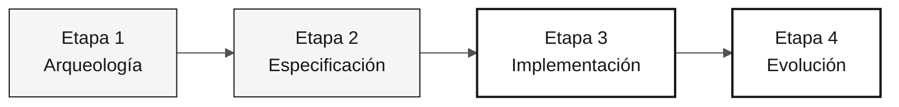

# Persona — Ingeniero de Calidad

> **Ruta:** [Kit del equipo](../../README.md) › [Personas](../OVERVIEW.md) › [Ingeniero de Calidad](README.md) › **PERSONA**

**Perfil de referencia de la persona Ingeniero de Calidad en la inmersión de modernización de SIFAP.**

  

| Campo | Valor |
|---|---|
| **Rol** | Ingeniero de Calidad (aseguramiento de la calidad) |
| **Pareja** | Pareja 4 — Calidad (con el DBA) |
| **Etapas activas** | Etapa 1 (escenarios críticos), Etapa 2 (criterios de aceptación), Etapa 3 (lidera las pruebas), Etapa 4 (valida la cobertura) |
| **Artefactos producidos** | Suite de pruebas (JUnit 5 + Testcontainers + Vitest), estrategia de pruebas, criterios de aceptación por REQ-ID y pipeline de CI en verde |
| **Artefactos consumidos** | Requisitos EARS con REQ-ID (Especialista en Requisitos), código comprobable (Desarrollador), datos iniciales (DBA) |
| **Entrega a** | Ingeniero DevOps — CI confiable; todo el equipo — pipeline en verde |

---

## Qué es esta persona

El Ingeniero de Calidad transforma los requisitos EARS en pruebas ejecutables que demuestran la equivalencia funcional entre el comportamiento heredado Natural/Adabas y el código moderno Java 21. En la modernización de SIFAP (Sistema de Fiscalización y Administración de Pagos), esta persona define la estrategia de pruebas, escribe las pruebas que importan en lugar de todas las posibles y mantiene el pipeline de CI en verde durante toda la Etapa 3.

Por qué importa: en la modernización del legado, la equivalencia funcional entre los sistemas antiguo y nuevo solo puede demostrarse mediante pruebas trazables a los requisitos. Sin el Ingeniero de Calidad, el equipo no puede saber si la traducción de Natural a Java preservó el comportamiento correcto del negocio.

Dentro del marco Agentic Legacy Modernization, el Ingeniero de Calidad trabaja con los agentes de generación de pruebas y de seguridad en la Etapa 3, y valida la cobertura en las PR de Copilot Agent durante la Etapa 4.

## Dónde trabajas en el SDLC

| Etapa | Responsabilidad | Entregable |
|---|---|---|
| **1 — Arqueología** | Identificar escenarios críticos en los programas Natural asignados | Escenarios críticos por programa |
| **2 — Especificación** | Validar que cada requisito EARS sea comprobable y proponer criterios de aceptación concretos | Criterios de prueba por REQ-ID |
| **3 — Implementación** | Escribir pruebas unitarias y de integración para los comportamientos priorizados; mantener la CI en verde | Suite de pruebas + pipeline en verde |
| **4 — Evolución** | Exigir que las PR de Copilot Agent incluyan pruebas y validar la cobertura de escenarios nuevos | Cobertura alineada con la funcionalidad |

## Responsabilidad principal

Definir la estrategia de pruebas del proyecto. Escribir las pruebas críticas, no para perseguir el 100% de cobertura, sino para cubrir los flujos que importan. Validar la trazabilidad de especificación a pruebas. Proteger al equipo de un pipeline de CI falsamente verde cuyas pruebas siempre pasan, independientemente del comportamiento.

## Competencias clave

- JUnit 5: `@Test`, `@DisplayName`, `@ParameterizedTest`, AssertJ
- Testcontainers para integración con PostgreSQL 16 real
- Vitest + Testing Library para componentes Next.js 15
- Trazabilidad de pruebas a REQ-ID mediante comentarios inline
- Análisis de cobertura guiado por riesgos, no por porcentajes

## Kit de la persona

| Artefacto | Ruta | Uso |
|---|---|---|
| Agente Ingeniero de Calidad | `.github/agents/qa-engineer.agent.md` | Generación de pruebas, análisis de cobertura y puertas de calidad |
| Prompt `/create-tests` | `.github/prompts/persona-qa-engineer-create-tests.prompt.md` | Generar pruebas a partir de un requisito EARS |
| Prompt `/coverage-gaps` | `.github/prompts/persona-qa-engineer-coverage-gaps.prompt.md` | Identificar lagunas de cobertura |
| Prompt `/test-strategy` | `.github/prompts/persona-qa-engineer-test-strategy.prompt.md` | Definir la estrategia de pruebas del proyecto |
| Instrucciones de pruebas | `.github/instructions/tests.instructions.md` | Convenciones obligatorias de pruebas |

## Herramientas y modos de Copilot

| Herramienta / Modo | Cuándo usarlo |
|---|---|
| **Copilot Ask** | Generar escenarios de prueba a partir de requisitos EARS; debatir la cobertura faltante |
| **Copilot Plan** | Planificar estructuras iniciales de JUnit por lotes para toda una porción del sistema |
| **Testcontainers** | Integrarse con PostgreSQL real: preferirlo a Mockito para las capas de repositorio |
| **Spec-Kit** (`/speckit.analyze`) | Revisar tareas de pruebas derivadas de `tasks.md` |
| **GitHub Actions MCP** | Supervisar la CI sin salir de VS Code |

## Fichas de referencia recomendadas

- [`09-cheat-sheets/spec-kit-workflow.md`](../../09-cheat-sheets/spec-kit-workflow.md) — `/speckit.analyze` y tareas de pruebas de `tasks.md`
- [`09-cheat-sheets/copilot-3-modes.md`](../../09-cheat-sheets/copilot-3-modes.md) — usa Plan para planificar la cobertura y Ask para debatir las lagunas

## Cómo desempeñarte bien

- [ ] **Cubre los flujos que importan.** Usa REQ-ID y evidencia del legado, no un porcentaje de cobertura.
- [ ] **Mantén rápida la suite de pruebas.** La suite completa debe ejecutarse en menos de dos minutos.
- [ ] **Escribe pruebas que fallen ante el primer error.** Las pruebas que siempre pasan no validan el comportamiento.
- [ ] **Mantén la trazabilidad.** Añade `// REQ-NNN` a cada método de prueba.

## Errores comunes y cómo evitarlos

| Síntoma | Causa | Corrección |
|---|---|---|
| Perseguir el 100% de cobertura e incumplir el plazo | Tratar la métrica como objetivo | Prioriza los flujos de riesgo identificados por el equipo |
| Las pruebas validan el framework en lugar del dominio | Enfoque en infraestructura en lugar de comportamiento | Pregunta si la aserción falla cuando cambia el comportamiento de negocio |
| Mock usado donde se necesitaba Testcontainers | Comodidad | Usa Testcontainers para repositorios y Mockito para servicios de dominio |
| CI en rojo ignorada durante 20 minutos | Falta de responsable | El Ingeniero de Calidad es responsable de la CI en verde; no delegues esta responsabilidad |

## Combinaciones con otras personas

| Combinación | Nota |
|---|---|
| **QA + Desarrollador** | La más común y productiva; escribir la funcionalidad y las pruebas en la misma sesión |
| **QA + Especialista en Requisitos** | Escribir el requisito y su prueba correspondiente |
| **QA + Ingeniero DevOps** | Evitar cuando sea posible: sobrecarga la Etapa 3 |

## Prompts listos para usar

1. **(Ask)** _"Para este requisito EARS, genera escenarios de prueba que cubran el comportamiento principal, los límites y los fallos relevantes."_
2. **(Plan)** _"Para la clase de la funcionalidad priorizada, planifica pruebas de integración con los datos y las verificaciones necesarios."_
3. **(Ask)** _"Analiza la cobertura actual e identifica los flujos sin pruebas de mayor riesgo. Priorízalos usando la evidencia del equipo."_

## Opciones de emergencia

| Situación | Qué hacer |
|---|---|
| No conoces JUnit 5 | Usa el patrón existente: `@Test`, `@DisplayName` y aserciones de AssertJ |
| Testcontainers no funciona | Comprueba si Docker está en ejecución; alternativa: prueba unitaria con Mockito |
| Demasiados escenarios y poco tiempo | Céntrate en el comportamiento de mayor riesgo identificado por el equipo |
| La CI está en rojo, pero las pruebas locales pasan | Problema de entorno: comprueba Docker/Testcontainers y la versión de Docker del runner |

## Dependencias

| Persona | Relación | Artefacto |
|---|---|---|
| Especialista en Requisitos | Dependes de esta persona | Requisitos comprobables con criterios de aceptación |
| Desarrollador | Dependes de esta persona | Código comprobable |
| Líder Técnico | Depende de ti | Pipeline en verde |
| Ingeniero DevOps | Depende de ti | CI confiable |

## Cómo se te evalúa

- **Rúbrica A3 — Integridad técnica:** pruebas aprobadas y CI en verde
- **Rúbrica A2 — Especificación:** cada requisito tiene criterios de verificación
- **Criterio:** las pruebas fallan ante el primer error, en lugar de pasar siempre

---

### Sigue leyendo

| Anterior | Siguiente |
|---|---|
| [DBA — PERSONA](../07-dba/PERSONA.md) Pareja 4 — Calidad — migraciones Flyway y optimización de consultas. | [Ingeniero DevOps — PERSONA](../09-devops-engineer/PERSONA.md) Pareja 5 — Operaciones — Terraform, GitHub Actions y runbook. |

[Volver al índice del kit](../../README.md)
