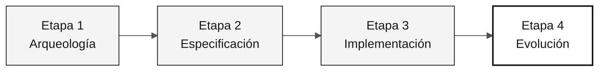

# Persona — Ingeniero DevOps

> **Ruta:** [Kit del equipo](../../README.md) › [Personas](../OVERVIEW.md) › [Ingeniero DevOps](README.md) › **PERSONA**

**Perfil de referencia de la persona Ingeniero DevOps en la inmersión de modernización de SIFAP.**

  

| Campo | Valor |
|---|---|
| **Rol** | Ingeniero DevOps |
| **Pareja** | Pareja 5 — Operaciones (con el Redactor Técnico) |
| **Etapas activas** | Etapa 1 (validación de herramientas), Etapa 2 (ADR de despliegue), Etapa 3 (pipeline y Terraform), Etapa 4 (lidera) |
| **Artefactos producidos** | Workflow de GitHub Actions (`ci.yml`), Dockerfile, módulos Terraform, ADR de estrategia de despliegue y ejecución local documentada |
| **Artefactos consumidos** | Build estable (Líder Técnico / Desarrollador), topología de infraestructura (Arquitecto Empresarial / Arquitecto de Software), esquema estable (DBA) |
| **Entrega a** | Demostración — ejecución local funcional; producción — `terraform plan` válido |

---

## Qué es esta persona

El Ingeniero DevOps es responsable del recorrido desde un commit de código hasta algo que funcione de manera confiable. En la modernización de SIFAP (Sistema de Fiscalización y Administración de Pagos), esta persona garantiza que cualquier máquina del equipo pueda iniciar el entorno local en menos de 60 segundos, que GitHub Actions valide cada PR con lint, pruebas y construcción de imágenes, y que Terraform describa la topología de destino en Azure aunque no se aplique durante la inmersión.

Por qué importa: un pipeline frágil o un entorno local ambiguo genera dificultades para todas las parejas. El Desarrollador pierde tiempo por errores del entorno, el Ingeniero de Calidad carece de una base estable para las pruebas y la demostración final corre el riesgo de fallar por motivos operativos, no funcionales.

Dentro del marco Agentic Legacy Modernization, el Ingeniero DevOps trabaja con el agente de despliegue en la Etapa 4 y con el agente de seguridad en la Etapa 3, configurando la infraestructura para el despliegue continuo y la coexistencia entre los sistemas heredado y moderno.

## Dónde trabajas en el SDLC

| Etapa | Responsabilidad | Entregable |
|---|---|---|
| **1 — Arqueología** | Validar las herramientas locales y planificar lo que necesita el prototipo para ejecutarse localmente | Entorno de trabajo validado |
| **2 — Especificación** | Escribir el ADR de estrategia de despliegue (ADR 005) y participar en el diseño de infraestructura | ADR 005 + borrador de Terraform |
| **3 — Implementación** | Mantener GitHub Actions para builds y pruebas, publicar imágenes Docker y mantener Terraform | Pipeline en verde + `terraform plan` válido |
| **4 — Evolución** | Validar las PR de Copilot Agent que modifican el pipeline o la infraestructura | El pipeline sigue en verde después del agente |

## Responsabilidad principal

Builds reproducibles, un pipeline en verde e infraestructura descrita como código. En la inmersión: ejecución local documentada que inicia la aplicación y la base de datos en menos de 60 segundos una vez que existe el prototipo, CI que comprueba lint, pruebas y construcción de imágenes, y un `terraform plan` sin errores.

## Competencias clave

- GitHub Actions: workflows de CI/CD, caché de dependencias y construcción de imágenes Docker
- Terraform (proveedor de Azure ~> 3.x): módulos por área de servicio (redes, cómputo, base de datos y monitoreo)
- Docker y Docker Compose: caché de dependencias Maven, imagen final reducida y comprobaciones de salud
- Observabilidad mínima: logs JSON estructurados, `/actuator/health` y métricas básicas
- Gestión de secretos: Azure Key Vault y variables de entorno de CI, nunca código ni `.env` versionados

## Kit de la persona

| Artefacto | Ruta | Uso |
|---|---|---|
| Agente Ingeniero DevOps | `.github/agents/devops-engineer.agent.md` | CI/CD, infraestructura como código, monitoreo y análisis de incidentes |
| Prompt `/pipeline` | `.github/prompts/persona-devops-engineer-pipeline.prompt.md` | Crear o mejorar un workflow de GitHub Actions |
| Prompt `/iac-module` | `.github/prompts/persona-devops-engineer-iac-module.prompt.md` | Crear un módulo Terraform para un servicio de Azure |
| Prompt `/incident-rca` | `.github/prompts/persona-devops-engineer-incident-rca.prompt.md` | Análisis de causa raíz de incidentes |
| Instrucciones de CI/CD | `.github/instructions/cicd.instructions.md` | Convenciones obligatorias de pipelines |
| Instrucciones de infraestructura | `.github/instructions/infrastructure.instructions.md` | Convenciones obligatorias de IaC |

## Herramientas y modos de Copilot

| Herramienta / Modo | Cuándo usarlo |
|---|---|
| **Copilot Ask** | Generar workflows de GitHub Actions y comprender errores de CI |
| **Copilot Plan** | Crear módulos Terraform por lotes y planificar cambios de infraestructura en varios archivos |
| **Copilot Agent** | Etapa 4: cadenas de CI largas y de varios pasos |
| **Azure / Terraform MCP** (si está habilitado) | Inspeccionar recursos de Azure y el estado de Terraform |
| **Spec-Kit** (`/speckit.taskstoissues`) | Crear Issues operativas a partir de tareas |

## Fichas de referencia recomendadas

- [`09-cheat-sheets/spec-kit-workflow.md`](../../09-cheat-sheets/spec-kit-workflow.md) — `/speckit.taskstoissues`, `/speckit.analyze` y transición para publicación
- [`09-cheat-sheets/copilot-3-modes.md`](../../09-cheat-sheets/copilot-3-modes.md) — usa Agent para pipelines con muchos pasos secuenciales

## Cómo desempeñarte bien

- [ ] **Inicia el entorno local en menos de 60 segundos.** Una vez que existe el prototipo: aplicación + base de datos con un solo comando.
- [ ] **Exige lint + pruebas + construcción de imagen en `main`.** Ninguno de estos pasos es opcional.
- [ ] **Mantén `terraform plan` sin errores.** Incluso si no se aplica ese día.
- [ ] **Añade logs estructurados y comprobaciones de salud en la Etapa 3.** No los dejes para la Etapa 4.

## Errores comunes y cómo evitarlos

| Síntoma | Causa | Corrección |
|---|---|---|
| El equipo pierde una hora al iniciar | Configuración local ambigua o sin documentar | Documenta el comando exacto de inicio antes de la Etapa 3 |
| La CI ejecuta solo pruebas unitarias | Alcance del pipeline demasiado limitado | Incluye construcción de imágenes y lint desde la primera versión |
| Terraform tiene 500 líneas y una salida poco clara | Módulo monolítico | Usa un módulo por área de servicio de Azure |
| Secreto real en un `.env` versionado | Comodidad inicial | Guarda secretos solo en Azure Key Vault o en variables de CI; añade `.env` a `.gitignore` de inmediato |

## Combinaciones con otras personas

| Combinación | Nota |
|---|---|
| **DevOps + DBA** | Gestionar PostgreSQL y el módulo Terraform que lo aprovisiona |
| **DevOps + Redactor Técnico** | En la Etapa 4, supervisar al agente mientras el Redactor Técnico documenta el runbook |

## Prompts listos para usar

1. **(Ask)** _"Crea un workflow de GitHub Actions `.github/workflows/ci.yml` que se ejecute con cada push, configure Java 21 con caché de Maven, ejecute pruebas y construya una imagen Docker."_
2. **(Plan)** _"Planifica el Dockerfile del backend: caché de dependencias Maven, una imagen final más pequeña y una comprobación de salud."_
3. **(Ask)** _"El entorno local tarda 3 minutos en iniciarse. Analiza los archivos creados por el equipo y propón 3 optimizaciones."_

## Opciones de emergencia

| Situación | Qué hacer |
|---|---|
| El entorno local no se inicia | Lista de verificación: (1) ¿Docker Desktop está en ejecución? (2) ¿Están libres los puertos 5432/8080/3000? (3) ¿Están definidas las variables de entorno? (4) ¿Los logs muestran la causa raíz? |
| La CI falla | Lee los logs de GitHub Actions: el error más común es una versión incorrecta de Java o un fallo de caché |
| `terraform plan` falla | Comprueba: (1) ¿Se ejecutó `terraform init`? (2) ¿La versión del proveedor es compatible? (3) ¿Están definidas las variables obligatorias? |
| No conoces GitHub Actions | Copia `.github/workflows/build.yml` y adáptalo |

## Dependencias

| Persona | Relación | Artefacto |
|---|---|---|
| Líder Técnico | Dependes de esta persona | Build estable para el pipeline |
| Arquitecto Empresarial | Dependes de esta persona | Topología para Terraform |
| Desarrollador | Depende de ti | Entorno local documentado y CI en verde |
| DBA | Depende de ti para la infraestructura | PostgreSQL aprovisionado |
| Ingeniero de Calidad | Depende de ti | Pipeline que ejecuta pruebas |

## Cómo se te evalúa

- **Rúbrica A3 — Integridad técnica:** la ejecución local funciona y la CI está en verde
- **Rúbrica A4 — Copilot:** Agent usado para pipelines de varios pasos
- **Criterio:** build reproducible: cualquier máquina del equipo ejecuta el entorno local documentado en menos de 60 segundos

---

### Sigue leyendo

| Anterior | Siguiente |
|---|---|
| [Ingeniero de Calidad — PERSONA](../08-qa-engineer/PERSONA.md) Pareja 4 — Calidad — pruebas de equivalencia y cobertura. | [Redactor Técnico — PERSONA](../10-tech-writer/PERSONA.md) Pareja 5 — Operaciones — documentación viva e informe del agente. |

[Volver al índice del kit](../../README.md)
