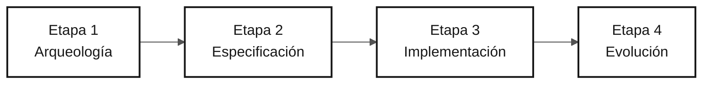

# Persona — Redactor Técnico

> **Ruta:** [Kit del equipo](../../README.md) › [Personas](../OVERVIEW.md) › [Redactor Técnico](README.md) › **PERSONA**

**Perfil de referencia de la persona Redactor Técnico en la inmersión de modernización de SIFAP.**

  

| Campo | Valor |
|---|---|
| **Rol** | Redactor Técnico (Tech Writer) |
| **Pareja** | Pareja 5 — Operaciones (con el Ingeniero DevOps) |
| **Etapas activas** | Todas las etapas (transversal); lidera la Etapa 4 — Evolución (informe del agente) |
| **Artefactos producidos** | Glosario e informe de descubrimiento (Etapa 1), especificación y ADR con formato (Etapa 2), README y `docs/` completos (Etapa 3), informe de experiencia con el agente (Etapa 4) |
| **Artefactos consumidos** | Decisiones y código de todas las parejas |
| **Entrega a** | Personas facilitadoras — informe final de la Etapa 4; Responsable de Producto — glosario e informes legibles |

---

## Qué es esta persona

El Redactor Técnico transforma las decisiones y el código en la memoria duradera del proyecto. En la modernización de SIFAP (Sistema de Fiscalización y Administración de Pagos), esta persona mantiene el glosario de términos del legado Natural/Adabas (MU, PE, FDT, DDM, ciclo mensual), formaliza las decisiones de arquitectura como ADR (registros de decisiones de arquitectura) y garantiza que el README refleje el estado real de la aplicación en cada hora de la inmersión, no solo al final.

Por qué importa: sin un Redactor Técnico que actúe de forma deliberada, los ADR siguen siendo archivos vacíos, el README permanece en "TODO: añadir instrucciones" y el conocimiento descubierto durante la inmersión desaparece. El Redactor Técnico hace trazable y transferible el aprendizaje del equipo.

Dentro del marco Agentic Legacy Modernization, el Redactor Técnico trabaja con el agente de documentación en cada fase, manteniendo la trazabilidad y una traza de auditoría de las decisiones.

## Dónde trabajas en el SDLC

| Etapa | Responsabilidad | Entregable |
|---|---|---|
| **1 — Arqueología** | Mantener el glosario y el catálogo en un formato legible; escribir el informe de descubrimiento al final | Informe de la Etapa 1 |
| **2 — Especificación** | Revisar la coherencia, terminología y claridad de la especificación; dar formato a los ADR con la plantilla | Especificación y ADR en formato estándar |
| **3 — Implementación** | Convertir el README provisional en documentación real; registrar las decisiones en `docs/` a medida que surjan | README completo + `docs/` |
| **4 — Evolución** | Acompañar a Copilot Agent y escribir un informe de experiencia honesto sobre lo que funcionó, falló y se aprendió | Informe final de la Etapa 4 |

## Responsabilidad principal

Mantener viva la documentación durante todo el día, no solo al final. Ampliar el README cada hora, escribir ADR cuando se tomen decisiones, mantener el registro de cambios y usar terminología coherente durante toda la inmersión.

## Competencias clave

- Redacción técnica al estilo Diátaxis: tutoriales, guías prácticas, referencia y explicación
- Formalización de ADR: contexto, decisión y consecuencias, ni más ni menos
- Trazabilidad de la documentación al código: endpoints, comandos y variables de entorno reales
- Detección de desalineaciones entre la documentación y el código mediante `/doc-drift`
- Mantenimiento del glosario y terminología coherente en todo el proyecto

## Kit de la persona

| Artefacto | Ruta | Uso |
|---|---|---|
| Agente Redactor Técnico | `.github/agents/tech-writer.agent.md` | Documentación de API, README, `CODEMAP.md`, registro de cambios y detección de desalineaciones |
| Prompt `/generate-docs` | `.github/prompts/persona-tech-writer-generate-docs.prompt.md` | Generar documentación a partir del código |
| Prompt `/update-codemap` | `.github/prompts/persona-tech-writer-update-codemap.prompt.md` | Actualizar el mapa de código |
| Prompt `/doc-drift` | `.github/prompts/persona-tech-writer-doc-drift.prompt.md` | Detectar divergencias entre documentación y código |

## Herramientas y modos de Copilot

| Herramienta / Modo | Cuándo usarlo |
|---|---|
| **Copilot Ask** | Revisar el estilo, la claridad y la coherencia terminológica |
| **Copilot Ask (redacción extensa)** | Redactar secciones largas de documentación técnica |
| **Spec-Kit** (`/speckit.*`) | Mantener `spec.md`, `plan.md` y `tasks.md`, generados por Specify CLI, coherentes con la documentación del equipo |
| **GitHub MCP** | Crear commits en `docs/` mientras las otras parejas trabajan en el código |

## Fichas de referencia recomendadas

- [`09-cheat-sheets/spec-kit-workflow.md`](../../09-cheat-sheets/spec-kit-workflow.md) — Specify CLI genera `spec.md`, `plan.md` y `tasks.md`; mantenlos coherentes con la documentación
- [`09-cheat-sheets/model-routing.md`](../../09-cheat-sheets/model-routing.md) — Haiku 4.5 para revisión de estilo; Sonnet 4.6 para redacción de contenido

## Puntos de control por hora

El Redactor Técnico es la persona más transversal del equipo. Para evitar esperar a tener algo que documentar, sigue estos puntos de control:

| Período | Qué hacer | Entregable visible |
|---|---|---|
| 11:00–12:00 | Leer los programas asignados a la Pareja 5 y registrar los términos que sustentan el alcance seleccionado | Glosario con términos relevantes |
| 13:30–14:00 | Consolidar el vocabulario y las decisiones necesarios para la funcionalidad acotada | Apoyo para la especificación de la funcionalidad |
| 14:00–15:00 | Revisar la claridad de `spec.md`, `plan.md` y `tasks.md`; registrar la decisión de alcance | Artefactos formales coherentes |
| 15:00–16:10 | Documentar los endpoints y comandos reales creados por el prototipo | Documentación factual actualizada |
| 16:10–16:50 | Acompañar al agente y escribir `agent-experience-report.md` en tiempo real | Informe honesto completado |

> [!NOTE]
> Si después de 30 minutos no tienes nada que documentar, pregunta a la pareja que lidera la etapa: _"¿Qué decidieron en los últimos 30 minutos que aún no se ha escrito?"_ Casi siempre hay algo.

## Cómo desempeñarte bien

- [ ] **Incluye contexto, decisión y consecuencias en cada ADR.** Ni más ni menos.
- [ ] **Haz evolucionar el README cada hora.** No solo al final del día.
- [ ] **Mantén una terminología coherente de principio a fin.** Si el proyecto usa "ciclo", no uses "ronda" en el siguiente párrafo.
- [ ] **Escribe un informe honesto de la Etapa 4.** No hagas publicidad del agente; documenta lo que funcionó y lo que falló.

## Errores comunes y cómo evitarlos

| Síntoma | Causa | Corrección |
|---|---|---|
| No hay nada escrito al final de la Etapa 3 | Esperar a que el código esté "listo" | Documenta en tiempo real: registra cada decisión cuando se tome |
| ADR de una sola línea | Confundir un registro con una nota | Usa la plantilla: contexto, decisión y consecuencias |
| El README sigue diciendo "TODO: añadir instrucciones" | Aplazamiento | Empieza por: (1) qué es el sistema, (2) cómo ejecutarlo, (3) endpoints disponibles |
| El informe del agente contiene solo elogios | Sesgo positivo | Documenta las dificultades, las intervenciones manuales, las alucinaciones y las correcciones |

## Combinaciones con otras personas

| Combinación | Nota |
|---|---|
| **Redactor Técnico + Responsable de Producto** | Documenta el porqué, la visión y el propósito del proyecto |
| **Redactor Técnico + Ingeniero DevOps** | Documenta mientras se ejecuta el pipeline, produciendo un runbook de forma natural |
| **Redactor Técnico + Especialista en Requisitos** | Muy útil para equipos pequeños: estructurar y escribir requisitos claros |

## Prompts listos para usar

1. **(Ask)** _"Revisa este README e identifica secciones TODO, terminología incoherente e información desactualizada, como puertos, credenciales y endpoints. Propón correcciones."_
2. **(Plan)** _"En ADR-001.md, planifica cómo completar Contexto, Decisión y Consecuencias usando la plantilla de `02-modern-spec/ADR-TEMPLATE.md`."_
3. **(Ask)** _"Crea un informe honesto de experiencia con Copilot Agent: qué funcionó, qué nos sorprendió y qué falló. Usa la plantilla de `04-evolution/agent-experience-report.md`."_

## Opciones de emergencia

| Situación | Qué hacer |
|---|---|
| No se conoce el formato de ADR | Abre `02-modern-spec/ADR-TEMPLATE.md`, copia y completa las tres secciones obligatorias |
| El README está vacío | Empieza por: (1) qué es el sistema, (2) cómo ejecutarlo, (3) endpoints disponibles |
| El glosario está bloqueado | Pregunta a Copilot: _"Enumera todas las abreviaturas encontradas en los archivos `.NSN` de SIFAP y desarrolla el significado de cada una."_ |
| El informe del agente está vacío | Abre `04-evolution/agent-experience-report.md`; la plantilla tiene secciones listas para completar |

## Dependencias

| Persona | Relación | Artefacto |
|---|---|---|
| Todas las parejas | Dependes de ellas | Decisiones y código que documentar |
| Responsable de Producto | Depende de ti | Glosario e informes legibles |
| Ingeniero de Calidad | Depende de ti indirectamente | Terminología coherente en la especificación |
| Personas facilitadoras | Dependen de ti | Informe final de la Etapa 4 |

## Cómo se te evalúa

- **Rúbrica A2 — Especificación:** documentación coherente y terminología estandarizada
- **Rúbrica A7 — Agente:** informe de experiencia con Copilot Agent honesto y detallado
- **Criterio:** el README evolucionó cada hora; los ADR tienen contexto, decisión y consecuencias; ninguna sección dice TODO

---

### Sigue leyendo

| Anterior | Siguiente |
|---|---|
| [Ingeniero DevOps — PERSONA](../09-devops-engineer/PERSONA.md) Pareja 5 — Operaciones — Terraform, GitHub Actions y runbook. | [Etapa 1 — Arqueología](../../01-archaeology/GUIDE.md) 11:00–12:00 — Leer el sistema heredado y catalogar reglas de negocio. |

[Volver al índice del kit](../../README.md)
