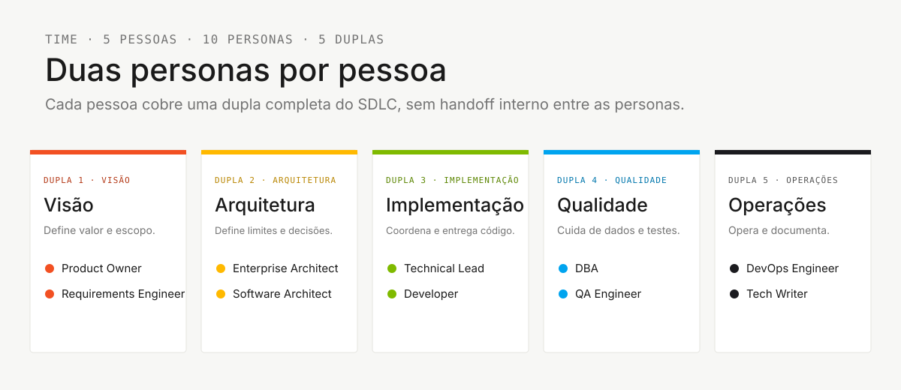
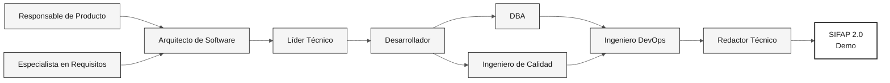

# Descripción general de las 10 personas

> **Ruta:** [Kit del equipo](../README.md) › [Personas](README.md) › **DESCRIPCIÓN GENERAL**

**Comparación de las 10 personas en una página.** Úsala para elegir tu pareja, identificar quién lidera cada etapa y consultar las opciones de emergencia.

| Campo | Valor |
|---|---|
| **Público objetivo** | Todos los participantes de la inmersión |
| **Prerrequisitos** | Ninguno |
| **Tiempo estimado** | 5 min |
| **Resultado esperado** | Pareja seleccionada y transiciones comprendidas |

> [!TIP]
> Cada integrante del equipo asume **2 personas** de la misma pareja. La pareja permanece unida durante toda la inmersión: no hay una transición interna entre sus dos personas.

---

## Las 5 parejas

---

## Tabla completa de las 10 personas

| **#** | Persona | Pareja | Etapa que lidera | Apoya | Herramienta principal | Opción si no puede avanzar |
|---|---|---|---|---|---|---|
| 01 | [Responsable de Producto](01-product-owner/PERSONA.md) | 1 · Visión | 1 (priorización), 2 (aprobación del alcance) | 3, 4 | Copilot Ask + spec.prompt | "Tenemos 3 horas para programar: elijan 3 funcionalidades" |
| 02 | [Especialista en Requisitos](02-requirements-engineer/PERSONA.md) | 1 · Visión | 2 (EARS) | 1 | `/ears-convert` + Spec-Kit | Trazar cada requisito a la evidencia |
| 03 | [Arquitecto Empresarial](03-enterprise-architect/PERSONA.md) | 2 · Arquitectura | 2 (C4 + ADR estructurales) | 4 | Mermaid + plantilla de ADR | Registrar las alternativas en la plantilla |
| 04 | [Arquitecto de Software](04-software-architect/PERSONA.md) | 2 · Arquitectura | 2 (contextos delimitados, módulos) | 3 | `/codemap` + impl-plan | Validar las suposiciones con el equipo |
| 05 | [Líder Técnico](05-technical-lead/PERSONA.md) | 3 · Implementación | 3 (estándares, revisión) | 4, 2 | Modo Plan + audit-context | Implementar el requisito EARS priorizado |
| 06 | [Desarrollador](06-developer/PERSONA.md) | 3 · Implementación | 3 (código) | 4 | Modo Plan + `/tdd` | Completar solo 1 endpoint, incluida su prueba |
| 07 | [DBA](07-dba/PERSONA.md) | 4 · Calidad | 3 (migraciones Flyway) | 3 | `/migration` + query-audit | Derivar el modelo de los DDM |
| 08 | [Ingeniero de Calidad](08-qa-engineer/PERSONA.md) | 4 · Calidad | 3 (pruebas BDD) | 3 | Skill Test-strategy | Escribir 1 prueba de aceptación por REQ-ID crítico |
| 09 | [Ingeniero DevOps](09-devops-engineer/PERSONA.md) | 5 · Operaciones | 4 (Terraform + CI/CD) | transversal | `/iac-module` + `/pipeline` | Ejecutar solo `terraform plan`, nunca `apply` |
| 10 | [Redactor Técnico](10-tech-writer/PERSONA.md) | 5 · Operaciones | 4 (informe del agente) | transversal (1, 2, 3) | Skills de Markdown + Copilot Ask | Consolidar las decisiones del equipo |

---

## Quién lidera cada etapa

| **Etapa** | Horario | Lidera | Apoya |
|---|---|---|---|
| **1 · Arqueología** | 11:00–12:00 + 13:30–14:00 | Las 5 parejas en paralelo (3 programas cada una) | — |
| **2 · Especificación** | 14:00–15:00 | Pareja 2 (EA + SA) | Pareja 1 (alcance), Pareja 5 (revisión) |
| **3 · Implementación** | 15:00–16:10 | Parejas 3 (TL + Dev) y 4 (DBA + QA) | Pareja 5 (estructura inicial de CI) |
| **4 · Evolución** | 16:10–16:50 | Pareja 5 (DevOps + TW) | Pareja 3 (Issues + revisiones de PR del agente) |

---

## Cadena de dependencias

---

## Cómo elegir tu pareja

| Si tu experiencia es en… | Considera la pareja |
|---|---|
| Negocio / producto | **1 · Visión** (PO + RE) |
| Arquitectura de sistemas | **2 · Arquitectura** (EA + SA) |
| Programación / desarrollo | **3 · Implementación** (TL + Dev) |
| Datos / pruebas | **4 · Calidad** (DBA + QA) |
| Infraestructura / documentación | **5 · Operaciones** (DevOps + TW) |

> [!NOTE]
> Las Parejas 1, 4 y 5 admiten personas sin formación técnica en programación. Las Parejas 2 y 3 requieren experiencia técnica.

---

## Opciones de emergencia (resumen)

Cada `PERSONA.md` detalla una sección "Si no puedes avanzar". Aquí tienes una línea por persona:

- **PO:** "Tenemos 70 minutos de implementación; elijan una funcionalidad acotada".
- **RE:** Traza cada requisito EARS a la evidencia y registra las lagunas para aclararlas.
- **EA:** Usa la plantilla de ADR para documentar las alternativas y la decisión del equipo.
- **SA:** Formula las suposiciones de arquitectura y valídalas con el equipo.
- **TL:** Deja de refactorizar sin pruebas; revisa las PR de tu pareja.
- **Dev:** 1 endpoint completo > 5 rotos. Testcontainers es obligatorio.
- **DBA:** Modela a partir de los DDM y nunca edites una migración antigua.
- **QA:** 1 prueba por REQ-ID crítico. Flujo correcto + flujo de error.
- **DevOps:** Solo `terraform plan`. Ejecutar `apply` en la inmersión es de alto riesgo.
- **TW:** Pregunta a la pareja que lidera la etapa: "¿Qué decidieron en los últimos 30 minutos que aún no se ha escrito?"

---

### Sigue leyendo

| Anterior | Siguiente |
|---|---|
| [CONFIGURACIÓN](../00-SETUP.md) Configuración del portátil: Git, VS Code, Copilot, Spec-Kit y protección de ramas. | [Etapa 1 — Arqueología](../01-archaeology/GUIDE.md) 11:00–12:00 + 13:30–14:00 · Leer el sistema heredado y catalogar reglas de negocio. |

[Volver al índice del kit](../README.md)
