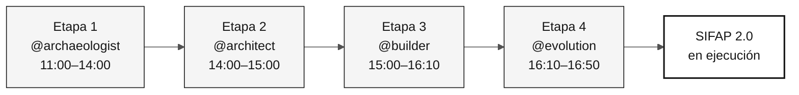

# Agentes de etapa — 4 agentes de contexto de la inmersión

> **Ruta:** [Kit del equipo](../README.md) › **Agentes de etapa**

**Los agentes de etapa son agentes personalizados de GitHub Copilot que concentran el contexto técnico de cada fase de la inmersión, garantizando que todo el equipo interactúe con Copilot de manera coherente durante la misma etapa.**

| Campo | Valor |
|---|---|
| **Público objetivo** | Todo el equipo; lectura obligatoria antes de iniciar la inmersión |
| **Prerrequisitos** | GitHub Copilot activo en VS Code |
| **Tiempo estimado** | 10 min |
| **Etapa** | Todas |
| **Resultado esperado** | Saber qué agente usar, cuándo usarlo y cuál es su función |

---

## ¿Qué es un agente personalizado de Copilot?

Un agente personalizado de GitHub Copilot es un perfil de instrucciones configurado en `.github/copilot-instructions.md` y archivos de `skills`. Orienta a Copilot sobre el contexto, las herramientas, el vocabulario y las restricciones de una tarea específica.

Cuando seleccionas `@archaeologist` en Copilot Chat, Copilot carga las instrucciones de ese agente y responde dentro de ese alcance, sin que tengas que repetir el contexto en cada mensaje.

**Por qué importa en esta inmersión:** sin agentes personalizados, cada integrante del equipo tendría que repetir el contexto de SIFAP, las reglas de trazabilidad y la stack de destino en cada conversación. Los agentes de etapa eliminan esta repetición y crean un ritual compartido.

---

## Dos capas de configuración

Esta inmersión usa dos capas de configuración de Copilot que trabajan juntas:

| Capa | Qué hace | Ubicación |
|---|---|---|
| **Kit de persona** (columna) | Define el rol individual: Responsable de Producto, Desarrollador, QA y otros | [`05-personas/`](../05-personas/) |
| **Agente de etapa** (fila) | Define el contexto de la fase: arqueología, especificación, implementación y evolución | Esta carpeta |

La persona responde "¿quién soy en este equipo?" El agente responde "¿en qué fase estamos ahora?" Cada integrante mantiene sus dos personas durante todo el día, mientras que el agente de etapa cambia a medida que avanza el cronograma.

---

## Los 4 agentes y el cronograma

| Etapa | Horario | Agente | Enfoque del agente | Propósito |
|---|---|---|---|---|
| Etapa 1 — Arqueología | 11:00–12:00 + 13:30–14:00 | [@archaeologist](01-archaeologist/README.md) | Investigativo | Leer el sistema heredado, registrar evidencia y delimitar una funcionalidad |
| Etapa 2 — Especificación | 14:00–15:00 | [@architect](02-architect/README.md) | Analítico | Crear `spec.md`, `plan.md` y `tasks.md` con decisiones de alcance |
| Etapa 3 — Implementación | 15:00–16:10 | [@builder](03-builder/README.md) | Constructivo | Crear código Java/Next.js, pruebas, migraciones y endpoints trazables |
| Etapa 4 — Evolución | 16:10–16:50 | [@evolution](04-evolution/README.md) | Operativo | Delegar una Issue pequeña y registrar el resultado de la revisión |

---

## Cómo seleccionar el agente en Copilot Chat

- [ ] **Confirma la etapa actual** en [00-TEAM-FLOW.md](../00-TEAM-FLOW.md).
- [ ] **Abre Copilot Chat** en VS Code (`Ctrl+Alt+I` / `Cmd+Alt+I`).
- [ ] **Abre el selector de agentes** (el icono de arroba o el menú contextual del campo de mensaje).
- [ ] **Selecciona el agente de la etapa actual** (por ejemplo, `@archaeologist`).
- [ ] **Abre el README del agente** desde la tabla anterior y copia el prompt de apertura.
- [ ] **Trabaja en los entregables de la definición de terminado del agente** hasta llegar a la puerta de transición.

> [!WARNING]
> No omitas la puerta de transición entre etapas. Garantiza que el siguiente agente reciba evidencia explícita, decisiones y trabajo pendiente, en lugar de solo una conversación de chat.

---

## Matriz de responsabilidades persona × agente

Quien **lidera** dirige la conversación con el agente. Quien **contribuye** participa activamente. Quien **observa** sigue el trabajo y responde preguntas cuando se le solicita.

| Persona | @archaeologist | @architect | @builder | @evolution |
|---|---|---|---|---|
| Responsable de Producto | Observa | Contribuye | Observa | Contribuye |
| Especialista en Requisitos | **Lidera** | Contribuye | Observa | Observa |
| Arquitecto Empresarial | Contribuye | Contribuye | Observa | Observa |
| Arquitecto de Software | Observa | **Lidera** | Contribuye | Observa |
| Líder Técnico | Observa | Contribuye | Contribuye | **Lidera** |
| Desarrollador | Observa | Observa | **Lidera** | Contribuye |
| DBA | Contribuye | Observa | Contribuye | Observa |
| Ingeniero de Calidad | Observa | Observa | Contribuye | Contribuye |
| Ingeniero DevOps | Observa | Observa | Contribuye | Contribuye |
| Redactor Técnico | Contribuye | Observa | Observa | Contribuye |

Para la versión detallada, consulta [docs/persona-agent-matrix.md](../docs/persona-agent-matrix.md).

---

## Principio: el agente no conoce tu sistema heredado

Los agentes saben **cómo** modernizar Natural/Adabas. No saben **qué** existe en el sistema heredado de tu equipo. Esto es intencional. El aprendizaje ocurre cuando el equipo lee, debate y registra evidencia.

| Solicitud inadecuada | Respuesta esperada del agente |
|---|---|
| "Dime todo lo que hace el sistema" | "Abre el primer archivo y lo leeremos juntos". |
| "Crea la arquitectura sin leer el sistema heredado" | "Aún nos falta evidencia. Vuelve a la Etapa 1". |
| "Implementa sin un REQ-ID" | "Falta trazabilidad. Crea o identifica el requisito". |

---

## Criterios de finalización por etapa

- [ ] El equipo usa el mismo agente durante la misma etapa.
- [ ] Quien lidera sabe qué entregable debe surgir de la conversación.
- [ ] La etapa termina con artefactos versionados en el repositorio, no solo con una conversación de chat.
- [ ] La siguiente transición recibe evidencia explícita, decisiones y trabajo pendiente.

---

### Sigue leyendo

| Anterior | Siguiente |
|---|---|
| [Kits de personas](../05-personas/) Configuración individual según el rol en el equipo. | [@archaeologist](01-archaeologist/README.md) Etapa 1: leer el sistema heredado Natural/Adabas. |

[Volver al índice del kit](../README.md)
