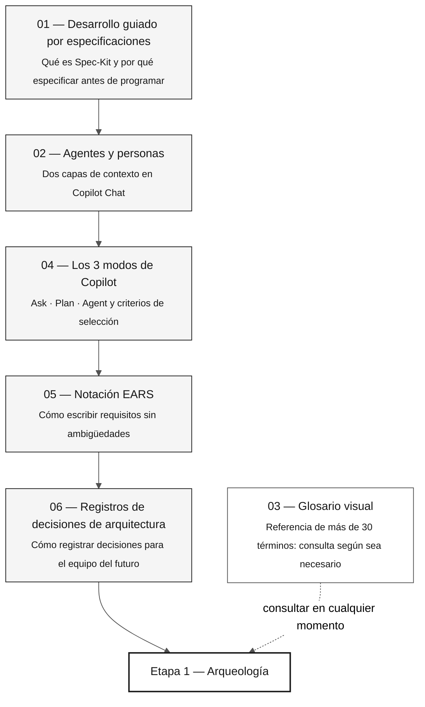

# 07 — Conceptos fundamentales de la inmersión

> **Ruta:** [Kit del equipo](../README.md) › **Conceptos fundamentales**

**Este índice presenta los conceptos esenciales de la inmersión de modernización de SIFAP: qué aprenderás, en qué orden, cuánto tiempo lleva y cómo se conecta cada concepto con las cuatro etapas de trabajo.**

  

| Campo | Valor |
|---|---|
| **Público objetivo** | Cualquier integrante del equipo, incluidas las personas que no desarrollan software |
| **Prerrequisitos** | Ninguno: este es el punto de partida |
| **Tiempo estimado** | 60–90 min para leer todos los documentos |
| **Resultado esperado** | Vocabulario compartido antes de la Etapa 1 |

---

## Qué aprenderás

Cada archivo de esta carpeta explica un concepto técnico de forma directa, con ejemplos reales del dominio SIFAP (Sistema de Fiscalización y Administración de Pagos): pagos, beneficios y fiscalizaciones. Después de leerlos, podrás:

- Explicar el ciclo de Spec-Kit sin consultar la documentación
- Distinguir un kit de persona de un agente de etapa y saber cómo combinarlos en Copilot Chat
- Elegir el modo de Copilot adecuado (Ask, Plan o Agent) para cada situación
- Escribir o revisar un requisito EARS con `source_legacy:`
- Escribir o evaluar un registro de decisión de arquitectura (ADR)

---

## Ruta de aprendizaje

---

## Documentos de esta carpeta

| # | Documento | Concepto fundamental | Etapa principal |
|---|---|---|---|
| 01 | [Desarrollo guiado por especificaciones](01-spec-driven-development.md) | Ciclo de Spec-Kit: especificar → planificar → tareas → implementar | Etapa 2 |
| 02 | [Agentes y personas](02-agents-and-personas.md) | Kit de persona individual × agente de etapa compartido | Todas |
| 03 | [Glosario visual](03-visual-glossary.md) | Más de 30 términos con definición, ejemplo de SIFAP y referencia | Todas |
| 04 | [Los 3 modos de Copilot](04-3-copilot-modes.md) | Ask · Plan · Agent: criterios y antipatrones | Todas |
| 05 | [Notación EARS](05-ears-notation.md) | 6 patrones EARS (5 básicos + Complejo), REQ-ID y `source_legacy:` | Etapa 2 |
| 06 | [Registros de decisiones de arquitectura](06-architecture-decision-records.md) | Anatomía, cuándo escribir uno y ciclo de vida de los ADR | Etapa 2 |

---

## Conexión con las cuatro etapas

| Etapa | Documentos de referencia de esta carpeta |
|---|---|
| Etapa 1 — Arqueología | Glosario (términos del legado: Natural, DDM, MU, PE, BR-NNN) |
| Etapa 2 — Especificación | Spec-Kit, Agentes, EARS, ADR, Glosario (EARS, REQ-ID, source_legacy) |
| Etapa 3 — Implementación | Los 3 modos de Copilot, Glosario (JPA, Flyway, Testcontainers, Controller) |
| Etapa 4 — Evolución | Los 3 modos de Copilot (modo Agent), Glosario (IaC, Terraform, CI/CD) |

---

## Comprueba antes de continuar

Antes de iniciar la Etapa 1, confirma que puedes responder estas preguntas sin consultar la documentación:

- [ ] ¿Qué es Spec-Kit y para qué sirve el comando `/speckit.specify`?
- [ ] ¿Cuál es la diferencia entre un kit de persona (en `05-personas/`) y un agente de etapa (en `06-stage-agents/`)?
- [ ] ¿Cuándo deberías usar Ask en lugar de Agent en Copilot?
- [ ] ¿Qué es EARS y por qué es obligatorio el campo `source_legacy:`?
- [ ] ¿Qué es un ADR y en qué situación escribirías uno?

Si respondiste cuatro de cinco, continúa a [`../05-personas/`](../05-personas/) y lee tus dos archivos `PERSONA.md`.

---

### Sigue leyendo

| Anterior | Siguiente |
|---|---|
| [Kit del equipo](../README.md) Centro principal de la inmersión. | [Desarrollo guiado por especificaciones](01-spec-driven-development.md) Por qué especificar antes de programar y cómo estructura Spec-Kit el proceso. |

[Volver al índice del kit](../README.md)
