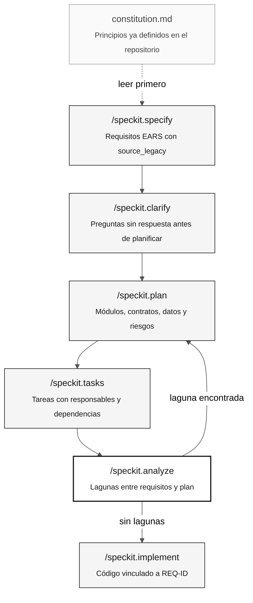

# Desarrollo guiado por especificaciones y Spec-Kit

> **Ruta:** [Kit del equipo](../README.md) › [Conceptos](00-README.md) › **Desarrollo guiado por especificaciones**

**El desarrollo guiado por especificaciones (SDD) es la práctica de especificar por completo el comportamiento esperado antes de escribir código, y Spec-Kit es el conjunto de comandos que estructura este proceso en Copilot Chat.**

  

| Campo | Valor |
|---|---|
| **Público objetivo** | Todas las personas, especialmente Especialistas en Requisitos y Arquitectos de Software |
| **Prerrequisitos** | Leer los programas `.NSN` asignados en la Etapa 1 |
| **Tiempo estimado** | 20 minutos |
| **Etapa** | Etapa 2 — Especificación |
| **Resultado esperado** | Comprender el ciclo de Spec-Kit y saber cuándo ejecutar cada comando |

---

## Concepto

El desarrollo guiado por especificaciones es un enfoque en el que el equipo produce una especificación formal —con requisitos, un plan de arquitectura y tareas— antes de escribir cualquier código. Así, cinco personas que trabajan en paralelo construyen partes compatibles del mismo sistema en lugar de cinco versiones divergentes.

**Spec-Kit** (repositorio oficial: [github/spec-kit](https://github.com/github/spec-kit)) es la implementación práctica de SDD para equipos que usan GitHub Copilot. Proporciona una secuencia de comandos en Copilot Chat que guía al equipo desde una idea vaga hasta tareas concretas con responsables y trazabilidad.

---

## Por qué importa en esta inmersión

En la inmersión SIFAP, cinco personas tienen unas pocas horas para modernizar un sistema de 29 años. Sin una especificación compartida, cada integrante implementa su interpretación del sistema heredado, lo que da lugar a código incompatible, reglas duplicadas o funcionalidades ausentes.

Spec-Kit resuelve este problema al exigir el ciclo:

> especificar el comportamiento esperado → planificar la arquitectura → distribuir tareas → implementar

No debe escribirse código antes de ejecutar y validar `/speckit.plan`.

---

## Cómo funciona

El ciclo completo de Spec-Kit tiene siete comandos. Cada uno produce un artefacto concreto:



| Comando | Qué produce | Cuándo usarlo |
|---|---|---|
| `/speckit.constitution` | Principios generales del sistema (tecnologías, patrones y restricciones) | Una vez por proyecto: ya están en `.specify/memory/constitution.md` |
| `/speckit.specify` | Requisitos EARS con REQ-ID y `source_legacy:` | Al inicio de la Etapa 2, para cada funcionalidad confirmada |
| `/speckit.clarify` | Preguntas sobre comportamientos sin evidencia en el legado | Después de `specify`, antes de planificar |
| `/speckit.plan` | Módulos, contratos de API, modelo de datos y riesgos | Después de responder todas las preguntas de `clarify` |
| `/speckit.tasks` | Tareas con estimaciones, responsables y dependencias | Después de que el equipo apruebe el plan |
| `/speckit.analyze` | Informe de coherencia: lagunas, conflictos y cobertura | Antes de implementar: obligatorio |
| `/speckit.implement` | Código, pruebas y migraciones con REQ-ID trazables | Solo después de que `analyze` no informe de lagunas críticas |

---

## Ejemplo de SIFAP

Supongamos que la Etapa 1 reveló que `CALCPGTO.NSN` calcula el importe neto del beneficio descontando las contribuciones. El flujo de la Etapa 2 sería:

```bash
# 1. Consulta los principios del sistema
cat .specify/memory/constitution.md

# 2. Especifica la funcionalidad
/speckit.specify calcular el importe neto del beneficio según CALCPGTO.NSN.
Incluye source_legacy en cada requisito.

# 3. Resuelve las preguntas abiertas
/speckit.clarify
# Ejemplo de pregunta generada: "Cuando una contribución está vencida, ¿se calcula
# la deducción sobre el importe bruto o sobre el importe después de otras deducciones?"
# → Responde consultando el código heredado o al PO antes de continuar.

# 4. Planifica la arquitectura
/speckit.plan
# Usa las tecnologías de la inmersión: Java 21 + Spring Boot 3.3 + PostgreSQL 16.

# 5. Distribuye las tareas
/speckit.tasks

# 6. Comprueba la coherencia
/speckit.analyze

# 7. Implementa
/speckit.implement
```

Cada REQ-ID generado por `/speckit.specify` debe contener una línea `source_legacy:` que apunte a la sección exacta del `.NSN`. Sin ella, el trabajo de CI `legacy-traceability` rechaza la PR.

---

## Caso de uso

Usa Spec-Kit siempre que el equipo inicie una funcionalidad nueva en la Etapa 2. Incluso cuando una funcionalidad parezca sencilla, ejecutar el ciclo completo previene el riesgo principal de la inmersión: **modernizar lo que el equipo cree que hace el sistema en lugar de lo que realmente hace**.

---

## Errores comunes y cómo evitarlos

| Síntoma | Causa | Corrección |
|---|---|---|
| Código escrito antes de `plan` | El equipo omitió los pasos iniciales | Vuelve a `specify`. El código sin especificación garantiza trabajo repetido. |
| Falta `source_legacy:` en un REQ-ID | Requisito escrito de memoria, sin evidencia del legado | Abre el `.NSN` correspondiente y localiza la sección exacta. |
| Doce preguntas de `clarify` | Es normal, no es un problema | Respóndelas todas. Cada pregunta sin respuesta se convierte en un error. |
| `analyze` informa de lagunas | Plan incompleto o incoherente | No continúes a `implement`. Corrige el plan y vuelve a ejecutarlo. |
| Spec-Kit no se encuentra | Instalación incompleta | Consulta [`09-cheat-sheets/spec-kit-workflow.md`](../09-cheat-sheets/spec-kit-workflow.md). |

---

## Lista de verificación de uso

- [ ] **Lee primero `constitution.md`.** Confirma las tecnologías, los patrones y las restricciones del proyecto.
- [ ] **Ejecuta `/speckit.specify` basándote en evidencia del legado.** Nunca dependas de la memoria.
- [ ] **Responde todas las preguntas de `/speckit.clarify`.** Registra las decisiones.
- [ ] **Haz que el equipo apruebe el plan antes de `/speckit.tasks`.** El plan es un artefacto compartido.
- [ ] **Ejecuta `/speckit.analyze` y corrige las lagunas antes de implementar.**
- [ ] **Cada REQ-ID tiene `source_legacy:` o `[GREENFIELD] + justificación`.**

---

## Referencias

- [Repositorio oficial de Spec-Kit](https://github.com/github/spec-kit)
- [Ficha de comandos](../09-cheat-sheets/spec-kit-workflow.md)
- [Guía de la Etapa 2](../02-modern-spec/GUIDE.md)

---

### Sigue leyendo

| Anterior | Siguiente |
|---|---|
| [Índice de conceptos](00-README.md)<br/><sub>Qué aprenderás y en qué orden.</sub> | [Agentes y personas](02-agents-and-personas.md)<br/><sub>Las dos capas de contexto de Copilot Chat.</sub> |

<sub>[Volver al índice del kit](../README.md)</sub>
