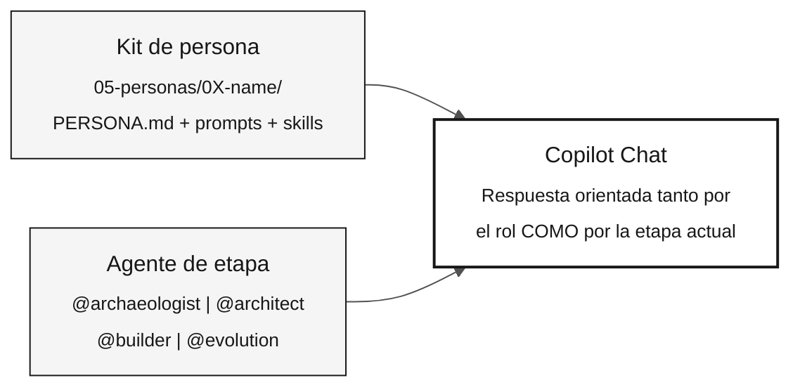

# Agentes y personas — Las dos capas de contexto

> **Ruta:** [Kit del equipo](../README.md) › [Conceptos](00-README.md) › **Agentes y personas**

**Copilot Chat opera con dos capas de contexto al mismo tiempo: la persona, que define el rol individual de cada participante, y el agente de etapa, que define el enfoque compartido del equipo. Saber combinarlas es esencial para obtener respuestas pertinentes durante la inmersión.**

  

| Campo | Valor |
|---|---|
| **Público objetivo** | Todas las personas |
| **Prerrequisitos** | Ninguno: leer antes de la Etapa 1 |
| **Tiempo estimado** | 20 minutos |
| **Etapa** | Todas las etapas |
| **Resultado esperado** | Saber seleccionar un agente y una persona, y usarlos juntos en Copilot Chat |

---

## Concepto

La inmersión usa **dos tipos de agentes** en Copilot:

- **Kit de persona** — contexto individual que cada participante carga desde `05-personas/`. Define el rol, las competencias y los comandos disponibles de esa persona a lo largo del día.
- **Agente de etapa** — contexto compartido que todo el equipo selecciona al inicio de cada etapa. Define el enfoque temático de las conversaciones del equipo con Copilot durante ese bloque de trabajo.

Las dos capas coexisten. Nunca reemplazas tu persona por el agente de etapa: usas ambos al mismo tiempo.

---

## Por qué importa

Sin una persona seleccionada, Copilot responde como un asistente genérico, sin considerar las competencias ni las restricciones de tu rol. Sin un agente de etapa, cada integrante del equipo recibe respuestas con un enfoque diferente, lo que impide mantener la coherencia.

Con ambas capas activas, Copilot sabe al mismo tiempo:

- **Quién pregunta** (rol, competencias y comandos de barra disponibles)
- **En qué contexto está el equipo** (Etapa 1: arqueología; Etapa 2: especificación; y así sucesivamente)

---

## Cómo se combinan



---

## Capa 1 — Personas (kit individual)

Cada participante elige **dos roles** (dos personas) y mantiene ambos durante toda la inmersión. Los archivos de cada persona están en [`05-personas/`](../05-personas/) y ya se han consolidado en `.github/`, en la raíz del repositorio.

| Persona | Rol en la inmersión | Etapa de mayor actividad |
|---|---|---|
| **Responsable de Producto** | Define el alcance y valida los requisitos con el negocio | Etapas 1 y 2 |
| **Especialista en Requisitos** | Lee el sistema heredado y convierte las reglas a EARS | Etapas 1 y 2 |
| **Arquitecto Empresarial** | Proporciona la visión de todo el sistema (C4 L1 y L2) | Etapa 2 |
| **Arquitecto de Software** | Define contextos delimitados y contratos de API | Etapa 2 |
| **Líder Técnico** | Lidera las revisiones de PR y las decisiones de implementación | Etapas 3 y 4 |
| **Desarrollador** | Implementa código Java y Next.js | Etapa 3 |
| **DBA** | Modela datos, escribe migraciones y optimiza consultas | Etapa 3 |
| **Ingeniero de Calidad** | Escribe y valida pruebas de equivalencia | Etapa 3 |
| **Ingeniero DevOps** | Configura CI/CD, Terraform y Actions | Etapa 4 |
| **Redactor Técnico** | Documenta API, ADR y runbooks | Etapas 2 y 4 |

### Qué incluye cada persona

El kit de persona contiene los siguientes artefactos en `05-personas/0X-name/` y `.github/`:

| Artefacto | Ubicación | Propósito |
|---|---|---|
| `PERSONA.md` | `05-personas/0X-name/` | Perfil del rol: responsabilidades, entregables y comandos de barra |
| `*.prompt.md` | `.github/prompts/` | Prompts específicos del rol |
| `SKILL.md` | `.github/skills/*/` | Conocimiento del dominio activado automáticamente |
| `*.instructions.md` | `.github/instructions/` | Reglas aplicadas automáticamente a archivos específicos |
| `mcp.json` | Raíz del repositorio | Servidores MCP disponibles para el rol |

> [!IMPORTANT]
> Lee tus dos archivos `PERSONA.md` antes de iniciar cualquier etapa. Los comandos de barra funcionan solo cuando el contexto del repositorio está cargado en Copilot Chat.

---

## Capa 2 — Agentes de etapa (kit compartido)

Al inicio de cada bloque de trabajo, todo el equipo selecciona el mismo agente de etapa en Copilot Chat. Esto garantiza que todos reciban respuestas con el mismo enfoque.

| Etapa | Agente | Enfoque temático | Roles líderes |
|---|---|---|---|
| Etapa 1 — Arqueología | [`@archaeologist`](../06-stage-agents/01-archaeologist/) | Lectura e interpretación de código Natural/Adabas heredado | Especialista en Requisitos, Redactor Técnico |
| Etapa 2 — Especificación | [`@architect`](../06-stage-agents/02-architect/) | Especificaciones EARS, ADR y modelo C4 | Arquitecto Empresarial, Arquitecto de Software |
| Etapa 3 — Implementación | [`@builder`](../06-stage-agents/03-builder/) | Código Java 21, JPA, Testcontainers y Next.js 15 | Desarrollador, DBA, Ingeniero de Calidad |
| Etapa 4 — Evolución | [`@evolution`](../06-stage-agents/04-evolution/) | Delegación al modo Agent, IaC y CI/CD | Ingeniero DevOps, Redactor Técnico |

### Diferencia práctica

| Sin un agente de etapa seleccionado | Con un agente de etapa seleccionado |
|---|---|
| Copilot responde en el contexto general del repositorio | Copilot adopta el enfoque de la etapa actual |
| Cada persona recibe respuestas con énfasis diferentes | El equipo recibe respuestas coherentes entre sí |
| Puede sugerir acciones inadecuadas para el momento (por ejemplo, código en la Etapa 1) | Se mantiene dentro del alcance de la etapa actual |

---

## Cómo seleccionarlos

### Persona

1. Abre Copilot Chat en VS Code.
2. Selecciona el panel de agentes (el icono de la esquina del campo de entrada).
3. Elige en la lista desplegable la persona que corresponda a tu rol.
4. Confírmala ejecutando un comando de barra de tu `PERSONA.md`. Si funciona, la persona está activa.

### Agente de etapa

1. Al inicio de cada etapa, la persona facilitadora anuncia qué agente usará el equipo.
2. Cada participante selecciona el agente en Copilot Chat de la misma forma que la persona.
3. La persona individual permanece activa: el agente de etapa se añade al contexto, no la sustituye.

---

## Ejemplo de SIFAP

**Escenario:** eres el Especialista en Requisitos en la Etapa 2. El equipo acaba de completar la Etapa 1.

```
1. La persona facilitadora anuncia: "Seleccionen @architect en el chat."

2. Seleccionas @architect.
   Resultado: Copilot Chat ahora orienta las respuestas
   al contexto de especificación y arquitectura.

3. Usas el modo Ask para pedir orientación:
   "@architect, ¿cuál es el orden recomendado para especificar
   las reglas de business-rules-catalog.md?"

4. A partir de la respuesta, ejecutas el comando de barra de tu rol:
   /ears-convert BR-042: <regla de cálculo del beneficio>
   Usa CALCPGTO.NSN#L120-L198 como source_legacy.

5. El requisito EARS incluye un REQ-ID y source_legacy.
   La CI valida la trazabilidad en la PR.
```

---

## Errores comunes y cómo evitarlos

| Síntoma | Causa | Corrección |
|---|---|---|
| Copilot sugiere código durante la Etapa 1 | Agente de etapa incorrecto o ausente | Selecciona `@archaeologist` y confírmalo con el equipo |
| El comando de barra no se reconoce | La ventana de Copilot se abrió fuera de la raíz del repositorio | Vuelve a abrir VS Code en la raíz del repositorio |
| Respuestas incoherentes entre integrantes del equipo | Cada persona seleccionó un agente diferente | Confirma el agente activo al inicio de cada etapa |
| El agente de etapa reemplazó a la persona | Confusión al seleccionar | La persona y el agente de etapa son selecciones independientes en el panel |

---

## Lista de verificación de activación

- [ ] **Lee los dos archivos `PERSONA.md` que tienes asignados.** Encuéntralos en `05-personas/`.
- [ ] **Prueba un comando de barra de persona** en Copilot Chat para confirmar que está activa.
- [ ] **Al inicio de cada etapa, selecciona el agente correcto** junto con el resto del equipo.
- [ ] **Confirma el agente activo antes de plantear preguntas técnicas críticas.**

---

## Referencias

- [Lista completa de personas](../05-personas/OVERVIEW.md)
- [Agentes de etapa](../06-stage-agents/)
- [Ficha de los 3 modos de Copilot](../09-cheat-sheets/copilot-3-modes.md)

---

### Sigue leyendo

| Anterior | Siguiente |
|---|---|
| [Desarrollo guiado por especificaciones](01-spec-driven-development.md)<br/><sub>Por qué especificar antes de programar y el ciclo de Spec-Kit.</sub> | [Glosario visual](03-visual-glossary.md)<br/><sub>Más de 30 términos con definición, ejemplo de SIFAP y referencia.</sub> |

<sub>[Volver al índice del kit](../README.md)</sub>
