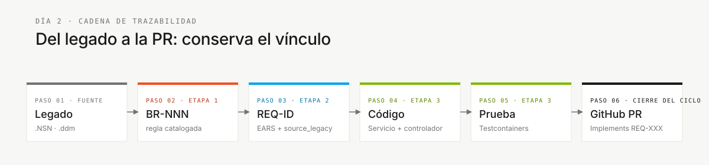

# Glosario — La terminología de la inmersión explicada

> **Ruta:** [Kit del equipo](../README.md) › [Conceptos](00-README.md) › **Glosario visual**

**Referencia de más de 30 términos técnicos usados en la inmersión SIFAP, organizados por área, con una definición en una frase, un ejemplo del dominio y un enlace para ampliar la lectura.**

 

| Campo | Valor |
|---|---|
| **Público objetivo** | Cualquier integrante del equipo, especialmente Responsables de Producto, Redactores Técnicos y analistas |
| **Cómo usarlo** | Mantén esta pestaña abierta durante la inmersión. No necesitas memorizarlo: consúltalo cada vez que encuentres un término desconocido. |

---

## Mapa por etapa

| Etapa | Términos de uso frecuente |
|---|---|
| Etapa 1 — Arqueología | Natural, NSN, DDM, Adabas, MU, PE, BR-NNN |
| Etapa 2 — Especificación | EARS, REQ-ID, source_legacy, ADR, C4, contexto delimitado, greenfield, Spec-Kit |
| Etapa 3 — Implementación | JPA, Flyway, migración, Testcontainers, controller, service, repository, Bean Validation, Server Component, Swagger |
| Etapa 4 — Evolución | Agent, Issue, PR, Terraform, IaC, CI/CD, Actions |

---

## Referencia terminológica

| Término | Significado en lenguaje claro | Contexto de uso |
|---|---|---|
| handoff | transferencia de responsabilidad | Transición entre etapas |
| stakeholder | parte interesada o afectada | Personas Responsable de Producto y Especialista en Requisitos |
| backlog | lista de trabajo pendiente | Gestión de tareas en GitHub Projects |
| commit | versión registrada | Control de versiones con Git |
| push | enviar cambios al repositorio remoto | Git: compartir cambios con el equipo |
| pull request (PR) | propuesta de cambio | Revisión de código antes de la integración |
| merge | integrar una rama | Incorporación de cambios en la rama principal |
| code review | evaluación por pares de cambios de código | Revisión de PR antes de integrar |
| CI green | pipeline de CI exitoso | Todas las pruebas se aprobaron |
| CI red | pipeline de CI fallido | Al menos una prueba o verificación falló |
| breaking change | cambio incompatible | Cambio que rompe contratos de API existentes |
| rollback | restaurar una versión anterior | Revertir un despliegue problemático |
| feature flag | interruptor para activar o desactivar una funcionalidad | Habilitar una funcionalidad sin volver a desplegar |
| deployment | publicación de una versión | Poner una versión a disposición en un entorno |
| production | entorno en vivo | Entorno usado por los usuarios finales |
| staging | entorno de preproducción | Validación antes de producción |
| sandbox | entorno experimental aislado | Pruebas sin riesgo para el sistema en vivo |
| bug | defecto de software | Comportamiento incorrecto identificado |
| hotfix | corrección urgente | Corrección aplicada directamente a producción |
| refactor | reestructurar sin cambiar el comportamiento | Mejorar el código preservando la funcionalidad |
| technical debt | trabajo de ingeniería pospuesto | Atajos que deberán corregirse |
| smoke test | prueba mínima de funcionamiento | Comprobación rápida de que el sistema funciona |
| spike | investigación técnica breve | Explorar una solución antes de comprometerse con ella |

---

## Área: legado

### Adabas

La base de datos mainframe donde SIFAP (Sistema de Fiscalización y Administración de Pagos) ha almacenado datos durante 29 años. A diferencia de las bases de datos relacionales convencionales, admite campos multivalor (MU) y grupos periódicos (PE). Los DDM contienen las definiciones de sus archivos. Aparece en la Etapa 1 al inspeccionar `01-archaeology/legacy-sifap/adabas-ddms/`.

### DDM — Módulo de definición de datos

Un archivo `.ddm` de Adabas que describe la estructura de un "archivo" (equivalente a una tabla): campos, tipos, tamaños y ocurrencias. Ejemplo de SIFAP: `BENEFIC.ddm` define los campos del archivo de beneficiarios. Ubicación: `01-archaeology/legacy-sifap/adabas-ddms/`.

### MU — Campo multivalor

Un campo Adabas que almacena varios valores en un solo registro; por ejemplo, un campo `TELEFONES` que contiene hasta cinco números de teléfono. El equivalente en SQL sería una tabla hija con una clave foránea. El equipo debe documentar en un ADR cómo preservar esta multiplicidad en el modelo moderno.

### Natural (lenguaje de programación)

Un lenguaje de programación de la década de 1980 que se usa con Adabas. Los programas SIFAP se almacenan en archivos `.NSN`. Tiene sintaxis imperativa con `IF`/`END-IF` y `FOR`/`END-FOR`, sin orientación a objetos. Guía de lectura: [`01-archaeology/legacy-sifap/HOW-TO-READ-NATURAL.md`](../01-archaeology/legacy-sifap/HOW-TO-READ-NATURAL.md).

### NSN (archivo `.NSN`)

La extensión de los programas Natural. Equivale a `.java` o `.py`, pero para Natural. SIFAP tiene 15 programas `.NSN` en `01-archaeology/legacy-sifap/natural-programs/`.

### PE — Grupo periódico

Un grupo de campos Adabas que se repite varias veces dentro del mismo registro; por ejemplo, hasta 12 entradas de historial de pagos mensuales. Es más complejo que MU porque cada ocurrencia contiene varios campos relacionados. Su mapeo al modelo relacional moderno requiere una decisión documentada en un ADR.

### BR-NNN — Regla de negocio

El identificador de una regla de negocio extraída del sistema heredado durante la Etapa 1 (por ejemplo, `BR-042`). Se usa en `business-rules-catalog.md`. Sin este identificador, no se puede trazar la regla hasta el requisito que la implementa.

---

## Área: requisitos

### EARS — Easy Approach to Requirements Syntax

Una notación estandarizada para escribir requisitos sin ambigüedades. Proporciona seis patrones sintácticos (ubicuo, guiado por eventos, guiado por estados, opcional, no deseado y complejo) que reemplazan las declaraciones vagas por frases de formato fijo y pruebas objetivas. Consulta [05 — Notación EARS](05-ears-notation.md) para más detalles.

### REQ-ID

Un identificador único de requisito (por ejemplo, `REQ-042`). Cada commit de la Etapa 3 que implemente un requisito debe incluir `Implements REQ-042` en el mensaje. Sin un REQ-ID, no hay trazabilidad.

### `source_legacy:`

Un campo obligatorio en cada REQ-ID que apunta a la sección de origen del sistema heredado. Formato: `01-archaeology/legacy-sifap/natural-programs/CALCDSCT.NSP#L120-L198`. Para una funcionalidad nueva, usa `[GREENFIELD] <justificación>`. Si falta, la CI rechaza el cambio.

### Greenfield

Un requisito sin equivalente en el sistema heredado: una funcionalidad verdaderamente nueva. Debe documentarse como `source_legacy: "[GREENFIELD] <motivo>"` y justificarse con el Responsable de Producto.

### Spec-Kit

La herramienta oficial de GitHub para el desarrollo guiado por especificaciones. Proporciona los comandos `/speckit.specify`, `/speckit.clarify`, `/speckit.plan`, `/speckit.tasks`, `/speckit.analyze` y `/speckit.implement` en Copilot Chat. Consulta [01 — Desarrollo guiado por especificaciones](01-spec-driven-development.md) para más detalles.

---

## Área: arquitectura

### ADR — Registro de decisión de arquitectura

Un archivo Markdown breve que registra una decisión de arquitectura: su contexto, la decisión tomada, las alternativas consideradas y las consecuencias. Garantiza que los futuros integrantes del equipo comprendan las decisiones tomadas hoy. Plantilla: `02-modern-spec/ADR-TEMPLATE.md`. Consulta [06 — Registros de decisiones de arquitectura](06-architecture-decision-records.md) para más detalles.

### Contexto delimitado

Un segmento del sistema claramente delimitado, con su propio vocabulario y reglas. En SIFAP, "beneficiario" significa cosas distintas en los contextos de Registro, Cálculo y Fiscalización. Los límites son hipótesis que el equipo valida y documenta en un ADR. Este concepto aparece en las Etapas 2 y 3.

### C4 (modelo C4)

Un enfoque para documentar arquitectura con cuatro niveles de detalle: Contexto del sistema (L1), Contenedores (L2), Componentes (L3) y Código (L4). La inmersión usa solo L1 y L2. Aparece en la Etapa 2 como entregable del Arquitecto Empresarial.

### Monolito Modular

El patrón de arquitectura adoptado en esta inmersión: un único proceso desplegable dividido en módulos internos con límites bien definidos. Se seleccionó en lugar de microservicios porque se adapta mejor al tiempo disponible de la inmersión. Documentado en ADR-001.

### Strangler Fig

Un patrón de migración incremental en el que el nuevo sistema "rodea" gradualmente al heredado, reemplazando una funcionalidad a la vez sin una migración de golpe. Se aplica cuando la inmersión produce solo una parte de SIFAP 2.0.

---

## Área: implementación

### Bean Validation

Anotaciones Java (`@NotNull`, `@Email`, `@Size`, `@Pattern`) que validan automáticamente los datos de entrada en la capa de controladores. Evitan que los datos no válidos lleguen a la lógica de negocio.

### Controller

Una clase Java que recibe solicitudes HTTP y devuelve respuestas. Sus responsabilidades son recibir y validar la entrada con `@Valid`, delegar al servicio y devolver el estado HTTP correcto. Ubicación del código: `infrastructure/`.

### DTO — Objeto de transferencia de datos

Una estructura Java con campos usados para transportar datos a través de la API, sin lógica de negocio. En SIFAP, un `BeneficiarioDTO` transporta los datos necesarios para crear o actualizar un beneficiario sin exponer directamente la entidad JPA.

### Flyway

Una herramienta de migración de bases de datos. Aplica scripts SQL versionados en el orden correcto (`V1__init.sql`, `V2__add_coluna.sql`). Una vez ejecutado, un script nunca se modifica: los cambios posteriores requieren uno nuevo. Ubicación: `src/main/resources/db/migration/`.

### JPA — Java Persistence API

El estándar de Java para mapear clases a tablas de base de datos. Una clase anotada con `@Entity` se mapea a una tabla; los campos anotados con `@Column` se mapean a columnas. Hibernate es la implementación usada en esta inmersión.

### JWT — JSON Web Token

Un token cifrado emitido por el backend tras una autenticación exitosa. El cliente envía el JWT con cada solicitud posterior en el encabezado `Authorization`. Autentica las llamadas a la API sin mantener sesiones del lado del servidor.

### Repository (Spring Data)

Una interfaz Java que proporciona métodos listos de lectura y escritura en base de datos (`findById`, `save`, `deleteAll`, `findByStatus`). Spring Data JPA la implementa automáticamente. Ubicación: `infrastructure/`.

### Server Component (Next.js)

Un componente React que se ejecuta en el servidor sin enviar JavaScript al navegador del usuario. Es ideal para obtener datos y renderizar HTML estático. Los componentes que necesitan interacción del usuario deben ser Client Components marcados explícitamente con `"use client"`.

### Service

Una clase Java que contiene lógica de negocio. Se sitúa entre el Controller (que recibe la solicitud) y el Repository (que accede a la base de datos). Cada transacción de base de datos debe gestionarse en la capa de servicios con `@Transactional`. Ubicación: `application/`.

### Swagger UI

Una interfaz web generada automáticamente por SpringDoc que documenta los endpoints de API y permite a los usuarios probarlos. Está disponible en `http://localhost:8080/swagger-ui.html` durante el desarrollo local.

### Testcontainers

Una biblioteca Java que inicia un contenedor Docker con una instancia real de PostgreSQL durante las pruebas. Elimina los mocks de base de datos y garantiza que las pruebas de integración reflejen el comportamiento real del sistema. Docker debe estar en ejecución.

---

## Área: operaciones

### CI/CD — Integración continua y entrega continua

CI (integración continua): ejecuta automáticamente las pruebas en cada commit. CD (entrega continua): despliega automáticamente después de que la CI se apruebe. En la inmersión, se configura en `.github/workflows/`. Se requiere un pipeline de CI exitoso antes de integrar en `main`.

### DoD — Definición de terminado

Una lista de criterios verificables que demuestran que un entregable está completo. El `GUIDE.md` de cada etapa termina con la DoD de esa etapa. Terminar el código no basta: hay que verificar toda la DoD.

### IaC — Infraestructura como código

La práctica de describir servidores, bases de datos y redes en archivos de código (Terraform) en lugar de configurarlos manualmente en el portal de Azure. Hace que la infraestructura sea reproducible y auditable. En la inmersión, los archivos `.tf` se crean en `infra/` cuando el equipo llega a la Etapa 4.

### Issue (GitHub Issue)

Un ticket de GitHub que describe una tarea, funcionalidad o defecto. En la Etapa 4, las Issues bien escritas —con contexto, criterios de aceptación y trazabilidad— se delegan al modo Agent de Copilot para generar PR automáticamente.

### PR — Pull Request

Una solicitud para incorporar cambios de una rama a la rama principal. Cada PR requiere al menos una revisión por pares antes de integrarse en `main`. La CI debe estar en verde antes de la integración.

### Terraform

Una herramienta de IaC que describe infraestructura de Azure en archivos `.tf`. El comando `terraform plan` muestra lo que se crearía sin realizar cambios; `terraform apply` crea los recursos. Durante las demostraciones de la inmersión, ejecuta solo `terraform plan`: nunca ejecutes un `apply` real sin aprobación.

---

## Cadena de trazabilidad

Esta cadena es lo que verifica la CI en cada PR. Siempre que tengas dudas sobre lo que estás haciendo, vuelve al eslabón anterior de la cadena.

---

### Sigue leyendo

| Anterior | Siguiente |
|---|---|
| [Agentes y personas](02-agents-and-personas.md) Las dos capas de contexto de Copilot Chat. | [Los 3 modos de Copilot](04-3-copilot-modes.md) Ask, Plan y Agent: criterios objetivos de selección. |

[Volver al índice del kit](../README.md)
