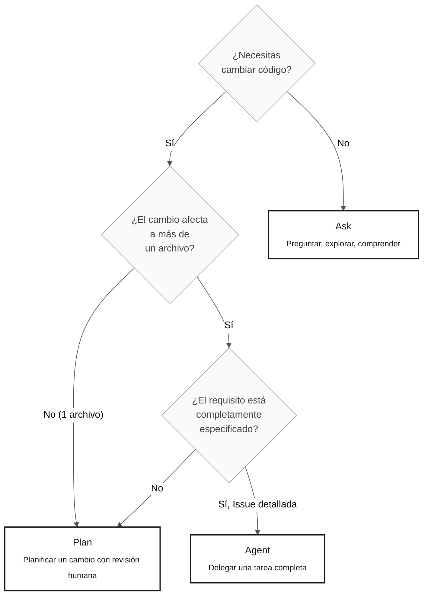

# Los 3 modos de Copilot — Ask, Plan y Agent

> **Ruta:** [Kit del equipo](../README.md) › [Conceptos](00-README.md) › **Los 3 modos de Copilot**

**GitHub Copilot opera en tres modos distintos —Ask, Plan y Agent— y elegir el modo equivocado para una tarea hace perder tiempo. Este documento proporciona criterios objetivos para seleccionar el modo adecuado en cada situación de la inmersión.**

  

| Campo | Valor |
|---|---|
| **Público objetivo** | Todas las personas |
| **Prerrequisitos** | Leer [Agentes y personas](02-agents-and-personas.md) |
| **Tiempo estimado** | 15 minutos |
| **Etapa** | Todas las etapas |
| **Resultado esperado** | Saber qué modo usar para cada tarea sin dudar |

---

## Concepto

Copilot Chat proporciona tres modos de operación con distintos niveles de autonomía, costos de tiempo y resultados:

- **Ask** — modo conversacional. Haces preguntas y recibes respuestas de texto. No se modifica código.
- **Plan** — modo de planificación. Describes un cambio y Copilot propone un plan que enumera los archivos que debe tocar y los cambios que debe realizar, antes de ejecutarlos.
- **Agent** — modo autónomo. Proporcionas una tarea bien definida, normalmente como una Issue, y Copilot lee el código, implementa el cambio y abre una PR de forma autónoma.

---

## Por qué importa

Usar el modo equivocado tiene consecuencias directas:

- **Ask cuando deberías usar Plan:** recibes orientación correcta, pero debes hacerlo todo manualmente, por lo que el trabajo resulta más lento de lo necesario.
- **Agent cuando deberías usar Ask:** Copilot modifica varios archivos a partir de un contexto incompleto y genera una PR defectuosa cuya corrección lleva más tiempo que un cambio manual.
- **Plan cuando deberías usar Agent:** revisas un plan paso a paso para una tarea grande y bien definida, generando un esfuerzo manual innecesario.

---

## Árbol de decisión



---

## Comparación de los tres modos

| Criterio | Ask | Plan | Agent |
|---|---|---|---|
| **Qué hace** | Responde preguntas en texto | Propone un plan de cambios sin ejecutarlo | Implementa de forma autónoma y abre una PR |
| **Autonomía** | Ninguna | Baja (apruebas cada paso) | Alta (se ejecuta sin intervención) |
| **Costo de tiempo** | Bajo | Medio | Alto: justificado solo para tareas grandes |
| **Cuándo usarlo** | Explorar, comprender y responder preguntas | Cambio en varios archivos con revisión humana | Issue completamente especificada con contexto y criterios de aceptación |
| **Prerrequisito** | Ninguno | Contexto de lo que debe cambiarse | Issue con contexto, REQ-ID, criterios de aceptación y trazabilidad |
| **Riesgo de repetir trabajo** | Ninguno | Bajo | Alto si la Issue está incompleta |

---

## Ejemplos de prompts por modo — Contexto de SIFAP

### Ask — Explorar el sistema heredado

```text
"Explica línea por línea qué hace CALCPGTO.NSN.
Céntrate en las decisiones de negocio. Ignora las rutinas de entrada/salida."
```

```text
"@archaeologist, ¿qué campos de BENEFIC.ddm
son obligatorios y cuáles son campos multivalor (MU)?"
```

### Plan — Implementar un requisito con revisión

```text
"Plan: implementar REQ-042 (calcular el importe neto del beneficio).
Enumera los archivos que deben crearse o modificarse, el orden de los cambios
y las pruebas de integración necesarias.
NO implementes todavía: espero la aprobación del equipo."
```

```text
"Plan: crear la migración Flyway V3 para añadir la
columna status_pagamento a la tabla beneficiario.
Muestra el script SQL y los cambios necesarios en las entidades JPA."
```

### Agent — Delegar una tarea completa (Etapa 4)

```text
[Crear una GitHub Issue que contenga:]
- Título: Implementar el endpoint GET /api/v1/beneficiarios/{id}
- Contexto: REQ-042 especificado en la Etapa 2 y mapeado a BeneficiarioService
- Criterios de aceptación: devuelve 200 con un DTO, devuelve 404 si no se encuentra,
  valida el UUID de la ruta e incluye pruebas Testcontainers para ambos escenarios
- Trazabilidad: REQ-042 › CALCPGTO.NSN#L120-L198
[Seleccionar el modo Agent y referenciar la Issue]
```

---

## Antipatrones — Qué no hacer

| Antipatrón | Consecuencia | Alternativa correcta |
|---|---|---|
| Usar Agent para una pregunta de dos minutos | Demora, consumo de contexto y riesgo de cambios no deseados | Usa Ask |
| Usar Ask para implementar un servicio completo | Recibes orientación, pero lo haces todo manualmente | Usa Plan o Agent |
| Delegar a Agent sin una Issue detallada | La PR generada contiene código incorrecto o incompleto | Escribe la Issue completa antes de iniciar Agent |
| Usar Plan durante la Etapa 1 (arqueología) | Copilot puede intentar modificar el sistema heredado | Usa Ask con `@archaeologist` |
| Ignorar la salida de Plan antes de ejecutarlo | Cambios inesperados en archivos no previstos | Lee y aprueba el plan antes de confirmar |

---

## Costo de tiempo estimado

Usa estas estimaciones para elegir un modo durante la inmersión. El tiempo real varía según la complejidad de la tarea:

| Modo | Tarea sencilla | Tarea mediana | Tarea compleja |
|---|---|---|---|
| Ask | 1–2 min | 3–5 min | 5–10 min |
| Plan | 5–10 min (incluida la revisión) | 15–20 min | Más de 30 min |
| Agent | No recomendado | 20–30 min (incluida la revisión de PR) | 45–90 min |

> [!WARNING]
> El tiempo de Agent incluye la revisión de la PR generada. Las PR con contexto incompleto pueden requerir varias iteraciones.

---

## Referencias

- [Ficha de una página sobre los 3 modos](../09-cheat-sheets/copilot-3-modes.md)
- [Agentes y personas](02-agents-and-personas.md)
- [Guía de la Etapa 4 — Modo Agent en la práctica](../04-evolution/GUIDE.md)

---

### Sigue leyendo

| Anterior | Siguiente |
|---|---|
| [Glosario visual](03-visual-glossary.md)<br/><sub>Más de 30 términos con definiciones y ejemplos de SIFAP.</sub> | [Notación EARS](05-ears-notation.md)<br/><sub>Cómo escribir requisitos sin ambigüedades.</sub> |

<sub>[Volver al índice del kit](../README.md)</sub>
