# Notación EARS — Requisitos sin ambigüedades

> **Ruta:** [Kit del equipo](../README.md) › [Conceptos](00-README.md) › **Notación EARS**

**EARS (Easy Approach to Requirements Syntax) es un conjunto de seis patrones de lenguaje que transforma requisitos vagos en enunciados de formato fijo que pueden probarse automáticamente. Es la notación obligatoria para todos los requisitos de SIFAP 2.0.**

  

| Campo | Valor |
|---|---|
| **Público objetivo** | Especialista en Requisitos, Arquitecto de Software, Responsable de Producto |
| **Prerrequisitos** | Leer los programas `.NSN` asignados y [Desarrollo guiado por especificaciones](01-spec-driven-development.md) |
| **Tiempo estimado** | 25 minutos |
| **Etapa** | Etapa 2 — Especificación |
| **Resultado esperado** | Escribir requisitos EARS válidos con un REQ-ID y `source_legacy:` |

---

## Concepto

Un requisito mal escrito es la principal causa de trabajo repetido en los proyectos de modernización. Enunciados como "el sistema debe ser seguro" o "procesar los datos correctamente" no especifican qué hace el sistema, cuándo lo hace ni cómo verificar el resultado.

EARS resuelve este problema con seis patrones sintácticos. Cada patrón corresponde a un tipo de comportamiento y produce un enunciado con una prueba objetiva. Si no puedes imaginar una prueba automatizada para un requisito, el requisito es vago.

---

## Por qué importa en SIFAP

SIFAP contiene 29 años de reglas implícitas distribuidas en 15 programas `.NSN` y cuatro DDM. Sin EARS, cada integrante del equipo interpreta las reglas de manera diferente. Con EARS, la regla extraída de la línea 142 de `CALCPGTO.NSN` se convierte en un único enunciado con una prueba asociada y trazabilidad al código heredado que la originó.

---

## Estructura básica de un requisito

Cada requisito de la inmersión usa este formato YAML:

```yaml
REQ-NNN:
  pattern: <ubiquitous | event-driven | state-driven | optional | unwanted | complex>
  text: "<enunciado EARS completo>"
  source_legacy: "<path>.NSN#L<start>-L<end>"
  acceptance:
    - "<criterio verificable 1>"
    - "<criterio verificable 2>"
```

> [!CAUTION]
> El campo `source_legacy:` es obligatorio en cada requisito. El trabajo de CI `legacy-traceability` rechaza las PR que contienen REQ-ID sin este campo.

---

## Los 5 patrones EARS

### Patrón 1 — Ubicuo (siempre se aplica)

**Cuándo usarlo:** la regla se aplica en todo momento, sin una condición.

**Plantilla:**

```
El sistema shall <action>.
```

**Ejemplo de SIFAP:**

```yaml
REQ-001:
  pattern: ubiquitous
  text: "El sistema shall registrar la fecha y la hora de cada modificación de los registros de beneficiarios."
  source_legacy: 01-archaeology/legacy-sifap/natural-programs/CADBENEF.NSP#L45-L52
  acceptance:
    - "Cada registro de beneficiario modificado contiene una marca de tiempo de modificación"
    - "La marca de tiempo usa la zona horaria UTC"
```

**Ejemplo deficiente:**

```
El sistema shall proporcionar una auditoría completa.
```

Problema: "auditoría completa" no es comprobable.

---

### Patrón 2 — Guiado por eventos (cuando ocurre algo)

**Cuándo usarlo:** un evento específico activa la regla.

**Plantilla:**

```
When <event>, el sistema shall <action>.
```

**Ejemplo de SIFAP:**

```yaml
REQ-042:
  pattern: event-driven
  text: "When se procesa el pago de un beneficio, el sistema shall calcular el importe neto descontando las contribuciones vigentes."
  source_legacy: 01-archaeology/legacy-sifap/natural-programs/CALCDSCT.NSP#L120-L198
  acceptance:
    - "Given un beneficiario con un importe bruto de R$ 1,000.00 y una tasa de contribución del 11%, el importe neto calculado es R$ 890.00"
    - "El resultado se registra en la tabla pagamentos con estado CALCULATED"
```

**Ejemplo deficiente:**

```
When hay un pago, procésalo.
```

Problema: "procesar" no describe la acción esperada.

---

### Patrón 3 — Guiado por estados (mientras persiste un estado)

**Cuándo usarlo:** la regla se aplica mientras el sistema o la entidad esté en un estado determinado.

**Plantilla:**

```
While <state condition>, el sistema shall <action>.
```

**Ejemplo de SIFAP:**

```yaml
REQ-078:
  pattern: state-driven
  text: "While el beneficiario tiene estado SUSPENDED, el sistema shall bloquear el procesamiento de nuevos pagos para ese beneficiario."
  source_legacy: 01-archaeology/legacy-sifap/natural-programs/VALELEG.NSN#L33-L41
  acceptance:
    - "Un intento de procesar un pago para un beneficiario SUSPENDED devuelve el error BENEFICIARY_SUSPENSO"
    - "No se crea ningún registro de pago para un beneficiario SUSPENDED"
```

---

### Patrón 4 — Opcional (cuando el usuario elige)

**Cuándo usarlo:** la regla se aplica solo cuando el usuario ha habilitado una opción o seleccionado una configuración.

**Plantilla:**

```
Where <selected option>, el sistema shall <action>.
```

**Ejemplo de SIFAP:**

```yaml
REQ-105:
  pattern: optional
  text: "Where el operador selecciona la exportación CSV, el sistema shall generar el archivo con una cabecera en la primera fila y codificación UTF-8."
  source_legacy: 01-archaeology/legacy-sifap/natural-programs/BATCHREL.NSP#L201-L215
  acceptance:
    - "El archivo generado tiene extensión .csv"
    - "La primera fila contiene los nombres de las columnas"
    - "El contenido usa codificación UTF-8"
```

---

### Patrón 5 — Comportamiento no deseado (lo que no debe ocurrir)

**Cuándo usarlo:** prohibiciones explícitas, incluidas las de seguridad, cumplimiento normativo o invariantes del sistema.

**Plantilla:**

```
El sistema shall not <prohibited behavior>.
```

**Ejemplo de SIFAP:**

```yaml
REQ-200:
  pattern: unwanted
  text: "El sistema shall not exponer el identificador fiscal completo de un beneficiario en las respuestas de la API: shall mostrar solo los últimos cuatro dígitos."
  source_legacy: 01-archaeology/legacy-sifap/natural-programs/CADBENEF.NSP#L88-L90
  acceptance:
    - "El endpoint GET /api/v1/beneficiarios/{id} devuelve el identificador fiscal en el formato ***.***.***-XX"
    - "Los logs de la aplicación nunca registran el identificador fiscal"
```

---

## Patrón 6 — Complejo (combinación de patrones)

El sexto patrón EARS combina condiciones de estado, evento y opción en un único requisito. Es coherente con la terminología de [`09-cheat-sheets/spec-kit-workflow.md`](../09-cheat-sheets/spec-kit-workflow.md), que enumera los seis patrones EARS.

**Plantilla:**

```
While <state>, when <event>, where <option>, el sistema shall <action>.
```

**Ejemplo de SIFAP:**

```yaml
REQ-250:
  pattern: complex
  text: "While el beneficiario tiene estado ACTIVE, when se procesa un nuevo pago, where el método seleccionado es el abono en cuenta, el sistema shall registrar el número de cuenta bancaria en el historial de pagos."
  source_legacy: 01-archaeology/legacy-sifap/natural-programs/VALELEG.NSN#L55-L72
  acceptance:
    - "El pago de un beneficiario ACTIVE mediante abono en cuenta registra la cuenta bancaria en el historial"
    - "Un pago para un beneficiario SUSPENDED no activa este flujo"
```

> [!TIP]
> Usa el patrón Complejo con moderación. Si un requisito combina como máximo dos condiciones sin perder claridad, Complejo puede ser apropiado. Si es difícil de leer, divídelo en dos REQ-ID.

---

## De un requisito EARS a una prueba

```mermaid
%%{init: {'theme':'neutral','themeVariables':{'fontFamily':'ui-sans-serif, system-ui, sans-serif','primaryColor':'#F5F5F5','primaryTextColor':'#171717','primaryBorderColor':'#171717','lineColor':'#525252','secondaryColor':'#FFFFFF','tertiaryColor':'#FAFAFA','background':'#FFFFFF'}}}%%
flowchart LR
    classDef step fill:#F5F5F5,stroke:#171717,color:#171717
    classDef gate fill:#FFFFFF,stroke:#171717,color:#171717,stroke-width:2px
    classDef muted fill:#FAFAFA,stroke:#A3A3A3,color:#404040

    A["Regla del legado<br/><sub>.NSN o .ddm</sub>"]:::muted
    B["BR-NNN<br/><sub>business-rules-catalog.md</sub>"]:::step
    C["REQ-NNN (EARS)<br/><sub>pattern + text + source_legacy</sub>"]:::step
    D["Criterios de aceptación<br/><sub>acceptance: [...]</sub>"]:::step
    E["Prueba automatizada<br/><sub>JUnit 5 + Testcontainers</sub>"]:::step
    F["CI en verde<br/><sub>legacy-traceability aprobado</sub>"]:::gate

    A --> B --> C --> D --> E --> F
```



---

## La prueba del espejo

Antes de considerar completo un requisito EARS, pregunta:

> "¿Cómo probaría esto automáticamente?"

Si la respuesta es vaga o no existe, el requisito está incompleto.

| Requisito vago | Requisito comprobable |
|---|---|
| El sistema shall ser seguro | El sistema shall not exponer un identificador fiscal completo en las respuestas de la API |
| Procesar datos | When se procesa un pago, calcular el importe neto según la fórmula X |
| Auditoría completa | When se modifica un beneficiario, registrar el operador, la fecha, los valores anteriores y los nuevos |
| Funcionar bien | When se recibe una solicitud, responder en dos segundos con carga normal |

---

## Lista de verificación de validación EARS

- [ ] **Identificador único.** El REQ-ID existe y sigue el formato `REQ-NNN`.
- [ ] **Patrón correcto.** El patrón declarado en `pattern:` coincide con la estructura del texto.
- [ ] **Texto sin ambigüedades.** No usa "adecuado", "eficiente", "completo" ni "seguro" sin una definición cuantitativa.
- [ ] **`source_legacy:` completado.** Apunta a un archivo y líneas específicos o declara `[GREENFIELD]` con una justificación.
- [ ] **Criterios de aceptación verificables.** Cada elemento de `acceptance:` describe un escenario con entrada, acción y resultado esperado.
- [ ] **Es posible imaginar la prueba.** Se puede describir una prueba automatizada para cada criterio de aceptación.
- [ ] **Tamaño adecuado.** Si el requisito cubre más de un comportamiento distinto, divídelo en dos REQ-ID.

---

## Errores comunes y cómo evitarlos

| Síntoma | Causa | Corrección |
|---|---|---|
| No sabes qué patrón usar | La regla aún no se ha clasificado | Empieza por el guiado por eventos (`When…`): cubre el 60% de los casos |
| No encuentras `source_legacy:` | Requisito escrito de memoria | Vuelve al `.NSN` y localiza la sección. Sin evidencia, no hay requisito. |
| El requisito tiene tres párrafos | Contiene dos o más requisitos distintos | Divídelo. Un REQ-ID = un comportamiento atómico. |
| El equipo no se pone de acuerdo sobre el texto | Ambigüedad en el sistema heredado | Ejecuta `/speckit.clarify` y registra la decisión en un ADR. |

---

## Prompts útiles en Copilot Chat

```text
# Convertir una regla del catálogo a EARS
/ears-convert BR-042: <texto de la regla confirmada por el equipo>.
Usa CALCPGTO.NSN#L120-L198 como source_legacy.

# Validar un requisito EARS escrito
"@architect, ¿este requisito EARS es comprobable? ¿Cómo escribirías la prueba?
REQ-042: <texto del requisito>"

# Identificar lagunas de cobertura
/speckit.analyze
¿Qué reglas confirmadas del catálogo todavía no tienen un REQ-ID?
```

---

## Referencias

- [Guía de la Etapa 2](../02-modern-spec/GUIDE.md)
- [Ficha de Spec-Kit](../09-cheat-sheets/spec-kit-workflow.md)
- [Lista de verificación de exploración del legado](../01-archaeology/LEGACY-EXPLORATION-CHECKLIST.md)

---

### Sigue leyendo

| Anterior | Siguiente |
|---|---|
| [Los 3 modos de Copilot](04-3-copilot-modes.md)<br/><sub>Ask, Plan y Agent: criterios de selección.</sub> | [Registros de decisiones de arquitectura](06-architecture-decision-records.md)<br/><sub>Cómo registrar decisiones para el equipo del futuro.</sub> |

<sub>[Volver al índice del kit](../README.md)</sub>
