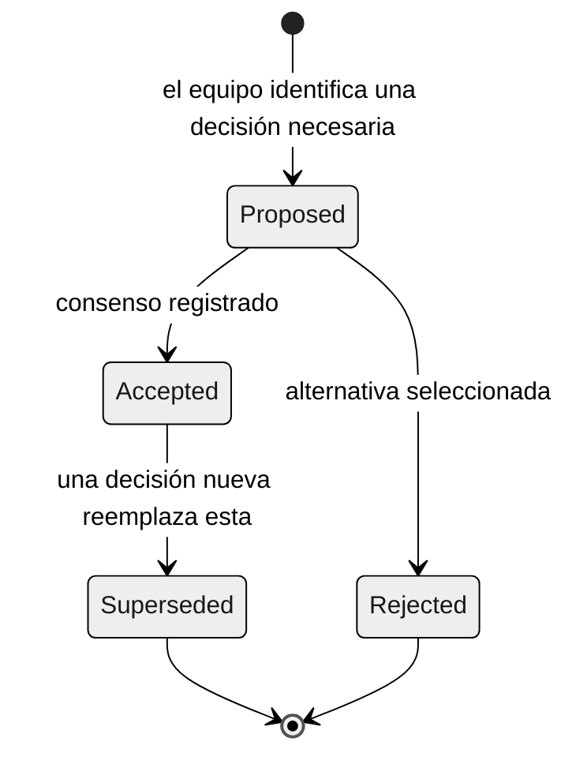

# Registros de decisiones de arquitectura (ADR)

> **Ruta:** [Kit del equipo](../README.md) › [Conceptos](00-README.md) › **Registros de decisiones de arquitectura**

**Un registro de decisión de arquitectura (ADR) es un documento breve que registra una decisión de arquitectura significativa: el contexto que la motivó, la decisión tomada, las alternativas consideradas y las consecuencias. Garantiza que el razonamiento de hoy siga siendo comprensible para cualquiera que trabaje en el sistema en el futuro.**

  

| Campo | Valor |
|---|---|
| **Público objetivo** | Arquitecto de Software, Arquitecto Empresarial, Líder Técnico, Responsable de Producto |
| **Prerrequisitos** | [Desarrollo guiado por especificaciones](01-spec-driven-development.md) |
| **Tiempo estimado** | 20 minutos |
| **Etapa** | Etapa 2 — Especificación |
| **Resultado esperado** | Saber cuándo y cómo escribir un ADR válido para SIFAP 2.0 |

---

## Concepto

Una decisión de arquitectura es cualquier elección técnica que afecte a la estructura, los contratos o la operación a largo plazo del sistema. Por ejemplo, seleccionar un patrón de arquitectura, definir cómo representar los campos multivalor de Adabas en el modelo relacional o elegir una estrategia de autenticación.

Las decisiones técnicas sin documentar se convierten en "conocimiento informal" que depende de quién estuvo presente. Cuando este conocimiento no se registra, los equipos futuros toman decisiones contradictorias, introducen redundancia o descartan trabajo por falta de contexto.

Un ADR formaliza el razonamiento en un archivo Markdown almacenado en el repositorio junto con el código al que se aplica.

---

## Por qué importa en SIFAP

SIFAP tiene 29 años. SIFAP 2.0 debe durar al menos tanto. Las decisiones tomadas durante la inmersión —como representar los grupos periódicos (PE) de Adabas, estructurar contextos delimitados o versionar la API— deben registrarse para que quienes mantengan el sistema en el futuro comprendan por qué se construyó así.

Sin ADR, los costos de mantenimiento aumentan cada vez que cambia el equipo.

---

## Anatomía de un ADR

```markdown
# ADR-NNN: título de la decisión

**Estado:** Proposed | Accepted | Rejected | Superseded by ADR-NNN
**Fecha:** YYYY-MM-DD
**Autores:** [nombres]

## Contexto

Describe la situación que requiere una decisión: evidencia, restricciones,
riesgos y qué sucede si no se toma una decisión ahora.

## Decisión

Una frase. "Elegimos X usando Y."

## Alternativas consideradas

- **Alternativa A:** <descripción y motivo para aceptar o rechazar>
- **Alternativa B:** <descripción y motivo para aceptar o rechazar>

## Consecuencias

- Positivas: <beneficio esperado>
- Negativas: <costo o riesgo aceptado>
- Nota: <condición que haría obsoleta esta decisión>
```

---

## Ciclo de vida de un ADR



> [!IMPORTANT]
> Nunca elimines un ADR. Cuando se sustituya una decisión, actualiza su estado a `Superseded by ADR-NNN` y crea un nuevo ADR que explique la nueva decisión. El historial del razonamiento es valioso.

---

## Cuándo escribir un ADR

Usa la prueba de las tres preguntas:

1. ¿La decisión **afecta a varios archivos, módulos o personas**?
2. ¿**Revertir** la decisión costaría más de un día de trabajo?
3. ¿Alguien del equipo preguntaría dentro de seis meses "por qué lo hicimos así"?

Si dos o más respuestas son afirmativas, escribe un ADR.

### Ejemplos

| Decisión | Requiere ADR | Justificación |
|---|---|---|
| Usar Spring Boot 3.3 en lugar de Quarkus | Sí | Afecta a todos los módulos y es irreversible dentro del tiempo disponible de la inmersión |
| Representar los campos MU de Adabas como una tabla hija | Sí | Afecta al modelo de datos y a los mapeos JPA de varios módulos |
| Adoptar un Monolito Modular en lugar de microservicios | Sí | Decisión estructural con impacto en todo el proyecto |
| Versionar la API con el prefijo `/api/v1` | Sí | Afecta a todos los contratos de API |
| Reemplazar `final` por `var` en una variable local | No | Local, reversible y sin impacto externo |
| Añadir Lombok como dependencia | Sí | Afecta a todos los módulos que lo adopten |
| Usar `@Autowired` frente a inyección por constructor | Sí, si se convierte en el estándar del equipo | Afecta a todos los componentes Spring |

---

## Ejemplo de SIFAP

El siguiente es un ADR realista que el equipo podría escribir en la Etapa 2 para una decisión de mapeo de datos:

```markdown
# ADR-003: representación de grupos periódicos (PE) de Adabas en el modelo relacional

**Estado:** Accepted
**Fecha:** 2026-08-12
**Autores:** Arquitecto de Software, DBA

## Contexto

El DDM HISTORICO_PAYMENTS.ddm define un grupo periódico (PE) con hasta
12 ocurrencias mensuales dentro de cada registro de beneficiario.
El modelo relacional de PostgreSQL 16 no admite grupos periódicos de forma nativa.
Debemos decidir cómo preservar las ocurrencias y su orden en el modelo moderno.

## Decisión

Mapear cada ocurrencia de PE a una fila de la tabla historico_pagamentos,
con una clave foránea a beneficiarios y una columna competencia (DATE)
para preservar el orden cronológico.

## Alternativas consideradas

- **Columna JSONB:** almacenar las 12 ocurrencias como un array JSON.
  Rechazada: dificulta las consultas y la indexación por período e infringe el principio
  de no reproducir la complejidad del legado en el modelo nuevo.
- **Tabla hija (seleccionada):** cada ocurrencia se convierte en una fila con una FK.
  Aceptada: consultas sencillas, indexable y compatible con JPA.

## Consecuencias

- Positivas: consultas eficientes por período; mapeo natural a JPA.
- Negativas: los registros de beneficiarios con historiales completos generan 12 filas por
  beneficiario, un número de filas mayor que en Adabas.
- Nota: si el volumen supera los 10 millones de filas, evaluar el particionamiento
  por año en un ADR futuro.
```

---

## Lista de verificación de un ADR completo

- [ ] **Número secuencial** con el formato `ADR-NNN`.
- [ ] **Estado declarado:** Proposed, Accepted, Rejected o Superseded.
- [ ] **Fecha y autores** registrados.
- [ ] **El contexto** explica por qué se necesita la decisión ahora, no solo qué se decidió.
- [ ] **Decisión en una frase**, objetiva y sin ambigüedades.
- [ ] **Al menos dos alternativas** enumeradas con los motivos de rechazo.
- [ ] **Las consecuencias** incluyen tanto las negativas como las positivas.
- [ ] **Cabe en una página**: si no, probablemente contiene dos decisiones separadas.
- [ ] **El Responsable de Producto puede leer y comprender** el contexto y la decisión sin conocimientos técnicos.

---

## Errores comunes y cómo evitarlos

| Síntoma | Causa | Corrección |
|---|---|---|
| El ADR no enumera alternativas | Presión de tiempo | Enumera al menos dos, aunque sea brevemente. Sin alternativas, quien lee no puede comprender el compromiso. |
| El ADR describe solo beneficios | Sesgo de confirmación | Toda decisión tiene un costo. Si no hay consecuencias negativas, el razonamiento está incompleto. |
| Decisión sin contexto | Se empezó por la decisión en lugar del problema | Escribe primero el contexto. "¿Por qué ahora?" importa más que "¿qué?" |
| El ADR tiene cinco páginas | Se mezclan varias decisiones | Divídelo. Un ADR = una decisión. |
| Se elimina el ADR al sustituirlo | Gestión manual de archivos | Márcalo como `Superseded by ADR-NNN`. Nunca lo elimines. |

---

## Prompts útiles en Copilot Chat

```text
# Estructurar un ADR
"@architect, registra un ADR sobre <decisión pendiente>.
Usa las alternativas y la evidencia proporcionadas por el equipo.
NO elijas por el equipo: presenta los compromisos."

# Cuestionar una decisión antes de aceptarla
"@architect, lee ADR-002 y haz de abogado del diablo.
¿Cuáles son los tres argumentos más sólidos para RECHAZAR esta decisión?"

# Resolver un desacuerdo del equipo
/speckit.clarify
"No hay consenso entre un Monolito Modular y los microservicios.
Enumera ventajas y desventajas objetivas de cada uno en el contexto de SIFAP."
```

---

## Referencias

- [Plantilla de ADR en blanco](../02-modern-spec/ADR-TEMPLATE.md)
- [Guía de la Etapa 2](../02-modern-spec/GUIDE.md)
- [adr.github.io — patrón oficial](https://adr.github.io)

---

### Sigue leyendo

| Anterior | Siguiente |
|---|---|
| [Notación EARS](05-ears-notation.md)<br/><sub>Cómo escribir requisitos sin ambigüedades.</sub> | [Personas (descripción general)](../05-personas/OVERVIEW.md)<br/><sub>Elige tus dos roles de la inmersión.</sub> |

<sub>[Volver al índice del kit](../README.md)</sub>
