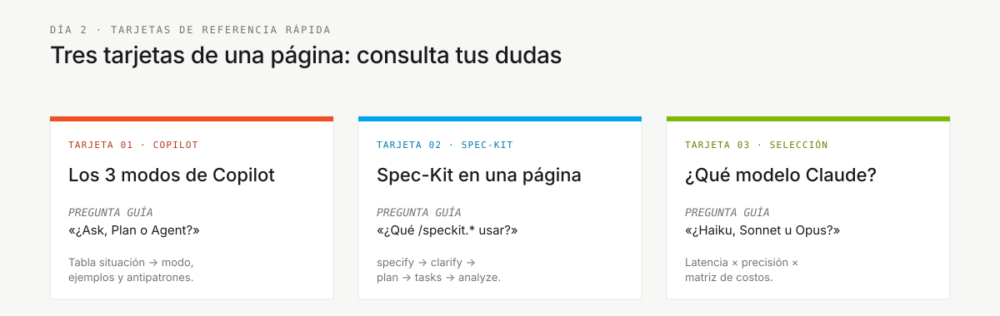

# Fichas de referencia rápida

> **Ruta:** [Kit del equipo](../README.md) › **Fichas de referencia**

**Tres fichas de una página para consultas rápidas durante la inmersión: modos de Copilot, flujo de Spec-Kit y selección de modelos.**

| Campo | Valor |
|---|---|
| **Público objetivo** | Todo el equipo: referencia rápida sin leer una guía completa |
| **Prerrequisitos** | Ninguno |
| **Tiempo estimado** | 2 min por ficha |
| **Etapa** | Todas |
| **Resultado esperado** | Saber qué ficha consultar para cada pregunta |

---

## Cuándo usarlas

Abre una ficha de referencia cuando necesites una respuesta rápida sin leer una guía completa. Cada ficha responde a una pregunta específica.

---

## Contenido

| Archivo | Tema | Úsala cuando |
|---|---|---|
| [`copilot-3-modes.md`](copilot-3-modes.md) | GitHub Copilot: modos Ask, Plan y Agent | No sabes qué modo de Copilot usar |
| [`spec-kit-workflow.md`](spec-kit-workflow.md) | Flujo de trabajo de Spec-Kit de un vistazo | No sabes qué comando `/speckit.*` usar |
| [`model-routing.md`](model-routing.md) | Qué modelo de IA usar para cada tipo de tarea | Estás decidiendo entre Haiku, Sonnet y Opus |

---

### Sigue leyendo

| Anterior | Siguiente |
|---|---|
| [Kits de personas — Índice](../05-personas/README.md) 10 personas con agentes, prompts, skills y MCP específicos de cada rol. | [Copilot en 3 modos](copilot-3-modes.md) Cuándo usar Ask, Plan o Agent: tabla de situaciones y modos. |

[Volver al índice del kit](../README.md)
