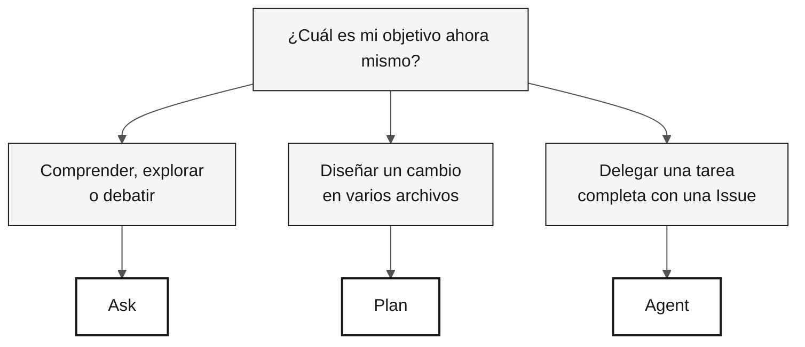

# GitHub Copilot en 3 modos — Ficha de referencia

> **Ruta:** [Kit del equipo](../README.md) › [Fichas de referencia](README.md) › **Los 3 modos de Copilot**

**Elige el modo de Copilot adecuado antes de abrir el chat: Ask para explorar, Plan para diseñar cambios y Agent para delegar tareas completas.**

| Campo | Valor |
|---|---|
| **Público objetivo** | Cualquier integrante del equipo antes de iniciar una conversación con Copilot |
| **Prerrequisitos** | GitHub Copilot activo en VS Code |
| **Tiempo estimado** | 2 min |
| **Etapa** | Todas |
| **Resultado esperado** | Saber qué modo usar para la situación actual |

---

## ¿Cuáles son los 3 modos de Copilot?

GitHub Copilot Chat opera en tres modos distintos, con diferentes niveles de autonomía y costo de contexto:

- **Ask** — modo conversacional. Tú preguntas; Copilot responde. No modifica archivos automáticamente. Ideal para comprender, explorar y debatir.
- **Plan** — modo de planificación. Copilot propone un plan de cambios con alcance, archivos y secuencia explícitos. Tú lo validas antes de ejecutarlo.
- **Agent** — modo autónomo. Copilot recibe una tarea completa, normalmente mediante una Issue, y trabaja de forma independiente hasta producir una PR. Tú revisas el resultado.

**Por qué importa en la inmersión SIFAP:** el modo equivocado hace perder tiempo. Usar Ask para una implementación de varios archivos puede llevar horas; usar Agent para una tarea de cinco minutos es un desperdicio. La tabla siguiente resuelve esta elección en segundos.

---

## Tabla de decisión rápida

| Situación | Modo | Motivo |
|---|---|---|
| Comprender código Natural/Adabas heredado | **Ask** | Conversacional, de bajo costo y reversible |
| Debatir un diseño o un compromiso | **Ask** | Exploratorio, sin comprometerse a modificar archivos |
| Evaluar un ADR antes de registrarlo | **Ask** | Comentarios antes de decidir |
| Diseñar un cambio en varios archivos | **Plan** | Plan explícito con alcance y secuencia claros |
| Enumerar las pruebas necesarias antes de implementar | **Plan** | Alcance visible antes de ejecutar |
| Delegar una Issue bien descrita (issue → PR) | **Agent** | Trabaja de forma independiente; revisas al final |
| Automatizar una cadena larga de CI/IaC | **Agent** | Tarea repetitiva con criterios claros |

---

## Flujo visual de decisión

---

## Ask — Preguntar y explorar

**Úsalo cuando** todavía no sepas exactamente qué quieres o cuando quieras comprender, debatir o evaluar un compromiso.

**Ejemplos en el contexto de SIFAP:**

- `"Explica qué hace este programa Natural línea por línea."`
- `"¿Cuáles son los riesgos de usar JSONB para almacenar el historial de cuentas bancarias?"`
- `"Resume este DDM en cinco líneas para alguien que no conozca Adabas."`
- `"Cuestiona este ADR: {pegar el ADR}."`

**Errores comunes:**

- Usar Ask para hacer cambios en varios archivos: usa Plan o Agent.
- Aceptar una respuesta sin validarla: Copilot puede alucinar; verifícala.
- Escribir un prompt demasiado corto ("ayuda"): aporta contexto sobre lo que tienes, lo que quieres y lo que has intentado.

---

## Plan — Planificar cambios

**Úsalo cuando** sepas lo que quieres, necesites involucrar varios archivos y quieras validar el alcance, la secuencia y los riesgos antes de ejecutar.

**Ejemplos en el contexto de SIFAP:**

- `"Planifica la creación del módulo <feature> usando la estructura de paquetes acordada por el equipo."`
- `"Enumera las pruebas necesarias para cada método público de <Service> antes de implementar."`
- `"Planifica el cambio de nombre de <legacy-term> a <modern-term> en todo el proyecto, en un orden seguro."`
- `"Revisa las migraciones Flyway existentes y propón una secuencia para añadir rollback documentado."`

**Errores comunes:**

- Alcance demasiado amplio: divídelo en etapas más pequeñas.
- No revisar el plan antes de ejecutarlo: ajústalo antes de autorizar.
- Mezclar cambios de lógica con cambios de nombre: una PR por propósito.

---

## Agent — Delegación autónoma

**Úsalo cuando** tengas una Issue bien descrita, aceptes que la tarea llevará tiempo y estés preparado para revisar una PR generada de forma autónoma.

**Cómo preparar la Issue:**

- [ ] **Escribe el contexto**: qué existe hoy y qué debe existir después.
- [ ] **Define criterios de aceptación**: el comportamiento verificable esperado.
- [ ] **Establece límites**: qué debe y qué NO debe cambiar Agent.
- [ ] **Identifica los archivos relevantes**: `"lee docs/adr/001.md antes de empezar"`.

**Seguimiento:** no interfieras mientras Agent está en ejecución. Déjalo terminar. Comprueba el progreso cada 10 minutos si es necesario.

**Revisión de la PR de Agent:** revísala exactamente como una PR humana. Una revisión rápida sigue siendo una revisión.

**Errores comunes:**

- Issue vaga: Agent entrega un resultado fuera del alcance.
- Iniciar Agent para una tarea de cinco minutos que Ask o Plan podrían resolver.
- Integrar sin revisión porque la PR se generó automáticamente.

---

## Modos por persona

| Persona | Modo principal | Modo secundario |
|---|---|---|
| Responsable de Producto | Ask (refinar historias) | Plan (priorizar el alcance) |
| Especialista en Requisitos | Ask (validar EARS) | Plan (organizar requisitos) |
| Arquitecto de Software | Ask (seleccionar un patrón) | Plan (diseñar un módulo) |
| Desarrollador | Plan (cambios en varios archivos) | Ask, Agent |
| Ingeniero de Calidad | Plan (cobertura y escenarios) | Ask (debatir lagunas) |
| Ingeniero DevOps | Agent (cadenas largas de CI) | Plan (Terraform) |
| Redactor Técnico | Ask (revisión de estilo) | Plan (reestructurar un ADR) |

---

> [!TIP]
> **Regla práctica.** Si no supieras que el código lo generó una IA, ¿lo aceptarías en tu proyecto? Si no, recházalo o refínalo. Copilot acelera el trabajo de las personas que saben; no sustituye el criterio.

---

### Sigue leyendo

| Anterior | Siguiente |
|---|---|
| [Fichas de referencia](README.md) Índice de las tres fichas de referencia rápida. | [Spec-Kit en 1 página](spec-kit-workflow.md) Secuencia: specify — clarify — plan — tasks — analyze. |

[Volver al índice del kit](../README.md)
