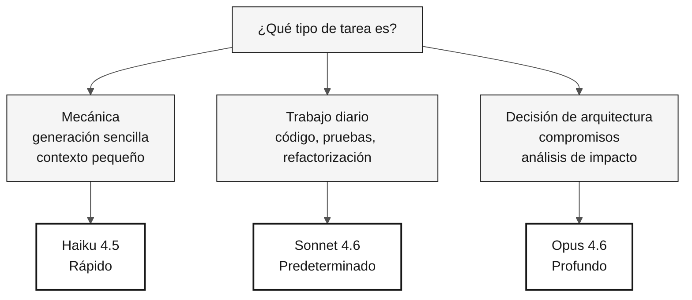

# Selección de modelos Claude — Ficha de referencia

> **Ruta:** [Kit del equipo](../README.md) › [Fichas de referencia](README.md) › **Selección de modelos**

**Usa el modelo más pequeño capaz de resolver tu tarea: Haiku para generación mecánica, Sonnet para el trabajo diario y Opus para decisiones de arquitectura que afecten a todo el proyecto.**

| Campo | Valor |
|---|---|
| **Público objetivo** | Cualquier integrante del equipo antes de enviar un prompt a Copilot |
| **Prerrequisitos** | Ninguno |
| **Tiempo estimado** | 2 min |
| **Etapa** | Todas |
| **Resultado esperado** | Elegir el modelo adecuado sin desperdiciar tiempo ni dinero |

---

## Principio: el modelo más pequeño que sea suficiente

Un modelo más grande significa más capacidad y más latencia. Cambiar de modelo cuesta menos que esperar 30 segundos por el equivocado.

> [!IMPORTANT]
> Usar Opus para una tarea mecánica hace perder tiempo. Usar Haiku para una decisión de arquitectura genera riesgo. Elige según el tipo de tarea, no según el prestigio del modelo.

---

## Tabla de decisión rápida

| Tipo de tarea | Modelo | Cuándo usarlo |
|---|---|---|
| Generación mecánica, transformación sencilla, contexto pequeño | **Haiku 4.5** | Generar DDL repetitivo, escribir una prueba unitaria sencilla o ajustar YAML trivial |
| Código, pruebas, refactorización, explicaciones cotidianas | **Sonnet 4.6** | Opción predeterminada para la mayoría de las tareas de la inmersión |
| Decisión de arquitectura, análisis de impacto, compromiso | **Opus 4.6** | Selección de patrones, definición de contextos delimitados y análisis de riesgos |

---

## Flujo visual de decisión

---

## Los tres modelos

| Modelo | Costo relativo | Velocidad | Cuándo usarlo |
|---|---|---|---|
| **Haiku 4.5** | Bajo | Rápido | Tarea mecánica, transformación sencilla, contexto pequeño |
| **Sonnet 4.6** | Medio | Media | Opción diaria predeterminada: código, pruebas, refactorización y explicación |
| **Opus 4.6** | Alto | Lento | Decisión de arquitectura, análisis de impacto y debate de compromisos |

---

## Selección por persona y situación

### Responsable de Producto y Especialista en Requisitos

| Situación | Modelo |
|---|---|
| Escribir una historia de usuario | Sonnet |
| Refinar requisitos EARS existentes | Haiku |
| Decidir si un requisito pertenece a v1 o v2 | Opus (una vez; decide y sigue adelante) |

### Arquitectos (Empresarial + Software)

| Situación | Modelo |
|---|---|
| Dibujar un diagrama C4 en Mermaid | Sonnet |
| Elegir entre patrones (hexagonal frente a capas) | Opus |
| Generar una variación de sintaxis de un diagrama existente | Haiku |

### Líder Técnico

| Situación | Modelo |
|---|---|
| Revisar una PR de tamaño mediano | Sonnet |
| Decidir un patrón para todo el proyecto | Opus al principio; Sonnet para aplicarlo |
| Comprobar si un fragmento compila | Haiku |

### Desarrollador

| Situación | Modelo |
|---|---|
| Implementar un servicio | Sonnet |
| Escribir una prueba unitaria sencilla | Haiku |
| Debatir la estructura de clases antes de escribir código | Opus |

### DBA

| Situación | Modelo |
|---|---|
| Traducir un DDM de Adabas a SQL | Sonnet (Opus para casos complejos) |
| Generar DDL repetitivo | Haiku |
| Decidir una estrategia de particionamiento | Opus |

### Ingeniero de Calidad

| Situación | Modelo |
|---|---|
| Generar una estructura inicial de JUnit 5 | Haiku |
| Escribir una prueba de integración no trivial | Sonnet |
| Elegir entre Testcontainers y un mock | Opus |

### Ingeniero DevOps

| Situación | Modelo |
|---|---|
| Generar YAML estándar de GitHub Actions | Sonnet |
| Ajustar comandos triviales del pipeline | Haiku |
| Decidir la topología de Azure | Opus |

### Redactor Técnico

| Situación | Modelo |
|---|---|
| Revisar el estilo del README | Haiku |
| Redactar un ADR | Sonnet |
| Decidir la estructura general de la documentación | Opus, una vez |

---

## Señales de que estás usando el modelo equivocado

| Síntoma | Diagnóstico | Acción |
|---|---|---|
| Esperas 30 segundos por una respuesta trivial | El modelo es más grande de lo necesario | Cambia a un modelo más pequeño |
| Respuesta superficial ante una decisión crítica | El modelo es más pequeño de lo necesario | Pasa a Opus |
| Respuesta correcta sin debate | El modelo es más pequeño de lo necesario | Pasa a Opus |
| Acumulas prompts para generar cientos de archivos | Modelo incorrecto para una tarea por lotes | Cambia a Sonnet o Haiku |

---

### Sigue leyendo

| Anterior | Siguiente |
|---|---|
| [Spec-Kit en 1 página](spec-kit-workflow.md) Secuencia: specify — clarify — plan — tasks — analyze. | [Fichas de referencia](README.md) Índice de las tres fichas de referencia rápida. |

[Volver al índice del kit](../README.md)
