# Spec-Kit — Ficha de referencia

> **Ruta:** [Kit del equipo](../README.md) › [Fichas de referencia](README.md) › **Flujo de trabajo de Spec-Kit**

**Spec-Kit es la herramienta oficial de GitHub para el desarrollo guiado por especificaciones. Exige la secuencia `specify → clarify → plan → tasks → implement` y evita que el equipo pase directamente al código sin una especificación.**

| Campo | Valor |
|---|---|
| **Público objetivo** | Especialistas en Requisitos y Arquitectos de Software durante la Etapa 2 |
| **Prerrequisitos** | Spec-Kit instalado (`uv tool install specify-cli`) y `specify init` completado |
| **Tiempo estimado** | 2 min de consulta; se aplica durante toda la Etapa 2 |
| **Etapa** | Etapa 2 — Especificación (y Etapa 3 para `/speckit.implement`) |
| **Resultado esperado** | `spec.md`, `plan.md` y `tasks.md` en `specs/<NNN>-<feature>/` |


> Repositorio oficial: <https://github.com/github/spec-kit>

---

## Qué es Spec-Kit y por qué existe

Spec-Kit (Specify CLI) es una herramienta de línea de comandos y un conjunto de comandos de barra de Copilot que implementa el flujo de desarrollo guiado por especificaciones (SDD). SDD es la práctica de escribir la especificación completa de una funcionalidad —incluidos los criterios de aceptación y la trazabilidad— antes de escribir cualquier código.

**Por qué importa en SIFAP:** cada regla de negocio del sistema Natural/Adabas heredado debe ser trazable desde el código heredado hasta un requisito moderno. Sin Spec-Kit, esa trazabilidad se pierde en las conversaciones de chat. Con él, cada requisito incluye `source_legacy:` apuntando al archivo y la línea del código original.

---

## Flujo de trabajo canónico

```mermaid
%%{init: {'theme':'neutral','themeVariables':{'fontFamily':'ui-sans-serif, system-ui, sans-serif','primaryColor':'#F5F5F5','primaryTextColor':'#171717','primaryBorderColor':'#171717','lineColor':'#525252','secondaryColor':'#FFFFFF','tertiaryColor':'#FAFAFA','background':'#FFFFFF'}}}%%
flowchart LR
    classDef step fill:#F5F5F5,stroke:#171717,color:#171717
    classDef result fill:#FFFFFF,stroke:#171717,color:#171717,stroke-width:2px

    P0["Constitución"]:::step --> P1["Especificar"]:::step --> P2["Aclarar"]:::step
    P2 --> P3["Planificar"]:::step --> P4["Tareas"]:::step --> P5["Analizar"]:::step
    P5 --> P6["Implementar"]:::result
```



| Momento | Comando | Entregable esperado |
|---|---|---|
| Antes de la primera funcionalidad | `/speckit.constitution` | `.specify/memory/constitution.md` |
| Etapa 2 | `/speckit.specify` | `specs/<NNN>-<feature>/spec.md` |
| Etapa 2 | `/speckit.clarify` | Preguntas resueltas en la especificación |
| Etapa 2 | `/speckit.plan` | `specs/<NNN>-<feature>/plan.md` |
| Etapa 2 | `/speckit.tasks` | `specs/<NNN>-<feature>/tasks.md` |
| Etapa 3 | `/speckit.analyze` | Lagunas e incoherencias identificadas antes de programar |
| Etapa 3 | `/speckit.implement` | Código guiado por especificación + plan + tareas |

---

## Recorrido ejecutable

- [ ] **Asigna un nombre a la funcionalidad.** Usa el formato `NNN-feature-name`.
- [ ] **Crea la especificación con `/speckit.specify`.** Incluye historias de usuario, criterios de aceptación y `source_legacy:`.
- [ ] **Resuelve las preguntas con `/speckit.clarify`.** No continúes con campos, reglas o flujos ambiguos.
- [ ] **Genera el plan técnico con `/speckit.plan`.** El plan debe identificar módulos, contratos, datos y riesgos.
- [ ] **Divide el plan en tareas con `/speckit.tasks`.** Una buena tarea es pequeña, comprobable y tiene un responsable claro.
- [ ] **Comprueba la coherencia con `/speckit.analyze`.** Corrige las lagunas antes de implementar.
- [ ] **Implementa con `/speckit.implement`.** El código debe seguir `spec.md`, `plan.md` y `tasks.md`.

---

## Comandos principales de Copilot

| Comando | Uso |
|---|---|
| `/speckit.constitution` | Crea o actualiza los principios y las reglas del proyecto |
| `/speckit.specify` | Crea la especificación de la funcionalidad con historias de usuario y criterios |
| `/speckit.plan` | Genera el plan técnico a partir de la especificación |
| `/speckit.tasks` | Divide el plan en tareas implementables |
| `/speckit.implement` | Ejecuta las tareas de implementación |

## Comandos opcionales útiles

| Comando | Uso |
|---|---|
| `/speckit.clarify` | Resuelve ambigüedades antes del plan técnico |
| `/speckit.analyze` | Analiza la coherencia y la cobertura entre artefactos |
| `/speckit.checklist` | Genera una lista de verificación de calidad para la especificación |
| `/speckit.taskstoissues` | Convierte las tareas en GitHub Issues |

---

## Los 6 patrones EARS

EARS (Easy Approach to Requirements Syntax) es una notación estandarizada para escribir requisitos verificables. Cada patrón define una estructura gramatical que Copilot puede reconocer y validar.

| # | Patrón | Plantilla | Ejemplo de sintaxis |
|---|---|---|---|
| 1 | Ubicuo | El sistema shall `[action]` | El sistema shall `<verifiable action>` |
| 2 | Guiado por eventos | When `[X]`, el sistema shall `[action]` | When `<event>`, el sistema shall `<action>` |
| 3 | Guiado por estados | While `[X]`, el sistema shall `[action]` | While `<state>`, el sistema shall `<action>` |
| 4 | Opcional | Where `[choice]`, el sistema shall `[action]` | Where `<option>`, el sistema shall `<action>` |
| 5 | No deseado | El sistema shall not `[action]` | El sistema shall not `<prohibited behavior>` |
| 6 | Complejo | While `[X]`, when `[Y]`, where `[Z]`, el sistema shall `[action]` | Combinación de los patrones 2, 3 y 4 |

---

## Estructura mínima de un requisito de SIFAP

```yaml
REQ-XXX:
  pattern: <patrón EARS>
  text: "<requisito>"
  source_legacy: <file:lines o [GREENFIELD] + justificación>
  acceptance: "<escenario verificable>"
```

> [!WARNING]
> Un requisito sin `source_legacy:` no está listo para `/speckit.plan`. El trabajo de CI `legacy-traceability` rechaza las PR que infringen esta regla.

---

## Instalación e inicialización

```bash
uv tool install specify-cli --from git+https://github.com/github/spec-kit.git@vX.Y.Z
specify version
```

Reemplaza `vX.Y.Z` por la versión más reciente de <https://github.com/github/spec-kit/releases>.

```bash
specify init . --integration copilot
```

En macOS/Linux, los scripts se almacenan en `.specify/scripts/bash/`. Las funcionalidades generadas por los comandos se almacenan en `specs/<NNN>-<feature>/`.

> [!NOTE]
> Si los comandos `/speckit.*` no aparecen en Copilot Chat, ejecuta de nuevo `specify init . --integration copilot` y recarga VS Code.

---

## Cómo adaptarlo a SIFAP

- Incluye `source_legacy:` en cada requisito derivado de un archivo `.NSN` o `.ddm`.
- Usa `[GREENFIELD]` solo cuando no exista un equivalente en el legado y justifica la decisión.
- Antes de `/speckit.plan`, valida el alcance con el Responsable de Producto y el Arquitecto de Software.
- Antes de `/speckit.implement`, confirma que `tasks.md` sitúe las pruebas antes del código siempre que el cambio afecte a una regla de negocio.

---

## Referencias

- [Spec-Kit en GitHub](https://github.com/github/spec-kit)
- [Documentación oficial](https://github.github.io/spec-kit/)
- [Guía de instalación](https://github.com/github/spec-kit/blob/main/docs/installation.md)
- [Desarrollo guiado por especificaciones](../07-concepts/01-spec-driven-development.md)

---

### Sigue leyendo

| Anterior | Siguiente |
|---|---|
| [Copilot en 3 modos](copilot-3-modes.md)<br/><sub>Cuándo usar Ask, Plan o Agent.</sub> | [Selección de modelos](model-routing.md)<br/><sub>Cuándo usar Haiku, Sonnet u Opus.</sub> |

<sub>[Volver al índice del kit](../README.md)</sub>
