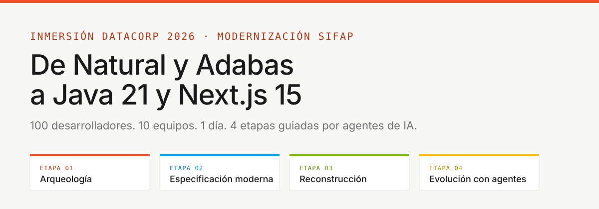
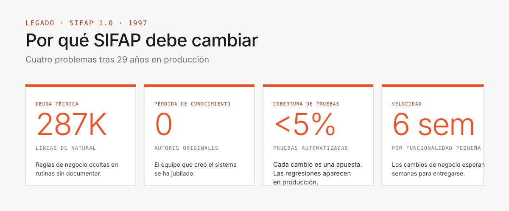

# Kit del equipo: inmersión SIFAP 2.0

> **Ruta:** **Kit del equipo** (estás aquí)

Empieza por [`00-START-HERE.md`](00-START-HERE.md).

## Idiomas del repositorio

**Esta es la edición en español, en la rama `espanol`. `main` es siempre la edición en inglés y la rama predeterminada.** La edición en portugués de Brasil reside en `portugues-br`.

| Idioma | Rama | Documentación | Clonación |
|---|---|---|---|
| **English** | [`main`](https://github.com/workshop-gbb/datacorp-sifap-modernization-team-kit/tree/main) | [Empieza aquí (en)](https://github.com/workshop-gbb/datacorp-sifap-modernization-team-kit/blob/main/00-START-HERE.md) · [Índice de documentación (en)](https://github.com/workshop-gbb/datacorp-sifap-modernization-team-kit/blob/main/docs/README.md) · [Instrucciones de Copilot (en)](https://github.com/workshop-gbb/datacorp-sifap-modernization-team-kit/blob/main/.github/copilot-instructions.md) | `git clone --branch main https://github.com/workshop-gbb/datacorp-sifap-modernization-team-kit.git` |
| **Português (BR)** | [`portugues-br`](https://github.com/workshop-gbb/datacorp-sifap-modernization-team-kit/tree/portugues-br) | [Empieza aquí (pt-BR)](https://github.com/workshop-gbb/datacorp-sifap-modernization-team-kit/blob/portugues-br/00-START-HERE.md) · [Índice de documentación (pt-BR)](https://github.com/workshop-gbb/datacorp-sifap-modernization-team-kit/blob/portugues-br/docs/README.md) · [Instrucciones de Copilot (pt-BR)](https://github.com/workshop-gbb/datacorp-sifap-modernization-team-kit/blob/portugues-br/.github/copilot-instructions.md) | `git clone --branch portugues-br https://github.com/workshop-gbb/datacorp-sifap-modernization-team-kit.git` |
| **Español** | [`espanol`](https://github.com/workshop-gbb/datacorp-sifap-modernization-team-kit/tree/espanol) | [Empieza aquí](00-START-HERE.md) · [Índice de documentación](docs/README.md) · [Instrucciones de Copilot](.github/copilot-instructions.md) | `git clone --branch espanol https://github.com/workshop-gbb/datacorp-sifap-modernization-team-kit.git` |

- Mantén la documentación y toda la prosa de las primitivas de Copilot (agentes, prompts, instrucciones, skills y hooks) de `main` y `develop` en inglés, independientemente del idioma de la conversación.
- Mantén la documentación y la prosa de las primitivas de Copilot en portugués de Brasil en `portugues-br` y en español en `espanol`; no integres el árbol de documentación traducida en `main` ni en `develop`.
- Conserva los nombres de archivo, las rutas, los identificadores técnicos y las fuentes originales Natural/Adabas al traducir.
- Añade otros idiomas a esta tabla solo después de que existan sus ramas. Se permiten los nombres nativos de los idiomas en el selector de la edición en inglés.

Los enlaces relativos te mantienen en la rama seleccionada. Usa la tabla anterior para cambiar el idioma de la documentación.

Portal público del equipo: <https://workshop-gbb.github.io/datacorp-sifap-modernization-team-kit/> — [English (`en`)](https://workshop-gbb.github.io/datacorp-sifap-modernization-team-kit/en/) · [Português (BR) (`pt-br`)](https://workshop-gbb.github.io/datacorp-sifap-modernization-team-kit/pt-br/) · [Español (`es`)](https://workshop-gbb.github.io/datacorp-sifap-modernization-team-kit/es/).

El portal incluye cada Markdown íntegro, un catálogo con búsqueda, descargas originales y enlaces al repositorio. Puedes seguir las mismas instrucciones en el sitio o en GitHub.

---



**La misión en una frase:** tú y cuatro compañeros de equipo tienen **ocho horas** para modernizar el **Sistema de Fiscalización y Administración de Pagos (SIFAP)**, de 29 años, pasando del legado Natural/Adabas a Java 21 + Next.js 15, con trazabilidad completa desde el código moderno hasta las reglas de negocio originales.

  

---

## Por dónde empezar (elige tu perfil)

| Soy... | Empieza aquí |
|---|---|
| **Es mi primera visita o tengo un perfil no técnico** | [`00-START-HERE.md`](00-START-HERE.md) - 15 minutos guiados |
| **Desarrollador, quiero ver el cronograma** | [`00-TEAM-FLOW.md`](00-TEAM-FLOW.md) - 10 minutos |
| **Quiero entender primero los conceptos** | [`07-concepts/`](07-concepts/) - conceptos fundamentales |
| **Quiero configurar mi entorno** | [`00-SETUP.md`](00-SETUP.md) - portátil + Copilot |
| **¿Cómo funciona Git en esta inmersión?** | [`00-GIT-WORKFLOW.md`](00-GIT-WORKFLOW.md) - una rama por persona |
| **Algo salió mal** | [`docs/troubleshooting.md`](docs/troubleshooting.md) |
| **Soy el líder del equipo** | [`docs/CHECKLIST-LIDER.md`](docs/CHECKLIST-LIDER.md) - hora por hora |
| **Quiero evitar errores comunes** | [`docs/lessons-learned.md`](docs/lessons-learned.md) |
| **Voy a presentar la demo** | [`docs/demo-script.md`](docs/demo-script.md) |
| **Quiero ver el progreso del día** | [`docs/STATUS.md`](docs/STATUS.md) |

---

## Consulta el sistema heredado en vivo

SIFAP no es solo material de lectura. Un entorno compartido ejecuta el sistema real Natural/Adabas con datos sintéticos. Los participantes reciben acceso **solo como observadores** a la pantalla de consulta de beneficiarios; el despliegue y la administración quedan fuera del ejercicio del equipo.

| Qué | Dónde |
|---|---|
| **Terminal del visor** | <https://sifap-lab-438k30.eastus2.cloudapp.azure.com/terminal/> |
| **Nombre de usuario** | `viewer` |
| **Contraseña** | La persona facilitadora la comparte en privado; nunca se incluye en un commit |
| **Permitido** | Consultar datos de beneficiarios en la pantalla generada de solo lectura `VIEWBENF` |
| **No permitido** | Administración de Adabas, línea de comandos de Natural, registro, trabajos batch o acceso a la infraestructura |

> [!IMPORTANT]
> Usa solo la credencial de observador. El entorno es compartido, contiene datos sintéticos y se administra fuera de este repositorio público. Si la URL no responde, pregunta a la persona facilitadora; no intentes desplegar ni reparar el laboratorio.

Instrucciones de acceso completas: [`docs/legacy-system-access.md`](docs/legacy-system-access.md).

---

## Cómo se organiza la inmersión

La inmersión tiene **cuatro etapas secuenciales** y **cinco parejas de personas** que trabajan en paralelo dentro de cada etapa. El objetivo final es una demo funcional de SIFAP 2.0.

```mermaid
%%{init: {'theme':'neutral','themeVariables':{'fontFamily':'ui-sans-serif, system-ui, sans-serif','primaryColor':'#F5F5F5','primaryTextColor':'#171717','primaryBorderColor':'#171717','lineColor':'#525252','secondaryColor':'#FFFFFF','tertiaryColor':'#FAFAFA','background':'#FFFFFF'}}}%%
flowchart LR
    classDef step fill:#F5F5F5,stroke:#171717,color:#171717
    classDef handoff fill:#FFFFFF,stroke:#525252,color:#171717
    classDef result fill:#FFFFFF,stroke:#171717,color:#171717,stroke-width:2px

    E1["Etapa 1<br/>Arqueología<br/>@archaeologist"]:::step
    H1["Transición H1<br/>Sincronización de 5 min"]:::handoff
    E2["Etapa 2<br/>Especificación<br/>@architect"]:::step
    H2["Transición H2<br/>Sincronización de 5 min"]:::handoff
    E3["Etapa 3<br/>Implementación<br/>@builder"]:::step
    H3["Transición H3<br/>Sincronización de 5 min"]:::handoff
    E4["Etapa 4<br/>Evolución<br/>@evolution"]:::step
    R["SIFAP 2.0<br/>en ejecución"]:::result

    E1 --> H1 --> E2 --> H2 --> E3 --> H3 --> E4 --> R
```



- **Cinco personas** = cinco parejas de personas, cada pareja comparte la responsabilidad de dos roles del SDLC
- **Cuatro etapas** = cada etapa tiene un agente de Copilot dedicado
- **Transiciones (H1, H2, H3)** = sincronización de cinco minutos entre la pareja que deja una etapa y la que entra en la siguiente
- **CI en verde** = un pipeline de integración aprobado valida cada pull request
- **Objetivo final** = una demo en vivo de SIFAP 2.0

---

## Estructura del kit (orden de lectura recomendado)

```text
workspace/
├── README.md                            <- estás aquí
├── 00-START-HERE.md                     <- 15 min para cualquier persona
├── 00-SETUP.md                          <- configurar portátil + Copilot
├── 00-TEAM-FLOW.md                      <- cronograma canónico del día
├── 00-SITEMAP.md                        <- mapa visual del kit
├── 00-GIT-WORKFLOW.md                   <- ramas, PR e integraciones
│
├── 01-archaeology/                      ETAPA 1 - leer el SIFAP heredado
│   ├── GUIDE.md                         (guía paso a paso de la etapa)
│   ├── LEGACY-EXPLORATION-CHECKLIST.md  (puerta obligatoria antes de la Etapa 2)
│   └── legacy-sifap/                    (24 miembros Natural + 4 DDM + 1 FDT)
├── 02-modern-spec/                      ETAPA 2 - escribir EARS, ADR y C4
├── 03-implementation/                   ETAPA 3 - Java + Next.js + pruebas
├── 04-evolution/                        ETAPA 4 - modo Agent + Terraform
│
├── 05-personas/                         10 personas (elige 2 = tu pareja)
├── 06-stage-agents/                     4 agentes de Copilot (1 por etapa)
├── 07-concepts/                         conceptos fundamentales (EARS, ADR, SDD, agentes)
├── 09-cheat-sheets/                     3 fichas de referencia rápida
│
├── docs/                                acceso al visor, preguntas frecuentes, solución de problemas y ADR
├── assets/                              SVG y diagramas
└── specs/                               artefactos de Spec-Kit creados por el equipo
```

---

## Las cinco parejas (elige la tuya)

Cada integrante asume **una pareja** (dos personas) y la mantiene durante todo el día.

| Pareja | Personas | Fase del SDLC |
|---|---|---|
| **1 - Visión** | Responsable de Producto + Especialista en Requisitos | Descubrimiento + Especificación |
| **2 - Arquitectura** | Arquitecto Empresarial + Arquitecto de Software | Especificación + Diseño |
| **3 - Implementación** | Líder Técnico + Desarrollador | Implementación + Evolución |
| **4 - Calidad** | DBA + Ingeniero de Calidad | Implementación (datos + pruebas) |
| **5 - Operaciones** | Ingeniero DevOps + Redactor Técnico | Transversal + Evolución |

Detalles de cada rol: [`05-personas/OVERVIEW.md`](05-personas/OVERVIEW.md)

---

## Herramientas aprobadas: usa solo estas

> [!IMPORTANT]
> La inmersión se realiza con un conjunto fijo de tecnologías. Mezclar herramientas alternativas fragmenta al equipo y rompe la trazabilidad de la especificación al código y a las pruebas.

| Usa | No uses |
|---|---|
| **VS Code** (o Insiders) | Cursor, Windsurf, IntelliJ, Eclipse |
| **GitHub Copilot** (Ask + Plan + Agent) | Cline, Continue, Aider, Codeium, Tabnine |
| **GitHub Copilot CLI** (opcional) | Interfaces de chat web para generar código |
| **Spec-Kit oficial** (`Specify CLI`) | Kiro, frameworks de SDD alternativos |
| **GitHub** (Issues, PR, Actions) | - |
| **Docker / Docker Compose** | Contenerización heredada de otro repositorio |
| **Terraform** (proveedor de Azure) | `terraform apply` sin revisión (usa solo `plan` hasta la Etapa 4) |

La justificación completa y las verificaciones de CI: [`.github/copilot-instructions.md`](.github/copilot-instructions.md)

---

## Dos capas de agentes, ambas obligatorias

El kit incluye **dos capas** que cubren ejes diferentes (rol x etapa). Usa ambas.

| Capa | Qué es | Cuándo cargarla | Cómo usarla |
|---|---|---|---|
| [`05-personas/`](05-personas/) | Tu kit de persona (responsabilidades, prompts, skills) | Una vez, durante la configuración | Lee tus dos archivos `PERSONA.md`; los agentes, prompts y skills ya están consolidados en `.github/` |
| [`06-stage-agents/`](06-stage-agents/) | El agente de la etapa actual (`@archaeologist` -> `@evolution`) | En cada etapa | Usa el selector de agentes de Copilot Chat |

**No son duplicados.** Persona = tu rol individual. Agente = la etapa en la que está todo el equipo en este momento.

Explicación completa: [`07-concepts/02-agents-and-personas.md`](07-concepts/02-agents-and-personas.md)

---

## Git: cada persona en su propia rama

Cada pareja trabaja en **su propia rama**, abre una **pull request** hacia `develop`, recibe una revisión de la siguiente pareja e integra los cambios. Al final del día, el líder integra `develop -> main`.

```text
spec/<NNN>-<feature>  <- Etapa 2 (RE + SA)
impl/<NNN>-<feature>  <- Etapa 3 (Dev + DBA + QA, creada desde develop)
infra/<componente>    <- Etapa 4 (DevOps)
docs/<topico>         <- Transversal (TW)
agent/<issue-NN>      <- Etapa 4 (Copilot Agent)
```

Detalles y comandos de emergencia: [`00-GIT-WORKFLOW.md`](00-GIT-WORKFLOW.md)

---

## Cómo usar este kit (3 pasos)

### 1. Configuración inicial (una sola vez, ~45 min)

- [ ] **Configura tu entorno.** Sigue [`00-SETUP.md`](00-SETUP.md).

```bash
# Clonar y abrir en VS Code
cd ~/Code
git clone --branch main <YOUR-TEAM-REPOSITORY-URL> workshop-team-XX
cd workshop-team-XX
git checkout develop
code .
```

> [!NOTE]
> El kit no incluye un prototipo listo, scripts de arranque ni contenerización heredada. Cada equipo crea `backend/`, `frontend/` y los archivos de contenedores e infraestructura necesarios durante la Etapa 3.

### 2. Preparación (~30 min, cada persona)

- [ ] **Lee el cronograma del día.**

```bash
cat 00-TEAM-FLOW.md
```

- [ ] **Lee los conceptos fundamentales** (si no desarrollas software, empieza aquí).

```bash
cat 07-concepts/00-README.md
```

- [ ] **Lee tus dos personas.**

```bash
cat 05-personas/XX-persona-A/PERSONA.md
cat 05-personas/YY-persona-B/PERSONA.md
```

- [ ] **Valida que los kits de Copilot estén consolidados.**

```bash
ls .github/agents .github/prompts .github/skills
```

### 3. Día de la inmersión: sigue las cuatro etapas

- [ ] `01-archaeology/GUIDE.md` - leer el código heredado y extraer reglas
- [ ] `02-modern-spec/GUIDE.md` - EARS, ADR y C4
- [ ] `03-implementation/GUIDE.md` - Java + Next.js + pruebas
- [ ] `04-evolution/GUIDE.md` - modo Agent + Terraform

---

## Por qué importa

La mayoría de los proyectos de modernización no fracasan porque el equipo no sepa escribir Java, sino porque escribe Java para el **problema equivocado**. Los equipos modernizan el resumen del proyecto, no el sistema. Pierden 29 años de reglas de negocio enterradas en código que nadie lee.



Este kit existe para evitarlo:

- El código heredado se incluye en la inmersión (en [`01-archaeology/legacy-sifap/`](01-archaeology/legacy-sifap/))
- La CI exige trazabilidad (`source_legacy:`)
- Las transiciones H1, H2 y H3 están programadas en el cronograma
- Los roles son explícitos (10 archivos `PERSONA.md`)
- No necesitas **inventar** el proceso, necesitas **ejecutarlo**

---

## Principios didácticos de este kit

Todos los documentos de este kit siguen cinco principios:

1. **Primero el contexto** - dónde encaja el concepto en el SDLC y por qué importa
2. **Pasos ejecutables** - comandos, una lista de verificación o una secuencia clara
3. **Ejemplo concreto** - siempre ejemplos de SIFAP, nunca abstracciones
4. **Definición de terminado** - cómo saber que el paso está completo
5. **Solución de problemas** - donde hay riesgo operativo, hay una sección de solución de problemas

---

## Glosario rápido

| Término | Definición objetiva |
|---|---|
| **EARS** | Notación estándar para escribir requisitos sin ambigüedades; cada requisito sigue una plantilla fija con condición, sujeto, acción y resultado esperado |
| **ADR** | Registro de decisión de arquitectura: registro formal de una decisión de arquitectura, que incluye contexto, alternativas consideradas y consecuencias |
| **Spec-Kit** | Kit de herramientas oficial de GitHub para el desarrollo guiado por especificaciones; crea `spec.md`, `plan.md` y `tasks.md` para cada funcionalidad |
| **Kit de persona** | Conjunto de artefactos de Copilot (agentes, prompts, skills) que configura una persona para la inmersión |
| **Kit de agente** | Agente de Copilot para la etapa actual; cada etapa tiene un agente dedicado (`@archaeologist`, `@architect`, `@builder`, `@evolution`) |
| **source_legacy** | Campo obligatorio en cada requisito EARS que apunta al archivo fuente `.NSP`/`.NSN` o `.ddm`; la CI lo verifica |
| **Contexto delimitado** | Límite de dominio que agrupa conceptos con un significado coherente (por ejemplo: Pago, Beneficio y Fiscalización en SIFAP) |
| **CI en verde** | Estado en el que el pipeline de integración continua supera todas las verificaciones; obligatorio antes de integrar una pull request |

Glosario completo con más de 30 términos: [`07-concepts/03-visual-glossary.md`](07-concepts/03-visual-glossary.md)

---

### Sigue leyendo

| Anterior | Siguiente |
|---|---|
| - | [00 - Empieza aquí](00-START-HERE.md)<br/><sub>Recorrido de 15 minutos para cualquier persona.</sub> |

<sub>[Volver al índice del kit](README.md)</sub>
