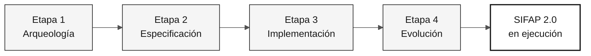

# Guía de estilo de documentación

> **Ruta:** [Kit del equipo](../README.md) › [Documentación](README.md) › **Guía de estilo de documentación**

Este es el **único contrato de estilo** para TODOS los archivos `.md` del
repositorio `datacorp-mm-team-kit`, **excepto** los que están dentro de `.github/` (no modificar).

Objetivo: documentación moderna, didáctica, profesional y sobria, sin emojis,
sin analogías de Super Mario y con diagramas Mermaid en tonos neutros
(blanco / gris / negro), tablas, listas de verificación y bloques de aviso.

---

## 1. Reglas absolutas (nunca infringir)

| # | Regla |
|---|---|
| R1 | **Cero emojis.** Elimina todos los caracteres emoji/pictográficos de títulos, tablas, listas, avisos, bloques ASCII y texto principal. Sustitúyelos por palabras, insignias grises o nada. |
| R2 | **Cero analogías de Super Mario / Nintendo.** Elimina Mario, Luigi, Peach, Daisy, Rosalina, Toad, Yoshi, Koopa, Goomba, Bowser, princesa, castillo, hongo, power-up, mundo 1-1, tubería verde, estrella de invencibilidad, maná, XP, "raid", "game over", "boss" y "co-op". Consulta el vocabulario de sustitución en §2. |
| R3 | **"hackathon"/"hackaton" → "inmersión".** Esto incluye los nombres de directorio de ejemplo (`hackathon-team-XX` → `workshop-team-XX`), los títulos y el texto principal. |
| R4 | **Esta guía rige `docs/` y las carpetas numeradas de etapas, no `.github/`.** Las primitivas de Copilot de `.github/` siguen su propio estándar estructural (plantillas de agentes, prompts, instrucciones y skills); una revisión de documentación no debe reestructurarlas como prosa. Los enlaces que *apuntan a* `.github/...` siguen siendo válidos y deben conservarse. |
| R5 | **No inventes contenido factual nuevo.** Conserva el 100% de la información técnica, los comandos, las rutas, los REQ-ID, los nombres de archivo y las tablas de datos existentes. Los cambios se refieren a la forma, la calidad didáctica y la organización, no a los hechos. |
| R6 | **No rompas enlaces.** Al renombrar un archivo, actualiza todos los enlaces que apunten a él. Las rutas relativas deben seguir siendo correctas. |
| R7 | Mantén la prosa de la documentación **en inglés en `main` y `develop`**, **en portugués de Brasil en `portugues-br`** y **en español en `espanol`**. Sigue la [política de idiomas del repositorio](../README.md#idiomas-del-repositorio); se permiten los nombres nativos de los idiomas en el selector, no secciones traducidas duplicadas en `main`. Nunca integres el árbol de documentación traducida en `main` ni en `develop`. Conserva los nombres de archivo, las rutas, los esquemas, los identificadores técnicos, el comportamiento del código y las fuentes originales del legado. Las primitivas de Copilot quedan fuera del alcance de esta guía; su idioma y estructura siguen [`.github/PRIMITIVE-STANDARD.md`](../.github/PRIMITIVE-STANDARD.md). |

---

## 2. Vocabulario de sustitución (Mario → profesional)

| Término anterior | Término nuevo |
|---|---|
| Mundo 1 / 1-1 / Mundo exterior | Etapa 1 — Arqueología |
| Mundo 2 / 2-1 / Subterráneo | Etapa 2 — Especificación |
| Mundo 3 / 3-1 / Atlético | Etapa 3 — Implementación |
| Castillo / 4-Castillo / Bowser | Etapa 4 — Evolución |
| Princesa / rescatar a la princesa | Objetivo final: SIFAP 2.0 funcionando en la demostración |
| Tubería verde | Transición entre etapas |
| Estrella / estrella de invencibilidad | Pipeline de CI aprobado (CI en verde) |
| Power-up / inventario / mochila | Kit de persona (prompts, skills, instrucciones) |
| Personaje jugable (Mario, Peach…) | La propia persona (Responsable de Producto, Desarrollador…) |
| Ataque / movimiento especial / maná / XP | Modo de Copilot / comando de barra / costo de tiempo |
| Escena de combate / raid / jefe | Escenario de uso / ejemplo práctico / revisión de PR |
| Fin del juego / caer en un pozo | Fallo del proyecto / riesgo / antipatrón |
| Cooperativo de 5 jugadores | Equipo de 5 integrantes que trabajan en 5 parejas de personas |
| Mario Maker | Herramienta de creación de especificaciones (Spec-Kit) |
| Receta de hongos | Plantilla de requisito |
| Carta de la princesa | Registro formal de decisión (ADR) |
| Yoshi se traga las tablas | (reescribir literalmente: modelado y optimización de datos) |

Cuando una analogía sea el *único* contenido de una sección, **reemplázala por
contenido didáctico real**: definición del concepto, por qué importa, un ejemplo
concreto de SIFAP y un caso de uso. No dejes la sección vacía ni cambies solo su etiqueta.

---

## 3. Estructura canónica de documentos

Cada archivo `.md` (excepto plantillas puras y archivos de datos) sigue este orden:

```markdown
# Título del documento

> **Ruta:** [Kit del equipo](../README.md) › [Sección](README.md) › **Documento actual**

**Resumen en una frase.** Una única frase directa que explique qué podrá
hacer quien lo lea al terminar.

| Campo | Valor |
|---|---|
| **Público objetivo** | quién debería leerlo |
| **Prerrequisitos** | qué necesita saber o tener previamente |
| **Tiempo estimado** | 15 min |
| **Etapa** | Etapa 2 — Especificación |
| **Resultado esperado** | artefacto concreto producido |

---

## Concepto

Explicación didáctica del concepto (qué es, por qué existe y qué problema resuelve).

## Cómo funciona

Diagrama Mermaid + explicación.

## Paso a paso

Lista de verificación ejecutable.

## Ejemplo aplicado a SIFAP

Ejemplo concreto, nunca abstracto.

## Casos de uso

Cuándo usarlo / cuándo no usarlo.

## Criterios de finalización

- [ ] elemento verificable

## Errores comunes y cómo evitarlos

Tabla de síntoma → causa → corrección.

## Referencias

Enlaces relacionados.

---

### Sigue leyendo
(bloque de navegación: véase §8)
```

Adapta las secciones al contenido real del archivo; no fuerces secciones vacías.
Lo importante es: **contexto → concepto → práctica → verificación → siguientes pasos**.

---

## 4. Diagramas Mermaid: tema neutro obligatorio

Sustituye los dibujos de arte ASCII por Mermaid cuando el diagrama represente un
flujo, jerarquía, secuencia, estados o relaciones. Conserva los bloques de terminal
y código fuente tal como están (no son diagramas).

### Paleta única (usa exactamente estos valores)

| Función | fill | stroke | color |
|---|---|---|---|
| Principal / destacado | `#F5F5F5` | `#171717` | `#171717` |
| Secundario | `#FFFFFF` | `#525252` | `#171717` |
| Terciario / de apoyo | `#FAFAFA` | `#A3A3A3` | `#404040` |
| Sombreado / inactivo | `#E5E5E5` | `#737373` | `#404040` |
| Contorno fuerte (resultado) | `#FFFFFF` | `#171717` | `#171717` (stroke-width 2px) |

### Cabecera estándar obligatoria en cada bloque Mermaid



Reglas de Mermaid:

- Incluye siempre el bloque `%%{init: ...}%%` anterior (cópialo literalmente).
- Nunca uses colores saturados (azul, naranja, verde, rojo, amarillo).
- Encierra las etiquetas entre comillas dobles: `A["Texto"]`. Usa `<br/>` para los saltos de línea.
- No incluyas emojis dentro del diagrama.
- Tipos permitidos: `flowchart`, `sequenceDiagram`, `stateDiagram-v2`,
  `journey`, `gantt`, `mindmap`, `timeline`, `erDiagram`, `classDiagram`,
  `quadrantChart`, `C4Context`.
- Para diagramas grandes, prefiere `flowchart TB` con un `subgraph` con nombre para cada área.
- No uses `linkStyle` con un color saturado; usa `stroke:#525252` si es necesario.

### Sustituir secuencias ASCII por Mermaid

Los bloques como `A ──> B ──> C` o las cajas dibujadas con `┌─┐` deben convertirse a Mermaid.
Los árboles de directorios (`├──`) **pueden mantenerse** como bloques de código `text`,
pero sin emojis en sus nodos.

---

## 5. Componentes visuales permitidos

### 5.1 Bloques de aviso (GitHub Alerts): usar en lugar de emojis

```markdown
> [!NOTE]
> Información complementaria útil.

> [!TIP]
> Atajo o práctica recomendada.

> [!IMPORTANT]
> Información necesaria para tener éxito.

> [!WARNING]
> Riesgo de perder trabajo o romper la CI.

> [!CAUTION]
> Consecuencia negativa grave; acción prohibida.
```

### 5.2 Insignias: solo escala de grises

Usa `flat-square` y solo estos colores: `171717`, `404040`, `737373`, `A3A3A3`, `E5E5E5`.

```markdown


```

Máximo de 3 insignias por documento, siempre inmediatamente después del resumen. Nunca uses color.

### 5.3 Tablas

Prefiere una tabla a una lista siempre que haya 2 o más dimensiones (elemento × atributo).
Usa encabezados en **negrita** solo en la primera columna cuando sea una clave.
Alineación: `|---|---|` (estándar). Evita tablas con más de 5 columnas.

### 5.4 Listas de verificación

Cada sección que describa acciones ejecutables se convierte en una lista de verificación GFM:

```markdown
## Paso a paso

- [ ] **Paso 1 — Leer los programas asignados.** Abre `01-archaeology/legacy-sifap/natural-programs/`.
- [ ] **Paso 2 — Registrar las reglas.** Completa `business-rules-catalog.md`.
- [ ] **Paso 3 — Validar.** Ejecuta `npm run lint:docs`.
```

Patrón de elemento: `- [ ] **Verbo en infinitivo — título breve.** Detalle con ruta/comando.`

### 5.5 Bloques `<details>` para contenido opcional extenso

```markdown
<details>
<summary><strong>Ejemplo completo del archivo generado</strong></summary>

...contenido...

</details>
```

### 5.6 Separadores

Usa `---` entre las áreas principales del documento. No uses más de un `---` consecutivo.

### 5.7 Imágenes/SVG existentes

Conserva todas las referencias existentes a `assets/*.svg`. No elimines imágenes.
Asegúrate de que cada `![...]` tenga **texto alternativo descriptivo** (accesibilidad),
sin emojis.

---

## 6. Tono didáctico (obligatorio)

Cada concepto nuevo debe incluir, en este orden:

1. **Definición**: qué es, en una frase objetiva.
2. **Por qué importa**: qué problema resuelve en esta inmersión.
3. **Cómo se aplica a SIFAP**: un ejemplo concreto del dominio (programas `.NSP`,
   subprogramas `.NSN`, DDM `.ddm`, pagos, beneficios, fiscalizaciones).
4. **Caso de uso**: una situación real en la que quien lo lea lo utilizará.
5. **Error común**: qué suele salir mal.

Orientaciones de redacción:

- Usa la voz activa y la segunda persona ("haces", "abre el archivo").
- Escribe frases cortas. Un párrafo = una idea.
- Explica los términos del dominio y de arquitectura (`bounded context`, `pull request`,
  `packed decimal`) en su primera aparición: quien lee desconoce al menos uno de
  los lados de la transición del legado a lo moderno.
- Sin humor forzado, jerga de videojuegos ni exageraciones. Sé profesional y acogedor.
- Nunca uses "simplemente", "solo" ni "es fácil".

---

## 7. Glosario y términos del dominio

Conserva y refuerza: SIFAP (Sistema de Fiscalización y Administración de Pagos),
Natural, Adabas, DDM, FDT, EARS, REQ-ID, `source_legacy`, ADR, contexto delimitado,
Spec-Kit, Strangler Fig, Monolito Modular, Testcontainers.

Al mencionar un término por primera vez en un documento, proporciona una definición
breve entre paréntesis o en una nota.

---

## 8. Pie de navegación estándar

Sustituye los pies actuales por este formato (sin emojis):

```markdown
---

### Sigue leyendo

| Anterior | Siguiente |
|---|---|
| Título anterior (`previous-file.md`)<br/><sub>Resumen en una línea.</sub> | Título siguiente (`next-file.md`)<br/><sub>Resumen en una línea.</sub> |

<sub>[Volver al índice del kit](../README.md)</sub>
```

Si no hay un documento anterior o siguiente, usa `—` en la celda.
Los bloques HTML `<table>` existentes deben convertirse a este formato.

---

## 9. Cabecera de archivo

**No añadas comentarios inline `<!-- markdownlint-disable ... -->`.**
El archivo `.markdownlint-cli2.jsonc` del repositorio es la única fuente de verdad
para la configuración del lint y ya desactiva todas las reglas que el kit necesita flexibilizar
(`MD003`, `MD013`, `MD025`, `MD026`, `MD028`, `MD029`, `MD033`, `MD034`,
`MD036`, `MD040`, `MD041`, `MD051`, `MD060`).

Las directivas inline son perjudiciales por dos motivos:

1. Duplican la configuración, por lo que las dos fuentes divergen con el tiempo.
2. En las primitivas de Copilot (`.github/agents/`, `.github/prompts/`,
   `.github/skills/`, `.github/instructions/`), el comentario se carga en la
   ventana de contexto del modelo y consume tokens en contenido que no aporta
   valor instructivo.

Añade una directiva **solo** cuando un archivo realmente necesite una regla que no
esté desactivada globalmente y desactiva únicamente esa regla. El único ejemplo actual es
`docs/adr/0000-template.md`, que necesita `MD024` porque la plantilla
repite títulos deliberadamente:

```markdown
<!-- markdownlint-disable MD024 -->
```

Por tanto, la primera línea de cada archivo del alcance de esta guía es el título `# H1`.
El frontmatter YAML de las primitivas de Copilot se rige por [`.github/PRIMITIVE-STANDARD.md`](../.github/PRIMITIVE-STANDARD.md), no por esta guía.
Solo un `# H1` por archivo. No omitas niveles de títulos (`#` → `##` → `###`).

---

## 10. Cambios de nombre acordados (07-concepts)

| Archivo actual | Nombre nuevo |
|---|---|
| `07-concepts/01-spec-kit-como-mario-maker.md` | `07-concepts/01-spec-driven-development.md` |
| `07-concepts/02-agentes-como-super-mario.md` | `07-concepts/02-agents-and-personas.md` |
| `07-concepts/05-ears-receita-de-cogumelo.md` | `07-concepts/05-ears-notation.md` |
| `07-concepts/06-adr-carta-da-princesa.md` | `07-concepts/06-architecture-decision-records.md` |

Los demás archivos (`00-README.md`, `03-visual-glossary.md`,
`04-3-copilot-modes.md`) conservan sus nombres.

Renombra archivos con `git mv`. Cada agente que encuentre enlaces a los nombres
anteriores debe actualizarlos a los nombres nuevos.

---

## 11. Lista de verificación por archivo

Antes de considerar completo un archivo:

- [ ] Sin emojis (`grep -P '[\x{1F300}-\x{1FAFF}\x{2600}-\x{27BF}\x{2B00}-\x{2BFF}\x{FE0F}\x{2190}-\x{21FF}]'` no devuelve resultados relevantes)
- [ ] Sin referencias a analogías de Mario/Nintendo/videojuegos
- [ ] Sin apariciones de "hackathon"/"hackaton"
- [ ] Cada bloque Mermaid tiene la cabecera `%%{init:...}%%` y una paleta neutral
- [ ] Todas las acciones ejecutables están en listas de verificación `- [ ]`
- [ ] Se usan tablas cuando hay 2 o más dimensiones
- [ ] Se usan avisos GFM (`> [!NOTE]`) en lugar de emojis de advertencia
- [ ] El pie de navegación usa el formato de §8
- [ ] Los enlaces relativos son válidos (el archivo de destino existe)
- [ ] El contenido factual está preservado

---

### Sigue leyendo

| Anterior | Siguiente |
|---|---|
| [Índice de documentación](README.md)<br/><sub>Todos los documentos de apoyo del kit.</sub> | [FAQ](FAQ.md)<br/><sub>Preguntas frecuentes sobre la inmersión.</sub> |

<sub>[Volver al índice del kit](../README.md)</sub>
