# Flujo del SDLC y transiciones de la inmersión

> **Ruta:** [Kit del equipo](../README.md) › [Documentación](README.md) › **Flujo del SDLC**

**Guía de los contratos entre parejas** — resume las entregas de artefactos sin cambiar horarios ni ampliar los entregables.

| Campo | Valor |
|---|---|
| **Público objetivo** | Todo el equipo |
| **Prerrequisitos** | Leer [`00-TEAM-FLOW.md`](../00-TEAM-FLOW.md) |
| **Resultado esperado** | Comprender qué entrega cada pareja y qué recibe la siguiente |

---

## Descripción general del flujo

```mermaid
%%{init: {'theme':'neutral','themeVariables':{'fontFamily':'ui-sans-serif, system-ui, sans-serif','primaryColor':'#F5F5F5','primaryTextColor':'#171717','primaryBorderColor':'#171717','lineColor':'#525252','secondaryColor':'#FFFFFF','tertiaryColor':'#FAFAFA','background':'#FFFFFF'}}}%%
flowchart LR
    classDef step fill:#F5F5F5,stroke:#171717,color:#171717
    classDef hand fill:#FFFFFF,stroke:#525252,color:#171717
    classDef result fill:#FFFFFF,stroke:#171717,color:#171717,stroke-width:2px

    E1["Etapa 1<br/>Arqueología<br/>11:00–14:00"]:::step
    H1["Transición H1<br/>14:00"]:::hand
    E2["Etapa 2<br/>Especificación moderna<br/>14:00–15:00"]:::step
    H2["Transición H2<br/>15:00"]:::hand
    E3["Etapa 3<br/>Implementación<br/>15:00–16:10"]:::step
    H3["Transición H3<br/>16:10"]:::hand
    E4["Etapa 4<br/>Evolución<br/>16:10–16:50"]:::step
    DEMO["Demo<br/>17:00–17:30"]:::result

    E1 --> H1 --> E2 --> H2 --> E3 --> H3 --> E4 --> DEMO
```



---

## Cronograma oficial

| Horario | Etapa | Agente | Resultado esperado |
|---|---|---|---|
| 11:00–12:00 y 13:30–14:00 | 1 — Arqueología | `@archaeologist` | Evidencia del legado y una funcionalidad acotada definida |
| 14:00–15:00 | 2 — Especificación moderna | `@architect` | `spec.md`, `plan.md` y `tasks.md` |
| 15:00–16:10 | 3 — Implementación | `@builder` | Primer incremento de funcionalidad probado |
| 16:10–16:50 | 4 — Evolución | `@evolution` | Una delegación al agente o un backlog revisable |

---

## Estructura de los artefactos formales

Los artefactos formales de Spec-Kit de una funcionalidad residen en:

```text
specs/<NNN>-<feature>/
├── spec.md
├── plan.md
└── tasks.md
```

`02-modern-spec/` almacena solo material de apoyo y decisiones de alcance. No crees artefactos formales paralelos fuera de la carpeta de la funcionalidad.

---

## Lista de verificación de transiciones

| Transición | Cuándo | Origen → Destino | Entrega mínima | Pregunta de confirmación |
|---|---|---|---|---|
| **H1** | 14:00 | Pareja 1 → Pareja 2 | Porción del alcance, evidencia `.NSN`/`.ddm` y preguntas abiertas | "¿Hemos leído las fuentes necesarias para la funcionalidad?" |
| **H2** | 15:00 | Pareja 2 → Parejas 3 y 4 | Ruta de la funcionalidad, `spec.md`, `plan.md`, `tasks.md` y primera tarea | "¿Están claras la primera tarea y sus pruebas?" |
| **H3** | 16:10 | Parejas 3 y 4 → Pareja 5 | Estado del incremento, pruebas ejecutadas y trabajo pendiente | "¿Qué se puede delegar sin cambiar el alcance?" |

Cada transición es una conversación síncrona de cinco minutos. Una laguna no autoriza a inventar requisitos, fuentes del legado ni arquitectura: reduce el alcance o registra el pendiente.

---

## Trazabilidad

Antes de escribir EARS, la persona responsable lee la fuente del legado asignada. Cada REQ-ID de `spec.md` incluye `source_legacy:` apuntando al archivo `.NSN` o `.ddm` correspondiente, o `[GREENFIELD]` con una justificación. La CI bloquea las pull requests hacia `develop` cuando se incumple este contrato.

---

## Ramas

Crea `spec/<NNN>-<feature>` desde `develop` e intégrala en `develop`. Después crea `impl/<NNN>-<feature>`, también desde `develop`. El flujo es `spec/<NNN>-<feature>` → `develop` → `main`. No existe una rama `stage`.

---

### Sigue leyendo

| Anterior | Siguiente |
|---|---|
| [Matriz persona-agente](persona-agent-matrix.md)<br/><sub>Quién lidera en cada etapa.</sub> | [Los cuatro agentes explicados](4-agents-explained.md)<br/><sub>Por qué hay cuatro agentes.</sub> |

<sub>[Volver al índice del kit](../README.md)</sub>
