# specs/

> **Ruta:** [Kit del equipo](../README.md) › **Especificaciones**

**Esta carpeta almacena los artefactos de GitHub Spec-Kit. Para cada funcionalidad, el equipo registra qué quiere construir (`spec.md`), cómo construirlo (`plan.md`) y en qué orden (`tasks.md`) antes de escribir cualquier código.**

  

| Campo | Valor |
|---|---|
| **Público objetivo** | Todas las parejas; la Pareja 2 crea los artefactos en la Etapa 2 |
| **Prerrequisitos** | Funcionalidad seleccionada en la Etapa 2; transición H1 completada |
| **Etapa** | Etapa 2 — Especificación |
| **Resultado esperado** | Una carpeta `NNN-short-name` con `spec.md`, `plan.md` y `tasks.md` trazables |

---

## Concepto: desarrollo guiado por especificaciones

El desarrollo guiado por especificaciones (SDD) es la práctica de especificar por completo una funcionalidad, incluidos los requisitos, un plan técnico y las tareas, antes de implementarla. GitHub Spec-Kit automatiza este flujo con comandos de barra en Copilot Chat.

**Por qué importa:** sin una especificación previa, el código crece sin una dirección trazable. La CI de la inmersión verifica que cada REQ-ID tenga `source_legacy:` apuntando al sistema heredado real. Esto garantiza que SIFAP 2.0 implemente las reglas del SIFAP original (Sistema de Fiscalización y Administración de Pagos).

**Caso de uso:** en la Etapa 1, el equipo identifica que `CALCCORR.NSP` contiene la lógica de cálculo del reajuste anual. En la Etapa 2, esa lógica se convierte en `REQ-015` dentro de `spec.md`, con `source_legacy: 01-archaeology/legacy-sifap/natural-programs/CALCCORR.NSP`. En la Etapa 3, la prueba se aprueba o falla, completando la cadena de trazabilidad.

---

## Estructura de carpetas

Cada funcionalidad tiene su propia carpeta:

```text
specs/
└── <NNN>-<feature>/
    ├── spec.md
    ├── plan.md
    └── tasks.md
```

El número (`NNN`) define el orden de creación. El nombre (`feature-name`) describe el alcance en términos de comportamiento. Evita nombres genéricos como `system` o `backend`.

---

## Flujo de Spec-Kit

```mermaid
%%{init: {'theme':'neutral','themeVariables':{'fontFamily':'ui-sans-serif, system-ui, sans-serif','primaryColor':'#F5F5F5','primaryTextColor':'#171717','primaryBorderColor':'#171717','lineColor':'#525252','secondaryColor':'#FFFFFF','tertiaryColor':'#FAFAFA','background':'#FFFFFF'}}}%%
flowchart LR
    classDef step fill:#F5F5F5,stroke:#171717,color:#171717
    classDef result fill:#FFFFFF,stroke:#171717,color:#171717,stroke-width:2px

    A["/speckit.specify"]:::step --> B["/speckit.clarify"]:::step
    B --> C["/speckit.plan"]:::step
    C --> D["/speckit.tasks"]:::step
    D --> E["/speckit.analyze"]:::step
    E --> F["/speckit.implement"]:::step
    F --> G["Código trazado<br/>a REQ-ID"]:::result
```



| Comando | Artefacto generado | Qué verificar |
|---|---|---|
| `/speckit.constitution` | `.specify/memory/constitution.md` | Reglas no negociables del proyecto |
| `/speckit.specify` | `spec.md` | REQ-ID, patrones EARS, criterios de aceptación y `source_legacy:` |
| `/speckit.clarify` | Preguntas resueltas en la especificación | Ambigüedades resueltas |
| `/speckit.plan` | `plan.md` | Arquitectura, datos, riesgos y contratos |
| `/speckit.tasks` | `tasks.md` | Orden de ejecución, pruebas y dependencias |
| `/speckit.analyze` | Informe de lagunas | Incoherencias resueltas |
| `/speckit.implement` | Código en `backend/` y `frontend/` | La implementación sigue la especificación |

---

## Paso a paso

- [ ] **Selecciona un descubrimiento de la Etapa 1.** La funcionalidad debe tener evidencia del legado.
- [ ] **Crea la carpeta de la funcionalidad.** Usa el patrón `NNN-short-name` en `specs/`.
- [ ] **Ejecuta `/speckit.specify`.** Genera `spec.md` con historias de usuario, requisitos EARS, criterios de aceptación y `source_legacy:`.
- [ ] **Ejecuta `/speckit.clarify`.** Resuelve las preguntas antes de planificar.
- [ ] **Ejecuta `/speckit.plan`.** Genera el plan técnico, los riesgos, los datos y los contratos en `plan.md`.
- [ ] **Ejecuta `/speckit.tasks`.** Divide el plan en tareas pequeñas, comprobables y trazables en `tasks.md`.
- [ ] **Ejecuta `/speckit.analyze`.** Corrige las incoherencias antes de implementar.
- [ ] **Ejecuta `/speckit.implement`.** Implementa solo después de que la especificación, el plan y las tareas sean coherentes.

---

## Convención de ramas

> [!IMPORTANT]
> El flujo correcto de ramas es `spec/<NNN>-<feature>` → `develop` → `main`. No existe una rama `stage`.

- Una rama por especificación: `spec/<NNN>-<feature>`, creada desde `develop`.
- Después de integrar la especificación, crea las ramas de implementación `impl/<NNN>-<feature>` desde `develop`, nunca desde la rama de especificación.
- Los commits que implementan comportamiento deben citar el REQ-ID: `Implements REQ-XXX`.

---

## Criterios de finalización

- [ ] Cada funcionalidad tiene una carpeta `NNN-short-name`.
- [ ] Cada requisito del legado tiene `source_legacy:` apuntando a `.NSN` o `.ddm`.
- [ ] Cada requisito greenfield tiene una justificación `[GREENFIELD]`.
- [ ] `tasks.md` coloca las pruebas antes de la implementación de las reglas de negocio.

---

## Relación con `02-modern-spec/`

`02-modern-spec/` no contiene una segunda especificación. Úsala para registrar decisiones de alcance y material de apoyo de la Etapa 2. Los requisitos EARS, el plan técnico y las tareas de la funcionalidad pertenecen a `specs/<NNN>-<feature>/spec.md`, `plan.md` y `tasks.md`.

---

## Errores comunes y cómo evitarlos

| Síntoma | Causa | Corrección |
|---|---|---|
| La CI rechaza la PR porque falta `source_legacy:` | Requisito escrito sin consultar el sistema heredado | Vuelve a leer el `.NSN` correspondiente y añade `source_legacy:` |
| `spec.md` aprobado sin criterios de aceptación | Requisito EARS escrito sin los patrones correctos | Reescríbelo usando uno de los 5 patrones EARS |
| `tasks.md` no tiene pruebas | Tareas creadas sin considerar la verificación | Añade al menos una prueba para cada regla de negocio |
| La carpeta tiene un nombre genérico (`backend-features`) | El nombre no refleja el comportamiento | Cámbiale el nombre para que refleje la funcionalidad real |

---

## Referencias

- [Ficha de referencia de Spec-Kit](../09-cheat-sheets/spec-kit-workflow.md)
- [Notación EARS](../07-concepts/05-ears-notation.md)
- [Spec-Kit oficial](https://github.com/github/spec-kit)
- [Desarrollo guiado por especificaciones](https://github.com/github/spec-kit/blob/main/spec-driven.md)

---

### Sigue leyendo

| Anterior | Siguiente |
|---|---|
| [Spec-Kit en 1 página](../09-cheat-sheets/spec-kit-workflow.md)<br/><sub>Secuencia: specify → clarify → plan → tasks → analyze.</sub> | [Etapa 2 — Especificación](../02-modern-spec/GUIDE.md)<br/><sub>Crear la especificación a partir del descubrimiento del equipo.</sub> |

<sub>[Volver al índice del kit](../README.md)</sub>
